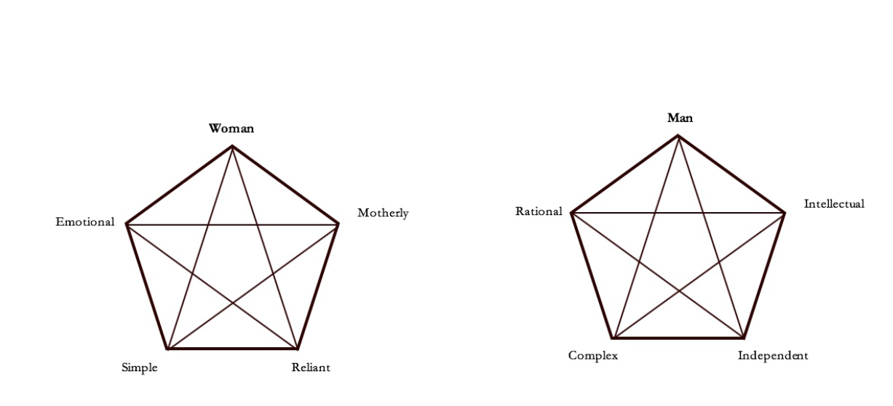
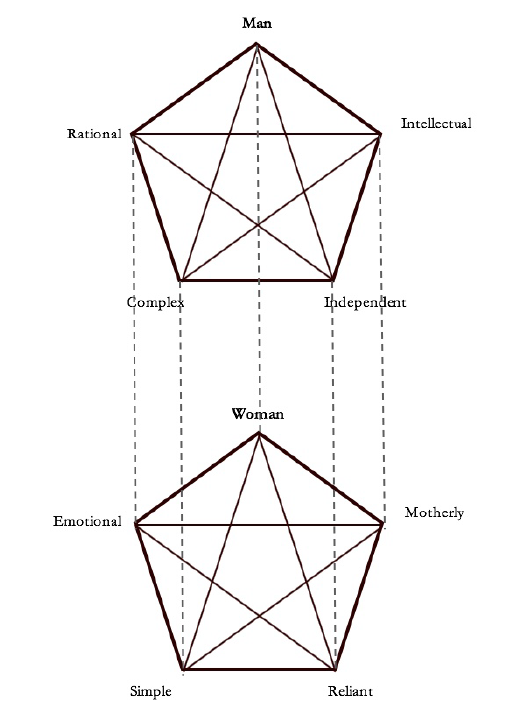
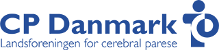

```{r, include=F}
pacman::p_load(tidyverse, knitr, ggdag, lubridate, kableExtra)

knitr::opts_chunk$set(echo = FALSE, 
                      fig.align = "center", 
                      fig.height=12)

Sys.setlocale(locale = "da_DK.UTF-8")
```

# Velkommen

- Velkommen - hvem er vi og hvad skal vi?

- Diskursanalyse: Snakke lidt om forelæsningerne og (poststrukturalistisk) diskursanalyse bredt set

- Øvelsesopgaver

---

# Præsentation

**Mig**

- Søren Damsbo-Svendsen

- Startede på ifs i 2013

- Ph.d.-studerende siden 2020

- Forskning: Holdningsdannelse på klimaområdet med fokus på medier og personlige klima- og vejrerfaringer

- Faglige interesser: Politisk adfærd og holdningsdannelse, kvantitative metoder, data science og kausal inferens

- I er velkomne til at skrive spørgsmål og forslag til mig på [sdas@ifs.ku.dk](mailto:sdas@ifs.ku.dk)

---

# Præsentation

**Jer**

- I stedet for "hurtig navnerunde", laver vi lige en poll.

--

- Andet at fortælle om holdet?


---

# Mit take på Metode 3

- Mega fedt fordi man:
    - hurtigt lærer at **kunne** en masse konkret frem for "bare" at **vide** meget 
    - laver egne empiriske analyser (så bliver det til forskning)

--

- Ret **hurtig overflyvning** af metoderne
    - Man bliver først ekspert i en metode, når man har anvendt den &rarr; hjemmeopgaven er en unik mulighed for at blive ekspert!

--

- **Forskningsspørgsmålet** er altid det primære (hvad er vi interesserede i, hvad vil vi finde svar på) &rarr; **metoden** er en teknik (med antagelser) til at besvare spørgsmålet

--

- Kunne (måske) have været et rent **teknisk fag**, men ... godt det ikke er. 

---

# Holdtimerne

```{r plan}

source("../print_plan.R")
print_plan(8)
```

???

- Struktur
- Kvantitativ indholdsanalyse
- Ekstra time / vejledning
- Eksamen

---

# Hvad skal vi med holdtimerne?

- Recap af **vigtige pointer** fra forelæsning og pensum &rarr; så sætter det sig bedre fast
    - alternative vinkler og formuleringer

--

- Mere **anvendelse**: Øvelsesopgaver, praktiske overvejelser og diskussion

--

- **Friere rum** til at diskutere, hjælpe hinanden, stille "dumme" spørgsmål (= gode spørgsmål)
  - Vi er her for at lære, ikke for at teste hinandens viden

---

# Undervisningsform

- Zoom ...
    - struktur: lidt "forelæsning", recap og slides &rarr; øvelser og diskussion
    - jævnlige break-outs (ca. 4 personer i hver)
    - spørgsmål: helst mundtligt (marker med "x" i chatten) eller alternativt skriv direkte i chatten
    - svar: "raise hand"
    - live sessions (optages ikke)
    - video på som hovedregel (især fra start og i grupper, fuld forståelse for undtagelser)
    
---

# Lad os snakke lidt om forventninger

**Hvad forventer jeg af jer?**

- At I er her for jeres egen skyld:

    - Generelt er forberedte mht. læsning og øvelsesopgaver
    - Deltager i undervisningen (det kan man gøre på mange måder, intet pres)
    - Siger til undervejs, hvis der er noget, der ikke fungerer/fungerer særlig godt (fx med Zoom)
    
- At I har noget metodeviden med fra tidligere - og siger til, når der er ekstra behov for at sætte det nye i relation til tidligere metode-ting

--

**Hvad er jeres forventninger/håb/ønsker/gode råd til Metode 3, til holdtimerne, til mig?**

- Brug 30 sekunder på at skrive en enkelt ting i chatten

--

- Nogle spørgsmål inden vi går i gang?

--

.center[**Lad os komme i gang!**]

---
class: title-slide, center, middle

# Diskursanalyse

---

# Formålet med i dag

- At få en endnu bedre forståelse af diskurser og diskursanalyse samt fundamentet, diskursanalyse står på (ontologi og andre grundantagelser)

- At kunne anvende kernebegreber som diskurs, repræsentation, identitet, sign (betegner), linking (sammenkobling) og differentiering (forskelsrelation)

- At have en idé om, hvor man begynder i praksis

---

# Pensum

- Hansen, L. (2006). Security as practice: Discourse analysis and the Bosnian war. Routledge. Kapitel 2-3.

- Mik-Meyer, N. (2016). Othering, ableism and disability: A discursive analysis of co-workers' construction of colleagues with visible impairments. human relations, 69(6), 1341-1363.

---

# Forelæsningen

- Hvad husker I tydeligst fra Lene Hansens to forelæsninger (eller hvilke pointer tror I, at I vil huske tydeligst om et år)? 

- Hvad er en diskurs? Find et eksempel! Hvorfor det?

- 5 min.

---

# Hvad er en diskurs?

> "a discursive formation can be defined as 'a system of ... objects, types of statement, concepts, or thematic choices', which form 'a regularity' (an order, correlations, positions and functionings, transformations)" .right[Foucault, citeret i Hansen (2006: 17)]

--

- Eller superkort (fra forelæsning 1, jf. Foucault): "**a system for the formation of statements**"
    
--

- Diskurser er strukturer, der organiserer og skaber mening via sproglige differentieringer, og - i større eller mindre grad - tages for givet (eller udfordres) som sande og objektive

--

- Sommetider kan diskurser være markante og springe os i øjnene (fx i politiske taler)

---

# Lidt mere lavpraktiske pointer 

- Vi interesserer os primært for **politiske** diskurser &rarr; politologi + hjælper os med at afgrænse og få øje på centrale diskurser 

--

- Diskurser er **analytiske konstruktioner** snarere end empirisk observerbare objekter

--

- Det er som udgangspunkt **eksplicitte artikulationer**, vi analyserer som diskurser (ikke ekstra-tekstuelle betydninger, men gerne inter-tekstuelle)

--

- **Tekster** er ikke lig med diskurser. Men de artikulerer hver især unikke varianter/udtryk af en diskurs - og er vores indgangsvinkel til diskurserne

--

- "**Basale diskurser**" er idealtyper, der strukturer politiske debatter og deres "underdiskurser" 

---

# (Sprogets) ontologi

**Ontologi**: Læren om det værende, dvs. hvad 'virkeligheden' består af. 

- Diskursanalyse hviler på en række grundlæggende **antagelser** (som alt andet forskning). 
- Lene Hansen beskriver det godt på s. 16: 

--

## Det er gennem sproget, at 'ting' opnår mening og identitet

> To poststructuralism, **language** is ontologically significant: it is only through the construction in language that ‘things'—objects, subjects, states, living beings, and material structures—are given meaning and endowed with a particular **identity**. **Language** is not a transparent tool functioning as a medium for the registration of data ... but a field of **social and political practice**, and hence there is no objective or ‘true **meaning**' beyond the linguistic **representation**.

--

- ingen objektiv eller sand mening uden for den sproglige repræsentation
- sproget er ikke et neutralt redskab
- ideer/materialitet har ingen meningsfuld forekomst uafhængigt af hinanden

---

# (Sprogets) ontologi

## Sproget er intrinsisk socialt og politisk

> To understand **language as social** is to see it not as a private property of the individual but as a series of **collective codes and conventions** that each individual needs to employ to make oneself comprehensible.

--

- Sproget findes mellem personer, bundet til tid og sted (indlejret i en specifik historisk og social sammenhæng)
- **Kollektive koder og konventioner**, som individer (nødvendigvis) anvender for at gøre sig forståelige

--

> To understand **language as political** is to see it as a site for the **production** and reproduction of particular **subjectivities and identities** while others are simultaneously **excluded**.

--

- **Sproget (re)producerer bestemte identiteter**, som (u)muliggør handlinger/politikker
- Sproget er strukturerende, stabilt og ustabilt på en og samme tid 
- Diskurser vil forsøge at etablere/stabilisere sig, men vil altid være udfordret af andre (mod)diskurser

---

# Hvad er identitet?

"*Identity is at the ontological and epistemological center of poststructuralist discourse analysis*" (Hansen, 2006: 33)

<iframe src="https://giphy.com/embed/26gQNeFX7fDrJrW9i" width="480" height="320" frameBorder="0" class="giphy-embed" allowFullScreen></iframe>

---

# Hvad er identitet?

- Identiteter er ikke nødvendigvis noget, nogen "ejer" eller føler. Det er **subjektpositioner** eller "mulige identiteter" i den sproglige repræsentation

--

- **Identiteter er relationelle**: 
    - Skabes af simultan positiv og negativ afgrænsning [linking og differentiering]

--

- **Ordbogsdefinition** (Oxford English Dict):
    - (A) "*the characteristics determining who or what a person or thing is*" (standardforståelse)
    - (B) "*close similarity or affinity*" 
    - B viser, hvorfor det giver god mening at tænke identitet som **linking** (lighed) - og differentation (forskel)

???

""

---

# Linking og differentiering

.pull-left[
Forklar disse figurer. Hvad fortæller de? Hvad er forskellen?

Brug begreberne **linking** og **differentiering**

```{r, echo=F, out.width="100%", fig.align="center"}

```
]

.pull-right[
```{r, echo=F, out.height="80%", out.width="80%", fig.align="center"}

```
]

---

# Linking og differentiering

.pull-left[
Forklar disse figurer. Hvad fortæller de, og hvad er forskellen? 

Pointer:

- identiteter skabes gennem linking og differentiering (positiv og negativ afgrænsning)

- "meaning is established not by the essence of a thing itself but through a series of *juxtapositions*, where one element is valued over its opposite" (Hansen 2006: 17)

- Skal positiv og negativ her forstås i deskriptiv eller normativ forstand?
]

.pull-right[
```{r, echo=F, out.height="80%", out.width="80%", fig.align="center"}

```
]

---

# Diskursiv epistemologi

**Epistemologi** (erkendelseslære): Hvordan opnår vi viden om verden?

- Ved at studere, hvordan identiteter både konstituerer og er et produkt af politik i en specifik historisk kontekst

--

Hvordan? (nu bevæger vi os ind på metodologiens område)

--

- Vi læser og fortolker tekster kvalitativt (ingen kvantificering - surprise! - modsat kvantitativ indholdsanalyse). 

- Retter opmærksomheden mod hvordan identitet og politik artikuleres

- Både den konkrete tekst og konteksten/overblikket er centralt

---

# Diskurser og kausalitet

Snak sammen 2 min.

1. Kan vi vurdere en diskurs' forklaringskraft ift. andre forklaringsfaktorer?

2. Kan vi estimere effekten af en given diskursivt konstrueret identitet på muligheden for at få gennemført en politik? 

Hvad ville Lene Hansen mon sige?

---

# The impossibility of causality

- Ad 1 (**forklaringer**): Der er ikke noget uden for diskursen. Derfor giver det ikke mening at sondre mellem diskursive forklaringer og andre (fx materielle) forklaringer &rarr; "the material ... is always discursively mediated" (Hansen, 2006: 22)

--

- Ad 2 (**effekter**): Politik og diskurs er gensidigt konstituerende og hænger altså sammen i et system. Derfor er det ikke muligt at opdele i uafhængig og afhængig variabel og estimere effekten af den første på den anden.

--

- Det hele falder tilbage til ontologi og epistemologi: 
    - "**Causal epistemology** cannot, however, establish its privilege through reference to any objective truth as **its own criterion for truth is enshrined within as historically situated discourse** of knowledge" (Hansen, 2006: 25).
    - "Poststructuralism’s **break with causality** is thus not a flaw within its research design but an ontological and epistemological **choice**" (ibid.)
    - Men stadigvæk interesseret i relationer mellem "ting" i den politiske verden

???

"It is, as a consequence, impossible to define identity as a variable that is causally separate from foreign policy or to measure its explanatory value in competition with non-discursive material factors."

---
class: center, middle

# Forslag til fremgangsmåde

---

## Trin 1: Emne eller område

- Hvilket emne/problemfelt/politikområde og relaterede "key events" ønsker du at undersøge?

- Find noget spændende!

- Alt andet lige nemmere at analysere et område med tekster og med markante repræsentationer, fænomener og (mod)diskurser

- Eksempler:

    - Krig og udenrigspolitik, global krig mod terror
    - Indvandring i Danmark (fx muslimske kvinder)
    - Opfattelse af personer med handicap på arbejdspladsen (Mik-Meyer)
    - Klimakrise: Klimatosser og klimavenlige vs. klimaskurke og klimasyndere (virksomheder, stater, individer)
    - Regulering af Facebooks brug af nyhedsmedier: platform?

---

## Trin 2: Opstil problemformulering

- Hvad er det, vi vil undersøge?

- Eksempel (Mik-Meyer, 2016: 1342): "in describing employees with impairments, **how do co-workers spontaneously engage in the ‘othering’** of employees with impairments, and how does their talk **challenge or reproduce ableism**?"

- Problemformuleringen er afgørende i al empirisk videnskab uafhængigt af metoden

- Gælder i højeste grad også diskursanalyse &rarr; styrer hele analysen og læsningen

---

## Trin 3: Overblik

- Orientér dig i relevant litteratur

- Dan overblik over det diskursive felt samt konkret politik &rarr; overblik over konteksten

- Kan danne grundlag for tekstudvælgelse

---

## Trin 4: Tekstudvælgelse

- Udvælg nogle centrale tekster, som analyseres grundigt

- Interessante, illustrative, centrale, vigtige

- Vær systematisk &rarr; argumentér for valg

- Mere end én tekst, men kloge begrænsninger

---

## Trin 5: Analyse I

- Start eventuelt med en "overfladisk" analyse a la Lene Hansen til første forelæsning (Forsvaret og Styrelseschefen)

- Hvilke **identiteter** artikuleres i materialet? Tænk i
     - "Os" og "Dem" (diskursive dikotomier)
     - **Nodalpunkter** (betydningsmæssigt centralt og priviligeret ord) 
     - Positive og negative definitioner af identitet &rarr; linking og differentiering
     - Tre dimensioner af linking/differentiering: **spatial** (grænsedragning i rum), **temporal** (forandring, udvikling, stagnation) og **etisk** (hvor placeres ansvarlighed - og for hvad/hvem?) 

- Hav blik for **dynamikker/(u)stabilitet**: identiteter kan få og miste betydning over tid

- Hvor stærke/svage/(u)stabile er de forskellige positive/negative links

- Vær opmærksom på, om stærkt rodfæstede diskurser overflødiggør eksplicitte betegnere


---

## Trin 7: Analyse II

- Hvilke **politikker** artikuleres og hvordan hænger de sammen med identiteterne?

- Er der sprækker i diskurserne? Hvordan udfordres og testes eksisterende forståelser af virkeligheden?

--

<iframe src="https://giphy.com/embed/3o7btNa0RUYa5E7iiQ" width="300" height="300" frameBorder="0" class="giphy-embed" allowFullScreen></iframe>

---
layout: false

## Anything goes? 

- Nej, ikke "anything goes": 
    - Besvares problemformuleringen - rød tråd?
    - Tekster kan fejllæses (bl.a. pga. fokus på eksplicitte artikulationer)
    - Analysers kvalitet kan diskuteres
    - Men tekster kan læses på mange måder

Reproducerbart (reliabelt)?

- Er resultaterne af en diskursanalyse altid "analytikerafhængige"?
    - &rarr; klare krav om systematik, argumentation og transparens 

---
class: title-slide, center, middle

# Øvelsesopgaver

---

# Lad os kigge på øvelsesopgaverne

- Først denne uges øvelsesopgave vedr. asyl til homoseksuelle (øvelsesopgave 3)

- *Hvis der er tid*: Sidste uges øvelsesopgave vedr. CP Danmark (øvelsesopgave 2)

```{r, out.width="50%"}
include_graphics("https://politiken.dk/migration_catalog/img5713570.c8zx8c/ORIGINALS/original_960/Lesbisk%20asylans%C3%B8ger")
```

---

# Øvelsesopgave 3.1

- 10 min.
- Hver gruppe vælger en referent
- Når vi er tilbage, skriver referenterne svarene ind her (så kort som muligt): [kortlink.dk/2ama4](https://docs.google.com/document/d/1Hp063k_JNguUehdmFl8mnPBvWA9DPdN3HY57bWblCoA/edit?usp=sharing)

***

Læs "Dianas" debatindlæg og snak sammen om følgende spørgsmål:

1. Hvilke sproglige betegnere er væsentlige for hendes identitet? Hvilke tidslige rum placeres disse betegnere inden for?

2. Hvilke "forskelsrelationer" har "Diana" oplevet, at hendes identitet er blevet konstitueret igennem i Uganda?

3. Hvilke handlinger har disse forskelsrelationer udløst?

4. Hvorledes beskrives mødet med LGBT Asylum?

5. Hvorfor har "Diana" ikke fået asyl?

---

# Øvelsesopgave 3.2 og 3.3

- Same procedure

***

Læs afgørelsen fra Flygtningenævnet og snak sammen om følgende spørgsmål:

1. Hvilken identitet har "Diana" ifølge Flygtningenævnet?

2. Hvilke konsekvenser har "Dianas" identitet haft, da hun levede i Uganda?

3. Hvorfor tilkendes "Diana" ikke asyl?

## Øvelsesopgave 3.3

De to tekster artikulerer henholdsvis en personlig og en juridisk diskurs, hvilken af dem giver det mest korrekte billede af de trusler, "Diana" står overfor, hvis hun vender tilbage til Uganda?

---

# Øvelsesopgave 2

I 2019 skiftede spastikerforeningen navn til "CP Danmark". Baggrunden er beskrevet på foreningens hjemmeside ([link 1](https://www.cpdanmark.dk/medlemstilbud/medlemsmagasin/artikler/historisk-tilbageblik-om-navne-og-logo/); [link 2](https://www.spastikerforeningen.dk/medlemstilbud/medlemsmagasin/artikler/en-rigtig-god-beslutning)).

1. Hvorfor er det ifølge foreningen selv vigtigt at skifte navnet? Besvar spørgsmålet med inddragelsen af begreberne "sproglig betegner" ("sign") og "linking" og "differentiering" (Hansen 2).

2. Hvorfor har der også været modstand mod beslutningen?

3. Mik-Meyer analyserer også den diskursive konstituering af kollegaer med CP: Hvilke metodiske/analytiske valg træffer Mik-Meyer i designet af sin diskursanalyse (s. 1346-48)?

4. Ekstra spørgsmål: Er der nogle af disse, som det kunne være interessant at få uddybet?

```{r}

```


???

1950: Foreningen For Spastisk Lammede Børn
1968: Foreningen for Spastisk Lammede (Landsforeningen til bekæmpelse af cerebral parese)
1988: Spastikerforeningen
1995: Cerebral Parese Foreningen – Spastikerforeningen
1995: Spastikerforeningen
2015: CP Ung (ungdomsafdelingen)
2018: CP Danmark – Landsforeningen for cerebral parese (tidligere Spastikerforeningen).

---

# Opsummering

- **Repræsentationer er væsentlige for politik** (Lene Hansen)

- Diskurser er systemer af tegn, der strukturer den sproglige konstruktion af identiteter og politikker

- Vi studerer diskurser gennem kvalitativ analyse af tekster

- Find et spændende område og kast jer ud i det! Læn jer op ad Lene Hansens bog

---

# Næste gang

.pull-left[
- **Interaktioner og modelspecifikation**

- Stort spring: 
    - kvalitativ &rarr; kvantitativ metode 
    - poststrukturalisme &rarr; positivisme 
    - tekster &rarr; Stata

]

.pull-right[

<iframe src="https://giphy.com/embed/4EIZ5XY6XmuQM" width="480" height="371" frameBorder="0" class="giphy-embed" allowFullScreen></iframe>

]
---
class: center, middle, title-slide

# Tak for i dag!