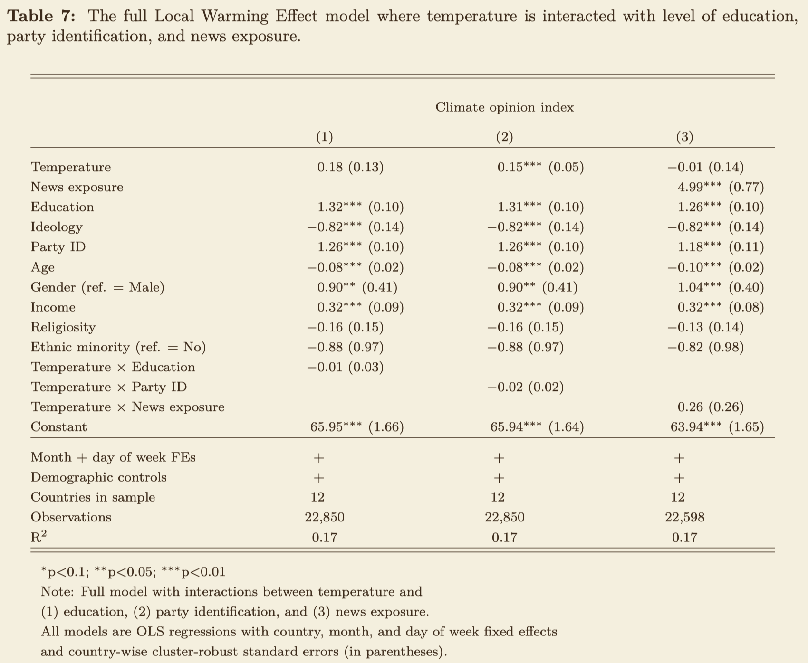
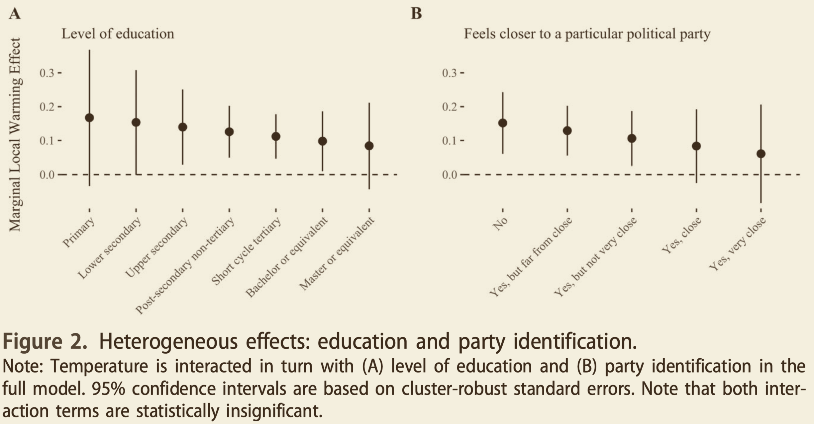

```{r, include=F}
pacman::p_load(tidyverse, knitr, ggdag, lubridate, kableExtra)

knitr::opts_chunk$set(echo = FALSE, 
                      fig.align = "center", 
                      fig.height=12,
                      cache = T)

Sys.setlocale(locale = "da_DK.UTF-8")
```

# Flytning af holdtime

- IP-eksamen d. 8. april
- Vi finder erstatningstime vha. poll i pausen

---

# Oversigt

```{r plan}

source("../print_plan.R")
print_plan(9)
```

---

# Recap fra sidste gang

- (Sproglige) repræsentationer er væsentlige for politik!

- Diskurser er (stabile og ustabile) strukturer, der organiserer og skaber mening og identitet via links og differentieringer - "*a system for the formation of statements*"

- I diskursanalyse bevæger vi os "metodisk" fra grundig nærlæsning af tekster til afdækning af diskurser og deres repræsentation af identiteter og politikker

- Vi mødte "Diana", hvis identitet (links og differentieringer) varierede markant afhængigt af det tidslige rum (i Uganda, på asylcentret i DK, efter mødet med LGBT Asylum i DK) og mellem de to tekster (debatindlæg og forvaltningsafgørelse)

---

# Dagens program og formål

**Dagens program**

1. Recap på ugens forelæsning om interaktion

2. Masser af tid til praktiske eksempler og øvelsesopgave

**Dagens formål**

- At forstå, hvad man bruger en **interaktionsmodel** til
- Hvilke typer spørgsmål hjælper den med at besvare?

- At lære, hvordan man **laver** en interaktionsmodel i Stata

- At træne os i at **fortolke** interaktionsmodeller pba. Stata output

- Side note: Timen hedder "og modelspecifikation", fordi interaktionsanalyse foretages ved at specificere sin regressionsmodel på en bestemt måde

---

# Pensum

- Kellstedt, P. M., Whitten, G. D. (2018). The Fundamentals of Political Science Research. 3rd edition. Cambridge University Press. Kapitel 11.3 

- Sønderskov, Kim Mannemar (2014). Stata – en praktisk introduktion (2. udg.). København: Hans Reitzels forlag. Kap. 10.

---

# Lidt indledende begrebsafklaring

**Interaktionsbegreber**

- **Interaktion**: *X interagerer med Z* i sin påvirkning af Y 

- **Moderering**: Effekten af X på Y *modereres af Z*

- **Betingede effekter**: Effekten af X på Y er betinget af (afhænger af) Z

- **Heterogene effekter**: Effekten af X på Y er *heterogen på tværs af Z* (de værdier Z antager - variationsbredden) ≠ homogen

De beskriver alle det samme: Vi undersøger X og Z's fælles indflydelse på Y (matematisk set multiplicerer vi de to variable, X og Z)

--

- Derudover en lille reminder om variables måleniveauer:
    - intervalskaleret ≈ kontinuert ≈ metrisk {1,2,3,4,5,6,7,8,9,10,...}
    - binær ≈ dikotom ≈ dummy {0,1}
    - kategorisk {"a","b","c"}

---

# Lidt indledende begrebsafklaring

**Kausalitet**

- Ordet **"effekt"** implicerer kausalitet &rarr; at en uafhængig variabel kausalt forårsager en ændring i en afhængig variabel.  

- Når vi snakker interaktion i dag bruger vi ordet "effekt" i flæng uden rigtigt at forholde os til, om kriterierne for kausalitet er opfyldt (ofte er de ikke). Mao. skyder vi spørgsmål om kausalitet lidt til hjørne og antager simpelthen at "**X påvirker Y**" - for bedre at kunne lære om interaktion.

- Vi vender tilbage til spørgsmålet om kausalitet senere. 

---

# Interaktion

```{r, echo=F, fig.width=12, fig.height=3.5, fig.align='center'}
coords <- tribble(
  ~name,     ~x,  ~y,
  "X",       0,   0,
  "Y",       1,   0,
  "Z",       0.5,  -0.25,
  "holder",   0.5, 0,
  "holder2",   0.5, 0.5,
  )

p1 <- dagify(Y~X,
             coords = coords) %>% 
  ggplot(aes(x = x, y = y, xend = xend, yend = yend)) + 
  geom_dag_point(data = function(x) filter(x, name != "holder|holder2"), size=20) +
  geom_dag_text(data = function(x) filter(x, name != "holder|holder2"), size=10) +
  geom_dag_edges(edge_width=2, arrow_directed = arrow(length = unit(0.5, "inches"))) + 
  theme_dag()

p2 <- dagify(Y~X,
             holder~Z,
             coords = coords) %>% 
  ggplot(aes(x = x, y = y, xend = xend, yend = yend)) + 
  geom_dag_point(data = function(x) filter(x, name != "holder"), size=20) +
  geom_dag_text(data = function(x) filter(x, name != "holder"), size=10) +
  geom_dag_edges(edge_width=2, arrow_directed = arrow(length = unit(0.5, "inches"))) + 
  theme_dag()

cowplot::plot_grid(p1, p2, greedy=F, labels = c("Simpel (additiv) model", "Interaktionsmodel"), 
                   align=c("hv"),
                   label_size = 20)
```

--

- Indtil videre har I lært (med lineær regression) at undersøge, hvordan en afhængig variabel (Y) påvirkes af en eller flere uafhængige variable (X). Dette kaldes en "**additiv model**"

--

- Men ofte afhænger effekten af X på Y af en tredjevariabel Z. Dette undersøges med en **interaktiv model**
    - Eksempel: Corona-udbetalte feriepenge (X) øger fattige personers (Z = fattig) privatforbrug (Y), men påvirker ikke rige personers (Z = rig) forbrug (Y)
    - Så siger man, at formue (Z) **modererer** effekten af X &rarr; Y
    - Og der er **heterogene effekter** i den forstand, at X påvirker Y forskelligt afhængigt af Z (ikke kun én homogen effekt)

---

# Additive modeller

- En lineær regressionsmodel uden interaktion kaldes en "additiv model", fordi de uafhængige variables indflydelse blot lægges sammen (+) for at forklare den afhængige variabel: 

> $Y = \alpha + \beta_1 X_1 + \beta_2 X_2 + ... + \beta_k X_k + \epsilon$

--

- Det antages, at effekten af X på Y er konstant (effekten af $X_1$ er $\beta_1$) uanset hvilke værdier de øvrige uafhængige variable i modellen har

--

- Med andre ord estimeres en **gennemsnitseffekt** af X for alle enheder, f.eks. den gennemsnitlige effekt af feriepenge (X) på privatforbrug (Y) på tværs af rige og fattige (Z)

---

# Additive modeller

Hvis vi har en model med to uafhængige variable, X og Z, kan den additive model se således ud:

.pull-left[

$Y = \alpha + \beta_1 X + \beta_2 Z + \epsilon$

- Vi har kontrolleret for Z, hvilket gør, at Y *ikke* er det samme i alle Z-grupper (pga. $\beta_2$ ), men 

- **effekten af X på Y** (dvs. $\beta_1$ &rarr; hældningen!) **er den samme for begge grupper**, dvs. en gennemsnitseffekt

]

.pull-right[

```{r, fig.height = 5}
a <- tibble(X=0:10, Y=0:10*2, Z="A") 
b <- tibble(X=0:10, Y=0:10*2+10, Z="B") 
ggplot(data=bind_rows(a,b), aes(x=X, y=Y, color=Z)) +
  geom_line() +
  scale_color_grey() +
  ggthemes::theme_stata()
```
]

---

# Interaktive modeller

> "Interaktion refererer til en situation, hvor størrelsen på effekten af en variabel [X] på en anden variabel [Y] afhænger af en tredje variabel [Z] ... Z modererer eller betinger X’s effekt, og at X og Z interagerer" .right[-tilpasset fra Sønderskov (2014), s. 233]

--

**Hvorfor interaktion?**

- Når effekten af X interagerer med en tredjevariabel Z, kan det være misvisende at se på gennemsnitlige effekter (dvs. lave alm. lineær regression uden interaktion &rarr; additiv model)

--

- Derudover gør interaktionsanalyse os i stand til at besvare andre typer spørgsmål/hypoteser:
    - modererer Z mon X &rarr; Y?
    - afhænger X &rarr; Y af Z?
    - er X's påvirkning af Y forskellig for forskellige niveauer af Z?

---

# Matematikken

**Tre variable X, Y og Z** &rarr; vi kan bruge eksemplet med feriepenge (X), forbrug (Y) og formue (Z)

Type | Model
---|---
Additiv model     | $Y = \alpha + \beta_1 X + \beta_2 Z$
Interaktionsmodel | $Y = \alpha + \beta_1 X + \beta_2 Z + \beta_3 X Z$

--

- **Hvad er forskellen?**

- Hvad er konstituerende led (hovedled) og hvad er interaktionsled?

- Vi kommer tilbage til fortolkning om lidt.

---

# Varierende hældning = varierende effekt

.pull-left[

- Hældningen for de to grupper varierer:
    - Hældningen for Z = "A" er 2
    - Hældningen for Z = "B" er 0.5 

- Hældningen for Z = "B" kan også udtrykkes som forskellen fra A, dvs. *-1.5* (*0.5-2=-1.5*) &rarr; det er sådan Stata præsenterer interaktionseffekten for os

- I Stata tester vi, om der statistisk signifikant forskel på hældningerne 2 og 0.5 &rarr; om differencen (*-1.5*) er signifikant forskellig fra nul]

.pull-right[
```{r, fig.height=5}
a <- tibble(X=0:10, Y=0:10*2, Z="A") 
b <- tibble(X=0:10, Y=0:10*0.5+5, Z="B") 
ggplot(data=bind_rows(a,b), aes(x=X, y=Y, color=Z)) +
  geom_line() +
  scale_color_grey() +
  ggthemes::theme_stata() 
```
]

--


---
class: title-slide, center, middle

# Hvordan laver man interaktion i Stata?

---

# Hvordan laver man interaktion i Stata?

Interaktive modeller implementeres nemt i Stata i form af en mindre tilføjelse til den lineære regression.

--

Interaktion mellem to uafhængige variable specificeres ved hjælp **#** a la: 

> *regress y c.x i.z c.x#i.z*

... hvilket vi ofte forkorter til:

> __*regress y c.x##i.z*__

- I eksemplet er x kontinuert (derfor "c.") og z er kategorisk (derfor "i.")

- Når man bruger **##** i stedet for **#** inkluderer Stata automatisk de konstitutive led (hovedleddene), dvs. *c.x* og *i.z*, foruden interaktionsleddet (andenordensleddet) *c.x#i.z*.

---

# Hvordan laver man interaktion i Stata?

Når man laver interaktion er det særligt vigtigt at være opmærksom på - og specificere! - variablenes måleniveauer:

- Kategorisk variabel eller dummy: *i.variabelnavn*
- Kontinuert (intervalskaleret) variabel: *c.variabelnavn*

--

Det giver altså:

- Når X er kontinuert og Z er kategorisk/binær: **reg y c.x##i.z**
- Når både X og Z er kontinuert: **reg y c.x##c.z**
- Når både X og Z er kategorisk/binær: **reg y i.x##i.z**

--

- Måleniveauerne er også afgørende for fortolkningen &rarr; det ser vi i øvelsesopgaverne om lidt

---

# Hvorfor ## og ikke bare # i Stata?

Som sagt giver *x##z* os automatisk både hovedleddene og interaktionsleddene i regressionen.

--

Men hvorfor ikke bare køre med # (uden hovedled)?

Fordi det i mange tilfælde (afhængigt af måleniveau) implicit antager at begge hovedled er lig med 0, hvilket: 

- kan medføre et biased estimat af interaktionen, 
- med sikkerhed medfører forvirring og en anden tolkning, og 
- sjældent er brugbart.

--

**Derfor &rarr; inkluder hovedled og brug ##**

---

# Fortolkning af interaktionsleddet

Når vi fortolker et regressionsoutput med interaktion et det væsentlige at fortolke koefficienten for interaktionsleddet:

- **Fortegn**: Retning som effekten ændrer sig, når den modererende variabel (Z) ændres med +1 &rarr; bliver effekten (X &rarr; Y) *større eller mindre*, når Z vokser?

- **Størrelse**: Hvor meget effekten ændrer sig, når den moderende variabel ændres med +1 &rarr; *hvor meget* ændrer effekten (X &rarr; Y) sig, når Z vokser?

--

- **Beta-koefficienten for X-hovedleddet** fortæller os, hvordan X påvirker Y, når $Z = 0$ &rarr; "udgangspunktet" for effekten. 
    - Det er en *marginal effekt*. 
    - Bemærk at koefficienterne for de konstituerende led ikke altid har en meningsfuld tolkning &rarr; Stata og *margins* hjælper os om lidt.

--

- **Beta-koefficienten for interaktionsleddet** lægges til hovedleddets koefficient (eller trækkes fra) for at få de *marginale effekter* af X på Y for andre niveauer af Z end nul:

---

# Fortolkning af interaktionsleddet

**Den konkrete fortolkning afhænger af variablenes måleniveau:**

- Hvis Z er **kontinuert**: *Hvor meget vokser effektstørrelsen, når Z vokser med +1?*

- Hvis Z er **binær**: *Hvad er forskellen i effektstørrelse mellem de to Z-grupper?*

- Hvis Z er **kategorisk** med mere end to kategorier: 
    - Stata indsætter automatisk en serie af (antal kategorier - 1) binære variable, som sammenligner hvert niveau af Z med det laveste niveau af Z (referencekategorien). 
    - Interaktions-koefficienterne giver her forskellene i effektstørrelse mellem Z-gruppe 1 og 2, Z-gruppe 1 og 3, Z-gruppe 1 og 4, osv.

- Vi øver det lige om lidt!

???

$Y_i = \beta_0 + \beta_1 X_{i} + \beta_2 Z_{i} + \beta_3 X_i Z_i +\epsilon_i$

---

# Marginale effekter

- Når vi beregner effekten af X &rarr; Y for forskellige niveauer af Z, taler vi om marginale effekter.

--

- Beregnes i Stata, efter vi har kørt regressionen, ved hjælp af *margins*. Den mest anvendelige kommando er:

> margins, dydx(x) at(z = (1 2 3 4 5 6 7 8 9 10)) 

... hvor X er vores kausale variabel, Z er vores modererende tredjevariabel og tallene 1-10 er de niveauer af Z, som vi ønsker at beregne den **marginale effekt** (af X &rarr; Y) for. 

--

- (Vær varsom med at *ekstrapolere*, dvs. beregne effekten for subjekter, som ikke findes i data eller måske overhovedet, fx en person med negativ alder)

--

Det hjælper ofte at visualisere de marginale effekter. Det gør ved at køre *marginsplot* umiddelbart efter *margins*.

---

# Eksempler

Problemstillingen og hypotesen er afgørende!

1. Modererer kvaliteten af statslige institutioner (Z) ulandsbistands (X) effekt på økonomisk vækst (Y)? (Sønderskov, 2014: 234ff)

2. Carolins eksempel: Does the effect of national identification (X) on political trust (Y1) and participation (Y2) differ between natives and immigrants (Z)?

3. **Min egen forskning: Temperaturer (X) påvirker klimaholdninger (Y), men afhænger effekten af (1) uddannelsesniveau, (2) partitilhørsforhold eller (3) nyhedsforbrug? &rarr;**

???

Damsbo-Svendsen, S. (2020). How weather experiences strengthen climate opinions in Europe. *West European Politics*.

---

## Temperaturer (X) påvirker klimaholdninger (Y), men afhænger effekten af (Z1) uddannelsesniveau, (Z2) partitilhørsforhold eller (Z3) nyhedsforbrug?

```{r, out.width="63%"}

```

???

Damsbo-Svendsen, S. (2020). How weather experiences strengthen climate opinions in Europe. *West European Politics*.

---

## Marginale effekter

```{r, out.width="63%"}

```

--

- "Figure 2(A) illustrates marginal effects for each education level. The trend is downward sloping, but the interaction term is indistinguishable from zero. The evidence therefore suggests that temperatures affect everyone equally regardless of education level."

--

- "Figure 2(B) shows that marginal effects are stronger for people who do not identify with a party, but this interaction term, too, is statistically insignificant meaning that the evidence of party identification as a moderating factor is also very weak." 

???

Damsbo-Svendsen, S. (2020). How weather experiences strengthen climate opinions in Europe. *West European Politics*.

---
class: title-slide, center, middle

# Øvelsesopgaver og Stata-eksempler

---

# Øvelsesopgaver

- Lad os tage et par opgaver ad gangen i break-out rooms (ca. 10 min. per to opgaver)?

- Tanken er, at I selv sidder i Stata og laver opgaverne

- Jeg laver også opgaverne i Stata (I får do-file med svar efter timen) og så fortolker vi sammen 

- Vi snakker om: 

    - (*Kort*) hvad de rigtige kommandoer er

    - (*Vigtigst*) hvordan resultaterne fortolkes &rarr; hvad svaret er på spørgsmålene
    
***

- Link til **slides**: http://kortlink.dk/2acdr
- Link til **data** (*states.dta* på Absalon): https://absalon.ku.dk/files/4521284/download?download_frd=1  
- Link til "tom" **do-fil** med spørgsmål: http://kortlink.dk/2aphr

---

# Spørgsmål 1-3

1. I skal undersøge om urbanisering (urban - procent andel af mennesker, der bor i byområder) har en indflydelse på antallet af restriktioner af lovlig abort (abortlaw2017), når der kontrolleres for befolkningens gennemsnitlige støtte til homoseksuelle rettigheder (gay_support) og hvorvidt det er en sydlig stat ’Southern State’ (south). Før I gør det, skal I reflektere hvad jeres analyseenhed er og undersøge variablenes måleniveau (fx med codebook). Fortolk regressionsresultatet af modellen.

2. Undersøg dernæst vha. en interaktionsmodel om stemmeandelen til Trump i 2016 (trump16) modererer effekten af urbanisering i modellen fra opgave 4.1. Husk at der enten skal stå i. eller c. foran de variable som interageres. Fortolk resultatet. Illustrér interaktionen mellem Trump-stemmeandel og urbanisering vha. marginale effekter (jf. Sønderskov afsnit 10.1.17).

3. Sønderskov (2014) kommenterer, at der i modeller med interaktion ofte vil være multikollinearitet. Diskutér, hvorfor det er tilfældet og undersøg, hvorvidt det også gælder i modellen 4.2. Derudover anbefaler Sønderskov at anvende robuste standardfejl i modeller med interaktionsled. Ændrer der på resultaterne i ovenstående [4.2]?

---

# Spørgsmål 4-7

4. Undersøg dernæst, om der er forskel i effekten af befolkningens gennemsnitlige støtte til homoseksuelle rettigheder (gay_support) mellem Sydstaterne og andre stater. Lav en interaktionsmodel med interaktion mellem gay_support og south. Fortolk resultatet.

5. Undersøg dernæst, om der er forskel i effekten af tidsbegrænsninger for lovgiver mellem Sydstaterne og andre stater. Lav en interaktionsmodel med interaktion mellem term_limits og south. Fortolk resultatet og illustrér interaktionen vha. marginale effekter.

6. Undersøg dernæst, om der er forskel i effekten af urbanisering mellem graden af sekularisme (secularism3). Lav en interaktionsmodel med interaktion mellem urban og secularism3. Fortolk resultatet.

7. Diskuter i hvilken grad de forskellige kriterierne for kausalitet er overholdt i disse analyser.

---

# En sidste vigtig pointe

Valget af uafhængig (X) og modererende (Z) variabel er et teoretisk valg - et spørgsmål om synsvinkel

Hvorfor? (hint: $\beta_1 * X * Z = \beta_1 * Z * X$)

--

Matematisk set er interaktionen symmetrisk (Stata skelner ikke mellem X * Z og Z * X):

- Interaktionsleddet fortæller, hvordan X &rarr; Y er forskellig afhængigt af Z
- Men også hvordan Z &rarr; Y afhænger af X
- Det er op til os (vores argument, problemformulering, forskningsdesign, hypotese), hvordan vi fortolker og præsenterer resultaterne
- Det er dog meget sjældent i praksis, at begge har en kausal fortolkning (det kræver meget af vores forskningsdesign)

Summa summarum:

Standard practice og hjælp til sig selv at anse den ene som kausal faktor (X) og den anden for tredjevariabel (Z). Fokus på én påstået kausaleffekt (X &rarr; Y), som potentialt afhænger af Z (på en ikke-kausal måde).

---

# Opsummering

- Interaktionsmodeller er fede, da der kan gemme sig rigtig meget information i interakive modeller

- Men man skal ofte holde tungen lige i munden, når man fortolker interaktionseffekter/moderation/marginale effekter

- Kan kaste lys, over hvordan en effekt varierer på tværs af forskellige typer subjekter (med forskellig Z)

- Kan også mere teoretisk fortælle, om en tredjevariabel Z modererer en effekt af X på Y

- Nuancerer kausale påstande, men "prisen" er en mere kompliceret model, der er sværere at tolke (og større risiko for *p-hacking*)

---

# Næste gang

- **Logistisk regression (logit)**

- En ikke-lineær generalisering af OLS (lineær regression), som bruges, når den *afhængige variabel* er binær 
    - 0/1, ja/nej, succes/fiasko

- En række fordele ift. OLS, når outcome er binært - men også ulemper

---

# Tak for i dag!
