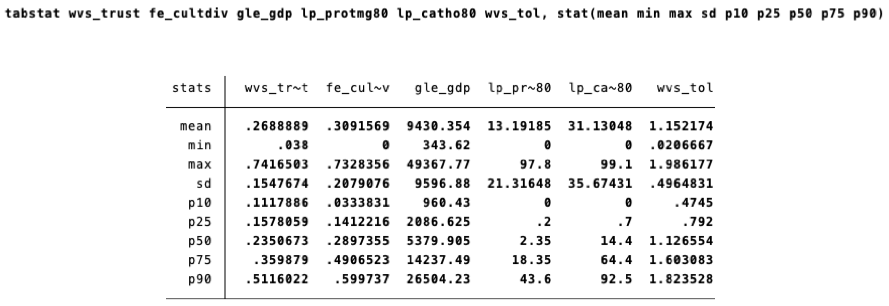
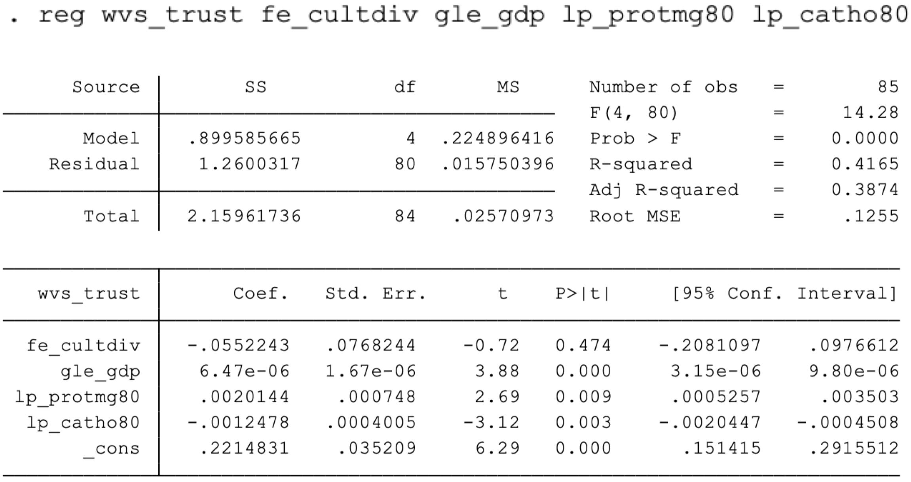
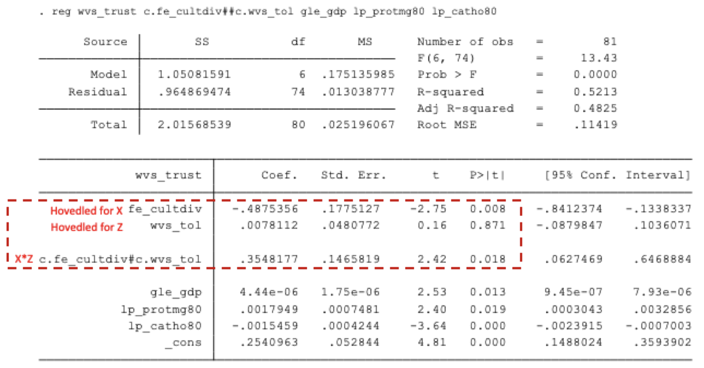
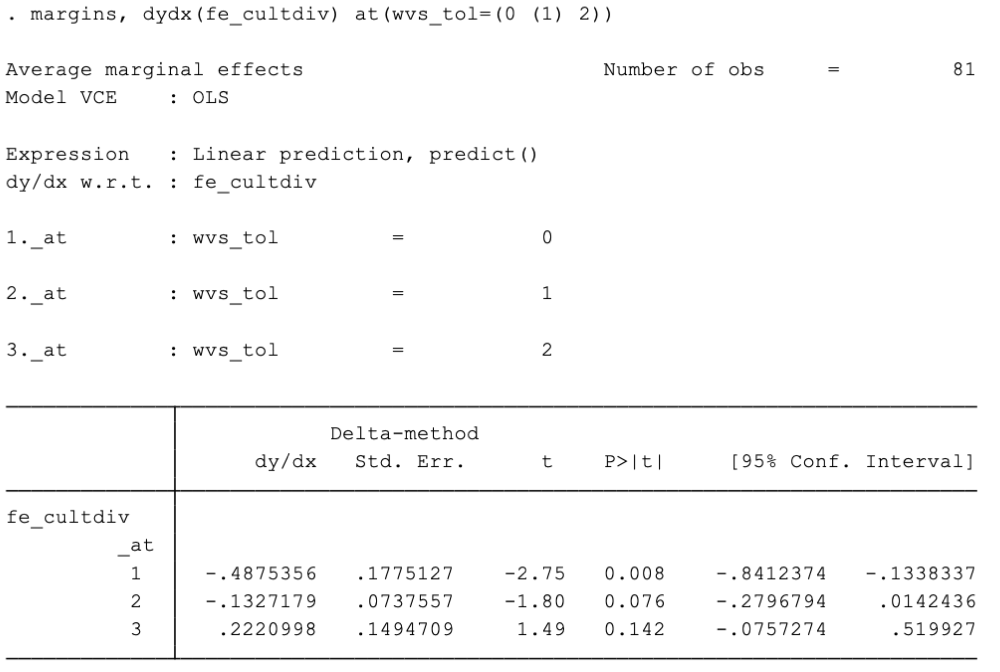
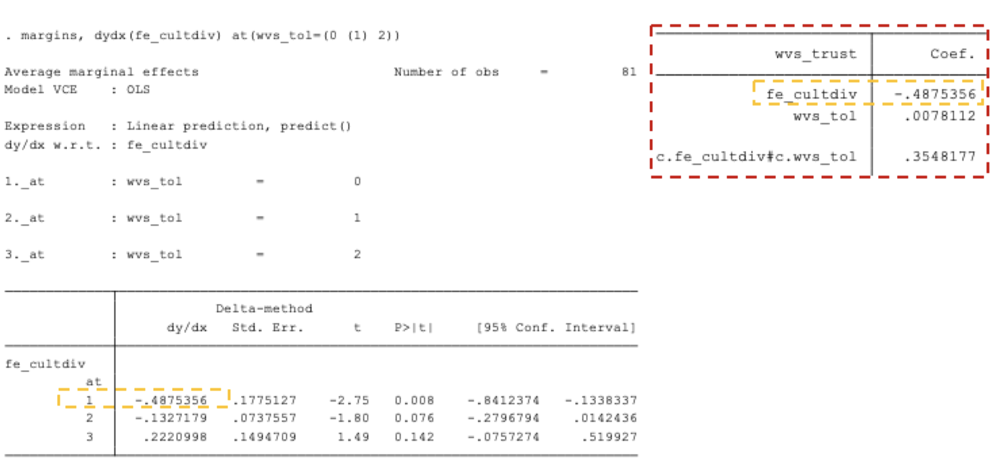
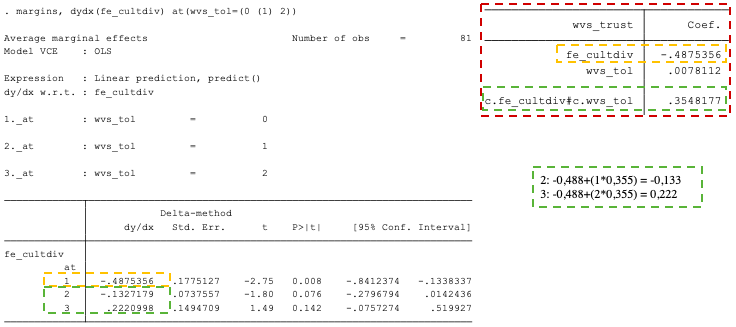
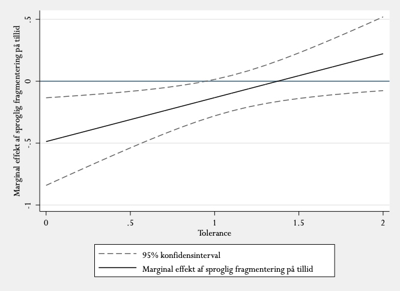
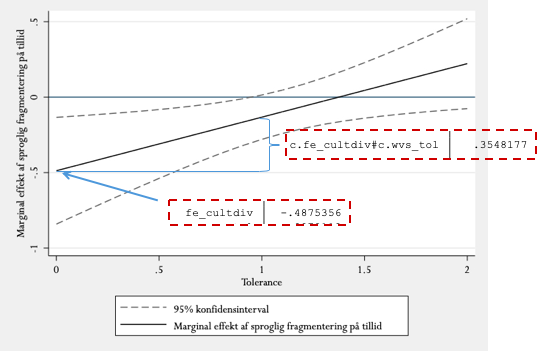
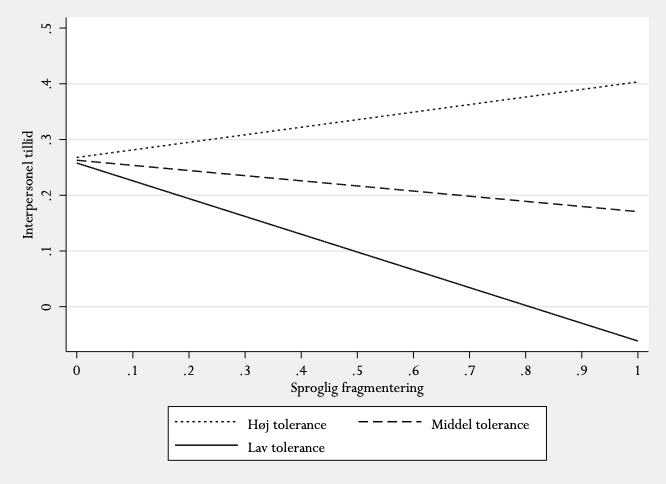
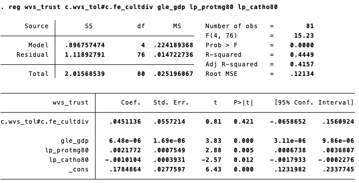

```{r, include=F}
uge_nr <- 9

pacman::p_load(tidyverse, knitr, ggdag, lubridate, kableExtra)

knitr::opts_chunk$set(echo = FALSE, 
                      fig.align = "center", 
                      fig.height=12)

Sys.setlocale(locale = "da_DK.UTF-8")
```

# Overblik

```{r plan}

start_date <- ymd("2021-02-11")
a_dates <- start_date+7*0:14
b_dates <- (start_date+1)+7*0:14

tibble(Uge = 6:20, 
       `Dato (holdtimer)` = tolower(paste0(day(a_dates),
                                           "-", 
                                           day(b_dates),
                                           " ", 
                                           format(a_dates, "%B %Y"))), 
       Emne = c("Kvantitativ indholdsanalyse",
                "Diskursanalyse I",
                "Diskursanalyse II",
                "Interaktioner og modelspecifikation",
                "Logistisk regression",
                "Multilevel analyse",
                "Kausal inferens I: Designbaseret inferens",
                "Kausal inferens II: Paneldata",
                "Påskeferie",
                "Kausal inferens III: Eksperimentelle designs",
                "Kausal inferens IIII: Regression Discontinuity (RD)",
                "Social Data Science: Big Data",
                "Process tracing",
                "Kriterier for god videnskab",
                "Opsamling/spørgetime"), 
       `Øvelsesopgave` = c(1:8, "", 9:14)) %>%
  mutate(`Dato (holdtimer)` = ifelse(Uge %in% c(6,7,12,14,16,17,19,20), "", `Dato (holdtimer)`)) %>% 
  kable("html", 
        align = c("c", "c", "l", "c"),
        escape = F,
        table.attr = "style=\"line-height: 100%;\"") %>% 
  kable_styling(font_size = 16,
                bootstrap_options = c("striped", "hover", "condensed", "responsive")) %>% 
  row_spec(9, bold = F, color = "grey") %>% 
  row_spec(uge_nr-5, bold = T, color = "white", background = "#8b2325")
```

---

# Recap fra sidste gang

---

# Dagens program

---

# Dagens formål

- At forstå, hvordan man laver og fortolker en interaktionsmodel (i Stata)

---

# Pensum

- Kellstedt, P. M., Whitten, G. D. (2018). The Fundamentals of Political Science Research. 3rd edition. Cambridge University Press. Kapitel 11.3 

- Sønderskov, Kim Mannemar (2014). Stata – en praktisk introduktion (2. udg.). København: Hans Reitzels forlag. Kap. 10

---

# Vigtige begreber

**Parameter**

- Værdien i populationen - den sande værdi

- Den værdi, som vi er interesserede i.

**Estimat** (parameterestimat)

- Vores bedste bud på en parameter - en værdi i populationen.

- Baseret på vores data/stikprøve.

**Estimator**

- En statistik, der estimerer en parameter

- Den fremgangsmåde der skaber et estimat (t-test, pr-test, OLS)

---

# Statistiske modeller - en metapointe

"*All models are wrong, but some are useful*" – George E.P. Box

I statistisk arbejde, er det vigtige spørgsmål ikke, hvorvidt en model beskriver hele virkeligheden.

- Uanset metode kan vi aldrig indfange hele virkeligheden.

- Verden er alt alt for kompleks til, at kunne beskrives som den i sandhed er.

- Ideal: Less is more

Det vigtige spørgsmål vedrører, hvorvidt modellen er oplysende og brugbar.

- Kaster den nyt lys over mønstre, som vi observerer ude i virkeligheden?

En metapointe i dag er: Interaktionen kan kaste nyt lys på vores observationer af virkeligheden - prisen er at modellen bliver mindre simpel. Er det godt eller dårligt?

- It depends

---

# I dag skal vi snakke om interaktion

- Indtil videre har I lært at undersøge gennemsnitlige effekter – hvordan Y i ’s gennemsnit afhænger af værdien på X i . Såkaldt additive modeller

- Men når effekten af X på Y afhænger af en tredjevariabel Z kan de gennemsnitlige effekter blive misvisende.

- Her vil en interaktion være den korrekte modelspecifikation. Altså en interaktiv model.

Sønderskov skriver på side 233:

- ”*Interaktion refererer til en situation, hvor størrelsen på effekten af en variabel (fx X) på en anden variabel fx(Y) afhænger af en tredje variabel (fx Z). I sådanne tilfælde taler man om, at Z modererer eller betinger X’s effekt, og at X og Z interagerer.*”

- (Der står faktisk X2 og ikke Z i bogen, men jeg har ændret det for pædagogikens skyld.)

---

# Lidt begrebsafklaring

Der findes en del begreber, som dækker over dagens tema:

- Interaktion: X interagere med Z

- Moderering: X’s effekt på Y modereres af Z.

- Betingede effekter: Effektstørrelsen af X på Y er betinget af Z

- Heterogene treatment effekter: Effekten af X på Y er heterogen på tværs af Z’s variationsbredde

Summa summarum: Alle beskriver det samme statistiske forhold - vi har multipliceret to variable, X og Z.

```{r, echo=F, fig.height=4, fig.width=8}
coords <- tribble(
  ~name,     ~x,  ~y,
  "X",       0,   0,
  "Y",      1,   0,
  "Z",       0.5,  -0.5,
  "holder",   0.5, 0)

dagify(Y~X,
       holder~Z,
       coords = coords) %>% 
  ggplot(aes(x = x, y = y, xend = xend, yend = yend)) + 
    geom_dag_point(data = function(x) filter(x, name != "holder")) +
    geom_dag_text(data = function(x) filter(x, name != "holder")) +
    geom_dag_edges() + 
    theme_dag()
```

---

# Additive modeller (I)

- Indtil nu har vi arbejdet med såkaldt additive modeller, hvor det antages, at effekten af X på Y (b’erne) er konstant for alle værdier af de øvrige uafhængige variable i modellen.

- Vi har således estimeret en gennemsnitseffekt af X for alle enheder.

```{r}
a <- tibble(X=0:12, Y=0:12*2, Z="1") 
b <- tibble(X=0:12, Y=0:12*2+10, Z="2") 
qplot(X, Y, data=bind_rows(a,b), geom="line", color=Z)
```

Hældningerne er ens – det betyder, at effekterne er de samme for begge grupper (Z)

---

# Additive modeller (II)

En bivariat model: $Y_i = ß_0 + ß_1*X_{i1} + \epsilon_i$

En multivariat model: $Y_i = ß_0 + ß_1*X_{i1} + ß_2*X_{i2} + ß_3*X_{i3} + ... + \epsilon_i$

- Hvad udtrykker alle disse led?

- Hvad er forskellen på den bivariate og den multivariate model? 

---

# Øvelsesopgave 7.1 (I)

Her bliver I bedt om at estimere en additiv model - som I lærte på metode 2.

Quality of Government-datasættet (QoG) X: sproglig fragmentering (fe_cultdiv) Y: gennemsnitlige tillid til andre mennesker (wvs trust) Kontrol:

- BNP (gle_gdp)

- Andelen af protestanter (lp_protmg80)

- Andelen af katolikker (lp_catho80).

$Tillid_i = ß_0 + ß_1 Fragmentering_i + ß2 BNP_i + ß3 Protestanter_i + ß4 Katolikker + \epsilon_i$

---

# Øvelsesopgave 7.1 (II)

Lad os kigge på variablene først:

```{r}

```

Sproglig fragmentering (fe_cultdiv): skala fra 0-1, hvor 1 = høj fragmentering Gennemsnitlige tillid til andre mennesker (wvs_trust): skala fra 0-1, hvor 1 = høj tillid

---

# Øvelsesopgave 7.1 (III)

```{r}

```

Fortolk outputtet:

- Er der en sammenhæng mellem sproglig fragmentering og tillid?

- Hvad kan vi sige om den samlede model? ($R^2$ , $R^2$ , F-statistik)

??? Svar: 

---

# Den interaktive model

I denne interaktive model er der tre variable, X, Y og Z:

$Y_i = ß_0 + ß_1 X_{i} + ß_2 Z_{i} + ß_3 X_i Z_i +\epsilon_i$

Interaktionsled:

- $ß_3 X_i Z_i$

- $ß_3$ er den gennemsnitlige interaktionseffekt! Altså hvordan X’s effekt på Y i gennemsnit ændres af Z.

Konstituerende led (også kaldet hovedled):

- $ß_1 Xi$

- $ß_2 Zi$

Koefficienten, f.eks. β 1 for et konstituerende led, X i , vil udtrykke variablens effekt på Y i , når det andet konstituerende led, Z i holdes på (er lig med) 0. Bemærk det er langt fra altid, at de konstituerende led har en meningsfuld tolkning!

---

# Den interaktive model

## Varierende hældning = varierende effekt (afhængigt af Z)

```{r}
a <- tibble(X=0:12, Y=0:12*2, Z="1") 
b <- tibble(X=0:12, Y=(0:12*2)*0.25+10, Z="2") 
qplot(X, Y, data=bind_rows(a,b), geom="line", color=Z)
```

---

# Interaktionsleddet

$Y_i = ß_0 + ß_1 X_{i} + ß_2 Z_{i} + ß_3 X_i Z_i +\epsilon_i$

Koefficienten/estimatet for interaktionsleddet:

- Fortegn: Retning som effekten ændrer sig, når den modererende variabel ændres med +1

- Størrelse: Hvor meget effekten ændrer sig, når den moderende variabel ændres med +1.

Når vi estimerer skal vi blot lægge interaktionsleddet til eller fra vores hovedled. Med metriske variable:

- Interaktionsleddet er den gennemsnitlige interaktion. Altså om Z i gennemsnit modererer X’s effet på Y.

- Dvs: Der kan givetvis være niveauer på Z moderationen ikke er signifikant!

---

# Interaktionsmodellen i Stata

Interaktive modeller implementeres nemt i Stata.

Ønsker vi at interagerer to variable, f.eks. X i og Z i , tilføjer vi blot X##Z til vores regressions-kommando.

Og i den forbindelse skal vi huske:

Man skal (som regel) angive måleniveauet for X i og Z i , så Stata ved hvordan de to variable skal behandles.

- Kategorisk/dummy variabel: i.variabelnavn

- Kontinuert (intervalskaleret): c.variabelnavn

Eksempler:

Når X er kategorisk og Z er kategorisk: **reg y i.x##i.z**
Når X er kategorisk og Z er kontinuert: **reg y i.x##c.z**

# Øvelsesopgave 7.2 (I)

Undersøg dernæst vha. en interaktionsmodel om befolkningens toleranceniveau (wvs tol) modererer effekten af sproglig fragmentering. Fortolk resultatet. . wvs tol går på en kontinuert skala fra 0 - 2 hvor 2 er meget tolerant.

$Tillid_i = ß_0 + ß_1 Fragmentering_i + ß2 BNP_i + ß3 Protestanter_i + ß4 Katolikker + ß5 Tolerance_i + ß6 Fragmentering_i * Tolerance_i + \epsilon_i$

```{r, echo=F, fig.height=4, fig.width=8}
coords <- tribble(
  ~name,     ~x,  ~y, ~label,
  "X",       0,   0, "Sproglig\nfragmentering",
  "Y",      1,   0,  "Tillid",
  "Z",       0.5,  -0.5, "Tolerance",
  "holder",   0.5, 0.0, "")

dagify(Y~X,
       holder~Z,
       coords = coords) %>% 
  ggplot(aes(x = x, y = y, xend = xend, yend = yend)) + 
    geom_dag_point(data = function(x) filter(x, name != "holder")) +
    geom_dag_text(data = function(x) filter(x, name != "holder")) +
    geom_dag_label_repel(aes(label=coords$label), size=7) +
    geom_dag_edges() + 
    theme_dag()
```

---

# Øvelsesopgave 7.2 (II)

```{r}

```

- Er der en interaktion?
- Hvad er koefficienten for sproglig fragmentering (X), når tolerance er 0? 
- Hvad er interaktionsleddets koefficient? Altså ændringen for X, når Z stiger?

---

# Øvelsesopgave 7.2 (III)

Her er et margins output, som estimerer sproglig fragmenterings effekt på tillid, når tolerance er hhv. 0, 1 og 2.

```{r}

```

---

# Øvelsesopgave 7.2 (IV)

Kan I genkende nogle tal fra før?

```{r}

```

---

# Øvelsesopgave 7.2 (V)

```{r}

```

---

# Øvelsesopgave 7.3 (I)

Lad os visualisere! (altid en god idé med interaktioner). Men først denne:

```{r}

```

---

# Øvelsesopgave 7.3 (II)

```{r}

```

---

# Øvelsesopgave 7.3 (III)

```{r}

```

---

# Øvelsesopgave 7.3 (IV)

Alternativt plot, hvor Y-aksen igen udtrykker værdien for Y - som vi er vant til. Nu har vi sammenhængen, men for tre forskellige niveauer af tolerance: 10. percentil, median og 90. percentil.

```{r}

```

---

# Øvelsesopgave 7.4

**Kausalitet?**

Tænk over det. Har vi belæg for at sige, at X forårsager Y? 

--

I hvilken grad er kriterierne for kausalitet overholdt?

1. Empirisk sammenhæng (samvariation)

2. Teoretisk sammenhæng

3. Tidslig rækkefølge

4. Fravær af spuriøsitet

---

# En statistisk pointe

Valget mellem uafhængig ( $X_i$ ) og modererende ( $Z_i$ ) variabel er teoretiske valg -- et spørgsmål om synsvinkel. I ikke-eksperimentelle situationer kan vi ikke skelne empirisk mellem de to.

- Hvorfor?

---

# Hvorfor ## og ikke # i Stata? 

Fordi ## automatisk giver os hovedleddene OG interaktionsleddene.

Hovedleddene giver os koefficienterne for, hvordan X hhv. Z påvirker Y, når den anden variabel er holdt på 0. Interaktionsleddets koefficient kan vi lægge til eller trække fra hovedleddenes koefficienter. Så hvorfor ikke bare køre med #?

Fordi det netop udelader hovedleddene. I den forbindelse vil vi komme til at antage, at:

- Begge hovedled er præcis 0

- ... og dette er tilmed estimeret uden statistisk usikkerhed!

Bl.a. fordi hovedleddene nærmest pr. definition er korreleret med interaktionsleddet, betyder det noget for estimatet af interaktionsleddet. Det betyder, at vi meget ofte vil få et biased interaktionsestimat, hvis man kun bruger #.

---

# Hvorfor ## og ikke # i Stata? 

```{r}

```

---

# Opsummering

Interaktive-modeller er fede, men også svære. Der kan gemme sig rigtig meget information i interakive modeller.

- Kaster lys over hvordan effekten varierer på tværs af subjekter eller:

- Ultimativt hvordan en tredjevariabel Z, modererer X’s effekt på Y. 

I sidste ende kan interaktive modeller dog:

- Nuancere kausale påstande - ”prisen” er selvfølgeligt en mere kompliceret model som er sværere at tolke (og større risiko for *p-hacking*).

- Give en bedre idé om den kausale mekanismen

---

# Næste gang

- Logistisk regression (logit) En ikke-lineær generalisering af OLS, hvor den afhængige variabel er binær – 0 eller 1.

- Tager højde for ‘gulv’- og ‘loft’- effekter – dvs. det faktum, at der skal mere til for at score 1, hvis sandsynligheden allerede er høj.

- En række fordele ift. at bruge OLS på binære variable – men også ulemper.

---

# Tak for i dag!
