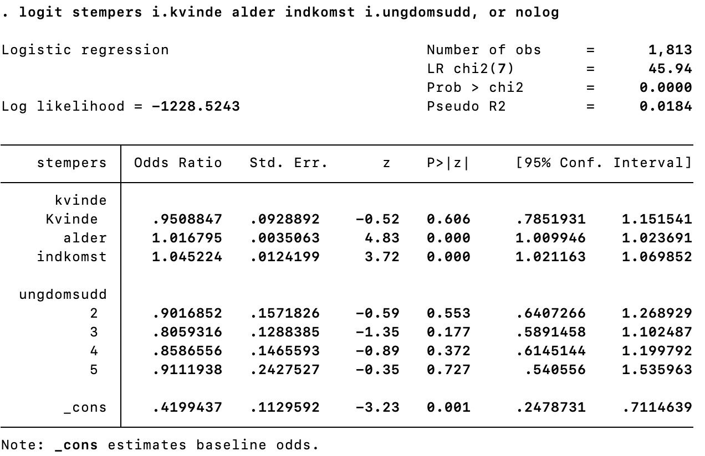

```{r, include=F}
pacman::p_load(tidyverse, knitr, ggdag, lubridate, kableExtra)

knitr::opts_chunk$set(echo = FALSE, 
                      fig.align = "center", 
                      fig.height=12,
                      cache = TRUE)

Sys.setlocale(locale = "da_DK.UTF-8")
```

# Oversigt

```{r plan}

source("../print_plan.R")
print_plan(10)
```

---

# Recap fra sidste gang

- Interaktion er, når effekten af X på Y afhænger af, hvilket niveau Z har        
    - X og Z interagerer; Z modererer X &rarr; Y

- Super smart redskab til at få flere nuancer og mere teoretisk dybde frem i sin analyse

- Eksempel i Stata: **reg y c.x##i.z**

- Interaktionsleddet er *forskellen i effekt* eller *noget ekstra, der lægges til effekten*

- Marginale effekter er de *forskellige effekter, X har på Y* for hvert af de respektive niveauer af Z: 
    - **margins, dydx(x) at(z = (1 2 3 4 5))** &rarr; **marginsplot**

---

# Dagens program

1. Eksamensopgaven

2. Logistisk regression
    - Baggrund
    - OLS vs. logistisk regression
    - Fortolkning/præsentation

3. Øvelsesopgaver undervejs - med/uden break-out

---
background-image: url("media/eksamensnotat.png")
background-size: cover

# Eksamensnotat

---

# Eksamen I

- Læs eksamensnotatet på Absalon

- Omfang (typeenheder): 19.200 for én studerende, 24.000 for to studerende, 28.800 for tre studerende
    
- Kraftig anbefaling: skriv sammen i **grupper** (2-3)

- Eksempler på opgaver kommer på Absalon før påske
    - inspiration, ikke en skabelon

- Aflevering **7. juni 2021** (kl. ??)

- Brug **mindst én metode** fra faget og perspektivér til mindst én anden
    - flere metoder ≠ bedre opgave

---

# Eksamen II

- "*analyse af en selvstændigt formuleret problemstilling*" &rarr; vigtigt! 
    - find et substantielt spørgsmål - og en metode - der interesserer jer
    - nogle gange kan det også hjælpe at starte med at finde data/materiale

- Tre gode muligheder fra eksamensnotatet:
    - egen undersøgelse (nyt - mindre skala)
    - arbejd videre med tidligere projekt (fx metode 2-survey data) 
    - replikation/kritisk diskussion af eksisterende undersøgelser (smart!) - skal *anvende* metoderne

**Vejledning**

- Ca. 15 min. per gruppe ad to omgange
- På Zoom
- Lav et kort skriv om tankerne bag opgaven
- Første gang efter påske (muligvis uge 16) og anden gang nær slutningen (muligvis uge 20)
- I hører nærmere!


---

# Dagens formål

- At forstå hvornår og hvorfor, vi bruger logistisk regression (frem for OLS)

- At vide hvordan man laver logistisk regression i Stata

- At vide hvordan man fortolker (og præsenterer) sine resultater 

???

OBS! **Kausalitetsspørgsmålet** er stadig skudt lidt til hjørne &rarr; vi taler om "effekter" uden at være sikre på, at vores forskningsdesign muliggør dette - om kriterierne for kausalitet er opfyldt.

---

# Pensum

- Kellstedt, P. M., Whitten, G. D. (2018). The Fundamentals of Political Science Research. 3rd edition. Cambridge University Press. Kapitel 12.1-12.2.

- Sønderskov, Kim Mannemar (2014). Stata – en praktisk introduktion (2. udg.). København: Hans Reitzels forlag. Kap. 11 

---

# Recap fra forelæsningen

**Logistisk regression bruges når vores afhængige variabel har et dikotomt udfaldsrum (0/1)**

- Visuelt: Alle observationer ligger vandret enten ud for enten y = 0 eller y = 1

- Når Y er 0 eller 1, kan Y i vores modeller fortolkes som den forudsagte **sandsynligheden for Y** fra 0-1

```{r}

```

--

- Hvad kunne et eksempel på en dikotom afhængig variabel (Y) være?

---

# Hvad vil vi med regressioner?

Husk at med regression forsøger vi at finde den model, som bedst beskriver forholdet mellem X og Y:

- **Den bedste linje**

--

- OLS estimerer den rette linje, som minimerer de kvadrerede residualer 
    
    - minimerer hvor meget vi med modellen skyder over/under de sande værdier af Y
    
    - ret linje = konstant hældning = linearitet
    
    - hældning = $\beta$
    
--

(Bl.a.) derfor er OLS fedt:

- Det er **intuitivt** - koefficienten som beskriver forholdet mellem X og Y har en intuitiv fortolkning:
    - når X vokser med +1 udtrykker koefficienten den tilsvarende ændring i Y

- Det er **effektivt** - forholdet mellem X og Y er opsummeret i **ét tal**

---

# Udfordring med OLS

Den store udfordring, når Y er binær:

- Data beskrives åbenlyst *ikke* bedst af en lige linje med konstant hældning

--

- Det komplicerer vores tolkning markant: 

    - Hvordan en ændring i X påvirker sandsynligheden for, at Y=1 **afhænger af, hvor på x-aksen vi står**

--

Kan vi alligevel udtrykke det med *ét tal* som i OLS?

- Det kan vi, men dette tal ("logit") er ikke intuitivt

- Heldigvis findes der løsninger, når vi kommer til fortolkning

---

# Hvordan ser logistisk regression ud grafisk?

.pull-left[

Her er plottet fra før. Der er blot indsat to linjer til at beskrive data

**Hvordan og hvor godt beskriver de data**<br>(dvs. sammenhængen mellem X og Y)?

]

.pull-right[

```{r}

```

]

---

# Hvordan ser logistisk regression ud grafisk?

.pull-left[

Rød linje:

- en ret linje - passer ikke så godt på punkterne

- = OLS som I kender det &rarr; kaldes også en "lineær sandsynlighedsmodel" (LPM), når Y er dikotom

Blå linje:

- en S-formet linje, som smyger sig langs punkterne - passer bedre

- = **logistisk regression**

]

.pull-right[

```{r}

```

]

---

<!-- # Sandsynligheden for et udfald (Y = 1) -->

<!-- Med en binær afhængig variabel kan Y per definition kun antage værdierne 0 eller 1  -->

<!-- -- -->

<!-- - gennemsnit af en binær variabel er **andelen af 1-taller** (succeser) -->

<!-- -- -->

<!-- - hvis fx **gennemsnittet er 0.66**, må 2/3, 66%, af værdierne være 1-taller (og 1/3, 33%, være 0'er) -->
<!--     - fx observationerne [0,0,1,1,1,1] -->

<!-- -- -->

<!-- - Det betyder, at der er 66% sandsynlighed for, at en observationen i populationen er **et 1-tal** -->

<!-- -- -->

<!-- - **Hvad er gennemsnittet af [0,0,0,1,1,1]?** -->

<!-- -- -->

<!-- - Når Y er en dummy, beskriver vores regression **sandsynligheden for, at Y=1** som funktion af en eller flere uafhængige variable -->

<!-- -- -->

<!-- - (**Notation**) Sandsynligheden for, at Y = 1 for et givet X skrives som: **P(Y = 1 | X)** -->

<!-- --- -->

# OLS vs. logit

Vi vil lave en model, der har et binært Y:

1. Først ser vi på en "lineær sandsynlighedsmodel" &rarr; OLS med binært Y

2. Så "udvider" vi til **logistisk regression** og sammenligner de to

---

# OLS når Y er binær

Vi starter med lineær regression (OLS)

Her er sandsynligheden for, at Y=1 en lineær funktion af X:

$P(Y = 1 | X) = \alpha + \beta X$

... helt som I kender det (med lidt ny notation)

--

Den lille forskel ligger i fortolkningen af $\beta$:

--

- "Normal OLS": Ændringen i den forudsagte *værdi af Y*, når X vokser med +1

- OLS med binært Y: **Ændringen i sandsynligheden for, at Y=1**, når X vokser med +1


---

# Øvelsesopgave 5.6

**Eksempel på OLS med binært Y**

.left-column[

**Hvordan vil I fortolke outputtet?**

Afhængig variabel (*stempers*): 

Stemte personligt<br>(1 = "Ja", 0 = "Nej)

Uafhængige variable: 
*kvinde* (ref. mand), *alder* (17-100), *indkomst* (16 niveauer), *ungdomsudd* (5 niveauer)

]
.right-column[

```{r}
include_graphics("media/logit3.png")
```

]

---

# Det fede ved OLS

- Fortolkningen er lige til - og vi kender det i forvejen

- (At undersøge interaktioner er ligeud ad landevejen - vender vi tilbage til senere)

--

<br>

## Det ufede ved OLS

Der er en række **grunde til, at OLS er problematisk, når Y er en dummy**

- Problemer med fejlled &rarr; altid heteroskedastiske og aldrig normalfordelte

--

- Den funktionelle form (linearitet) er problematisk

--

- Den rette linje løber i princippet fra $-\infty$ til $\infty$

    - betyder at vores model kan forudsige (absurde) sandsynligheder større end 100 % og mindre end 0 %

---

# Logistisk regression


.left-column[
```{r}
include_graphics("media/logit4.png")
```
]

.right-column[

Logistisk regression er alternativet til OLS, når vi har en **binær afhængig variabel**

- I logistisk regression begrænses de forudsagte Y-værdier til intervallet [0,1]

- Forholdet mellem X og Y er S-formet (ikke lineært)
]

---

# Logistisk regression

.left-column[
```{r}
include_graphics("media/logit4.png")
```
]

.right-column[

Logistisk regression fungerer ved at lave en matematisk transformation

- Den generelle logistiske funktion ser således ud: 

$F(x) = \frac{e^x}{1+e^x}$

- Vi indsætter vores lineære sandsynlighedsmodel på X's plads og får:

$Y = P(Y = 1 | X) = F(\alpha+\beta X+\epsilon) = \frac{e^{\alpha+\beta X+\epsilon}}{1+e^{\alpha+\beta X+\epsilon}}$

- Modellen giver os sandsynligheden for Y = 1 som en *logistisk funktion af X*
    - dette trick giver os en meget bedre funktionel form

]

---

# Logistisk regression 

.left-column[
```{r}
include_graphics("media/logit4.png")
```
]

.right-column[

- Vi modellerer stadig effekten af en uafhængig variabel på sandsynligheden for Y - blot med en bedre model

- Fordi den logistiske funktion ikke er lineær, varierer effekten af X på Y med størrelsen af X

Tænk på det sådan her:

- Spørgsmål: "Hvad er hældningen på den S-formede kurve?"

- Svar: "Det kommer an på, hvor på X-variablen, du kigger!" 
    - fx stejlest på midten

&rarr; Ja, bedre funktionel form, men **tolkningen bliver sværere**
]

---

# OLS vs. logit - opsummering

- Tænk på logistisk regression som **en udvidelse af lineær regression** (det er dog en ikke-lineær model), som anvendes, når Y er binær

--

- Det kan give god mening at starte med at lave OLS - om ikke andet for ens egen skyld

--

- OLS på binært Y medfører problemer, men har et lidt dårligere ry end hvad rimeligt er

    - Man skal ikke kimse af den værdi, der ligger i lettere fortolkning

    - Når man laver kausalstudier i praksis, er eksogenitetsantagelsen (fravær af spuriøsitet m.m.) langt vigtigere end valget mellem OLS vs. logistisk regression
    
--
    
- **I en metode 3-opgave skal man dog naturligvis bruge logistisk regression**
    
---
class: title-slide, center, middle

# Fortolkning, eksempler og øvelsesopgaver<br><br>(pause)

---

# Logit-koefficienten

Når vi kører en logistisk regression i Stata

> logit Y X1 X2 X3

... giver Stata os **logit-koefficienten**

--

- Den udtrykker **ændringen i den naturlige logaritme til oddset, når X stiger med +1**
    - ikke spor intuitivt!

--

- **P-værdi** kan tolkes som normalt 
    - er der en **statistisk signifikant sammenhæng** mellem X og Y?

- **Fortegn**
    - **Positiv (+)**: sandsynligheden for Y = 1 *stiger*, når X vokser
    - **Negativ (-)**: sandsynligheden for Y = 1 *falder*, når X vokser

---

# Øvelsesopgave 5.1

**Eksempel med logit-koefficient**

.left-column[

Hvad kan vi sige om effekten af alder på sandsynligheden for at stemme personligt?

Andet?

]

.right-column[

```{r}

```

]

---

# Odds ratio

- Hvis vi ønsker logit-koefficienten udtrykt som **odds ratio**, tilføjer vi blot optionen "**or**": 

> logit Y X1 X2 X3, or

--

- Den udtrykker, hvor mange gange større odds (Y=1) bliver, når X vokser med +1
    - faktor som oddset for ”succes" ganges med
    - eksempel: "*oddsene for at stemme på blå blok er ca. 1,18 gange større for mænd end for kvinder*"

--

- **P-værdi** kan tolkes som normalt
    - er der en **statistisk signifikant sammenhæng** mellem X og Y?

- **"Fortegn":**
    - **OR > 1**: sandsynligheden for Y = 1 *stiger*, når X vokser
    - **OR 0-1**: sandsynligheden for Y = 1 *falder*, når X vokser

---

# Øvelsesopgave 5.2

**Eksempel med odds ratio** - samme model med koefficienter udtrykt som odds ratio

.left-column[

Fortæller modellen noget, som den "almindelige" logit-model ikke fortalte os?

Fokusér evt. på **alder**

Hvad er uændret?

]

.right-column[

```{r}

```

]

---

# Øvelsesopgave 5.2

**Eksempel med odds ratio** - samme model med koefficienter udtrykt som odds ratio

.left-column[

Samme model &rarr; koefficienterne er bare udtrykt anderledes

Alders-OR på 1.017: Når alder stiger med ét år, stiger **oddsne** for at stemme personligt med 1,7%

Indkomst-OR på 1.045: Når indkomst stiger med ét niveau, stiger **oddsne** for at stemme personligt med 4%

]

.right-column[

```{r}

```

]

---

# Mere intuitive måder at rapportere effekter 

- Logit-koefficienten og odds ratio er forsøg på at opsummere heterogene effekter med ét tal

    - ikke synderligt informativt eller intuitivt
    
--

- De fleste er nok enige i, at det mest intuitive er:

    - **Sandsynlighed**: "der er 70 % sandsynlighed for, at hun stemmer personligt"
    
    - **Ændringer i sandsynlighed**: "når X vokser med +1, stiger sandsynligheden for, at hun stemmer personligt med 5 procentpoint"

--

- **Effekten udtrykt som ændringer i sandsynligheder**

    - Average Marginal Effect (AME): Gennemsnittet af den marginale effekt _for alle niveauer af X_
    
    - Marginal Effect at the Mean (MEM): Den marginale effekt _ved gennemsnittet af X_

---

# Gennemsnitlig Marginal Effekt (AME)

--

- **Gennemsnittet af den marginale effekt ved alle niveauer af X**
    - gennemsnitlig ændring i P(Y = 1), når X ændres vokser med +1 
    - gennemsnitlig hældning af S-kurven
    - ikke effekten i et bestemt punkt, men på tværs af alle punkter
    - bedste bud på den marginale effekt, *hvis man ikke vidste, hvor på X-aksen man stod*

--

- **Fortolkning:**        
    - parallel til tolkningen i OLS
    - den gennemsnitlige effekt på P(Y=1), når X stiger med +1

--

- **Smart:**
    - tillader os at opsummere resultatet fra en logistisk regression i et enkelt meningsfuldt tal
    - letter fortolkningen enormt meget

--

- **Usmart:**
    - særligt når der er stærk ikke-linearitet (S-form) kan den gennemsnitlige effekt være vildledende

--

- AME er good practice

---

# Øvelsesopgave 5.3

**Eksempel med Average Marginal Effect (AME)**

--

.left-column[

Den gennemsnitlige marginale effekt kan (pyha, endelig!) fortolkes som *ændringen i sandsynlighed*

**Tolk på de gennemsnitlige marginale effekter (dy/dx)**

Fokusér evt. på *alder* og *kvinde*

]

.right-column[

```{r}
include_graphics("media/logit8.png")
```

]

---

# Øvelsesopgave 5.3

**Eksempel med Average Marginal Effect (AME)**

.left-column[

Når alder stiger med +1, stiger sandsynligheden for at stemme personligt i gennemsnit med ca. 0,4 procentpoint 

Over 50 år svarer det til en stigning på $0.004*50 = 0.2$ ≈ 20 procentpoint

Sandsynligheden er ca. 1,2 procentpoint lavere for kvinder end for mænd (*insignifikant!*)

]

.right-column[

```{r}
include_graphics("media/logit8.png")
```

]

---

# Marginal Effekt ved Gennemsnittet (MEM)

--

- Hvor stor er effekten af X på P(Y = 1) **i et bestemt punkt på grafen**, dvs. for en bestemt værdi af X

    - ofte vælger man gennemsnittet på X, deraf navnet MEM
    
    - argumentet er, at dette niveau af X er *repræsentativt* i en eller anden forstand
    
    - men man kan ligeså godt vælge **andre repræsentative/illustrative niveauer** af teoretiske eller andre grunde
    
    - hældningen af X-kurven i et bestemt punkt
    
--
    
- **Fortolkning:**
    - Hvordan ændres sandsynligheden for Y=1, når X ændres med +1 - *for observationer som er gennemsnitlige på X*

--

- Kan også være mere eller mindre smart - *mere eller mindre repræsentativ for den samlede effekt*
    - afhænger bl.a. af S-kurvens hældning og den konkrete X-variabel

---

# Øvelsesopgave 5.3

**Eksempel med Marginal Effect at the Mean (MEM)**

--

.left-column[

**Tolk igen på de marginale effekter (dy/dx)**

Husk at vi her har sat alle uafhængige variable på deres gennemsnit

Fokusér evt. på *alder* og *indkomst*

]

.right-column[

```{r}

```

]

---

# Øvelsesopgave 5.3

**Eksempel med Marginal Effect at the Mean (MEM)**

.left-column[

Med udgangspunkt i en person med gennemsnitlig alder, køn, uddannelse og indkomst estimeres følgende:

Når alder stiger med +1, øges sandsynligheden for at stemme personligt med ca. 0,4 procentpoint

Når indkomstniveau stiger med +1, øges sandsynligheden med ca. 1,1 procentpoint

]

.right-column[

```{r}

```

]

---

# Forudsagte sandsynligheder

Tidligere blev vi enige om, at de mest intuitive størrelser er **sandsynligheder** og **ændringer i sandsynligheder**
    
- Vi har kigget på *ændringer i sandsynligheder* i form af AME og MEM

- Men hvorfor forsøge så hårdt at opsummere i ét tal, når vi bare kan **plotte den forudsagte sandsynlighed for Y = 1 for alle værdier af X**? 

    - giver et hurtigt **overblik** over hele sammenhængen
    
    - forudsagt Y (sandsynlighed) på Y-aksen, forklarende X på X-aksen

---

# Øvelsesopgave 5.5

**Eksempel på forudsagte sandsynligheder**

.pull-left[

Ved hjælp af kommandoen 

> **margins, at(alder=(17(1)100))** 

efterfulgt af 

> **marginsplot** 

kan vi plotte de forudsagte sandsynligheder for at stemme personligt (Y) for alle niveauer af alder (X)

**Hvad ser vi?**

]

.pull-right[

```{r}
include_graphics("media/logit-margins.png")
```

]

---

# Øvelsesopgave 5.5

**Eksempel på forudsagte sandsynligheder**

.pull-left[

Fra (fx) 20 til 70 år stiger den forudsagte sandsynlighed for at stemme personligt med ca. 20 procentpoint, hvilket svarer til vores AME, som vi gangede op til 50 år. 

Desuden næsten en ret linje: 

S-formen er ikke tydelig &rarr; mao. er linearitet ikke en problematisk funktionel form i dette tilfælde

Hvad ser vi ikke? Signifikanstest!

]

.pull-right[

```{r}
include_graphics("media/logit-margins.png")
```

]

---

# Interaktion i logistisk regression

Interaktion i en logit-model er "dobbelt-kompliceret" og kan være **problematisk**:

- Det er komplekst at beregne korrekte standardfejl for interaktioner i ikke-lineære modeller &rarr; Stata giver en **P-værdi**, men den er ikke til at stole på

- "På eget ansvar", men bestemt muligt

--

**To praktiske muligheder**

- (A) Hvis den modererende variabel (Z) er **binær** &rarr; ingen problemer med interaktion i logit

- (B) Hvis den modererende variabel (Z) er **kontinuert eller kategorisk** &rarr; lav interaktionsanalysen med OLS
    - tag forbehold og vær opmærksom på forudsætningsbrud
    
--

- Også andre muligheder ved kontinert/kategorisk Z: 
    - (C) find et alternativt, intervalskaleret Y og lav OLS-interaktion efter bogen
    - (D) fortsæt med interaktion i logit, men fortolk/præsentér kun marginale effekter (husk på at marginale effekter ikke fortæller om interaktionens signifikans)

???

Til de særligt interesserede: Find mere om interaktion i logistisk regression [her](https://stats.idre.ucla.edu/stata/seminars/deciphering-interactions-in-logistic-regression)

---

# Antagelser bag logistisk regression

Mange af de samme model-antagelser som i OLS, men lidt sværere at tjekke (se Sønderskov, 2014, pp. 274ff)

--

- Modellen er korrekt specificeret (ingen udeladt variabel bias etc.) - vigtigt!

- Fravær af alvorlig multikollinearitet (tjek med VIF i OLS-version af modellen)

- Fravær af meget indflydelsesrige observationer (ikke pensum men se evt. do-fil til øvelsesopgaven)

- Linearitet ("linear in the logits") &rarr; der skal være en lineær sammenhæng mellem Y udtrykt som log-odds og den uafhængige variabel X (tjek jf. Sønderskov (2014), pp. 274ff)

- Til gengæld antager vi *ikke* homoskedasticitet og normalfordelte fejlled

--

***

Det gælder i øvrigt også for **interaktion** (sidste uge) - at der overordnet gøres de samme antagelser som i OLS uden interaktion (se Sønderskov, 2014, p. 239)

---

# To teknikaliteter

--

**Maximum likelihood estimation**

- Logit finder den bedste model (og dermed også "effektstørrelserne") med **maximum likelihood estimation (MLE)** i stedet for ordinary least squares (OLS)

- Ikke så substantielt vigtigt her og nu, men vigtigt at vide

--

**Asymptotisk unbiased estimator**

- Logistisk regression er **asymptotisk unbiased**, hvilket betyder, at logit først bliver unbiased i takt med, at N stiger

- Betyder større krav til **antal observationer** (N) end ved normal OLS

> Et bud på guidelines ville være, at 100 observationer er for lidt, 500 observationer vil være tilstrækkeligt i langt de fleste tilfælde, og **200 er formentligt nok**, såfremt modellen ikke indeholder mere end 20 uafhængige variable .right[(Sønderskov, 2014, p. 279)]

---

# Dagens pointer

.pull-left[

- Logistisk regression er et vigtigt redskab, når vi arbejder med **dikotome afhængige variable**, fordi modellen tager højde for mange af OLS’ shortcomings

- Det kommer dog med den ulempe, at vores resultater bliver **langt mindre intuitive**

- I sidste ende laver vi typisk "korrekt" logistisk regression, men forsimpler informationen, når vi fortolker og formidler resultaterne
    - fx vha. AME, MEM, OLS
    
]

.pull-right[
```{r, out.width="85%"}

```

]

---

# Næste gang

- **Multilevel analyse**

- Bruges når vi har uafhængige variable på flere niveauer
    - fx lande-BNP og individ-alder

- Helt nyt emne og ny teknik på pensum &rarr; I kan blive de første eksperter

---
class: title-slide, center, middle

# Tak for i dag!
