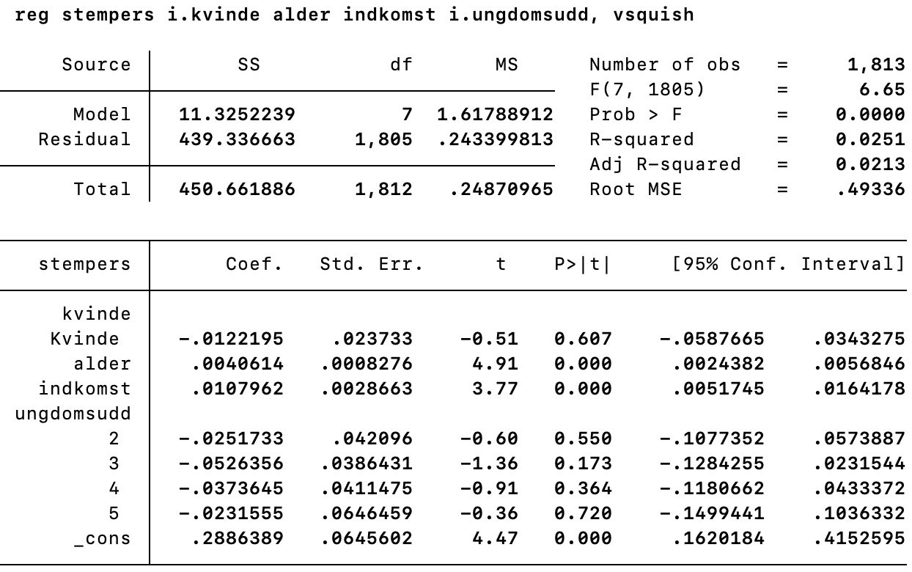
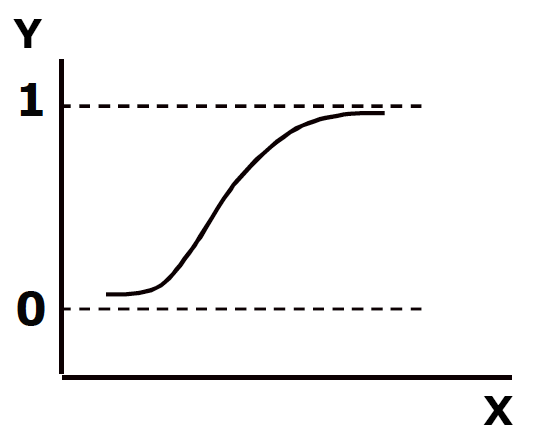
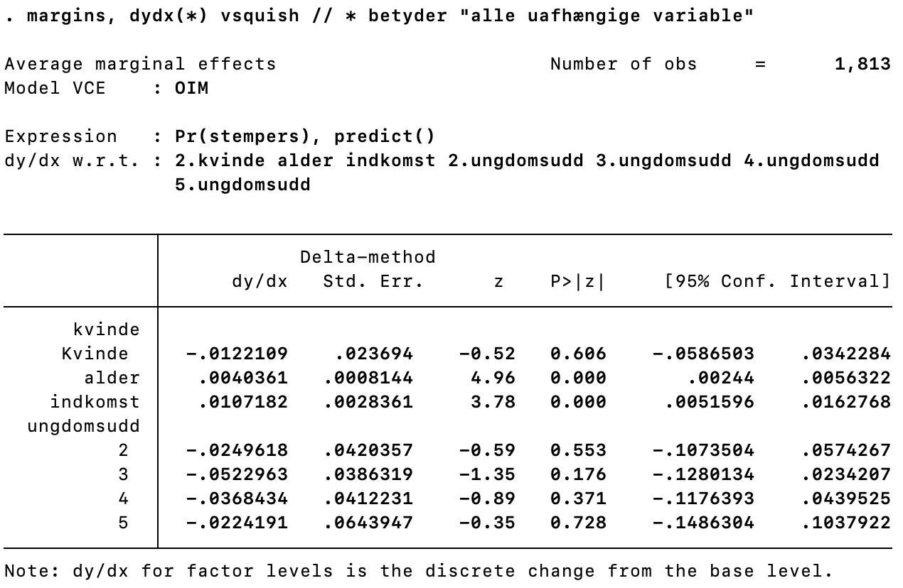
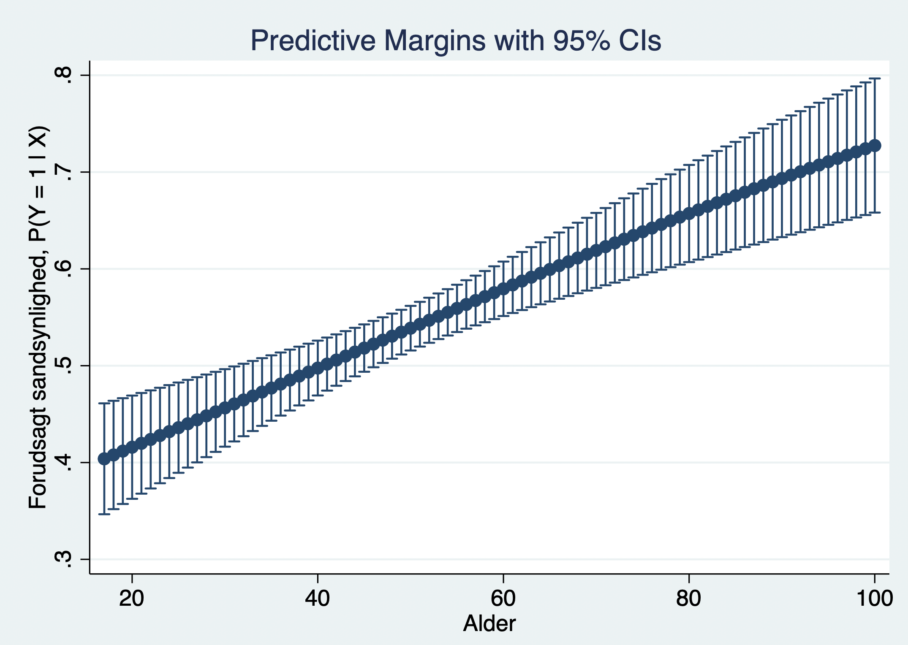

```{r, include=F}
uge_nr <- 10

pacman::p_load(tidyverse, knitr, ggdag, lubridate, kableExtra)

knitr::opts_chunk$set(echo = FALSE, 
                      fig.align = "center", 
                      fig.height=12)

Sys.setlocale(locale = "da_DK.UTF-8")
```

# Overblik

```{r plan}

start_date <- ymd("2021-02-11")
a_dates <- start_date+7*0:14
b_dates <- (start_date+1)+7*0:14

tibble(Uge = 6:20, 
       `Dato (holdtimer)` = tolower(paste0(day(a_dates),
                                           "-", 
                                           day(b_dates),
                                           " ", 
                                           format(a_dates, "%B %Y"))), 
       Emne = c("Kvantitativ indholdsanalyse",
                "Diskursanalyse I",
                "Diskursanalyse II",
                "interaktioner og modelspecifikation",
                "Logistisk regression",
                "Multilevel analyse",
                "Kausal inferens I: Designbaseret inferens",
                "Kausal inferens II: Paneldata",
                "Påskeferie",
                "Kausal inferens III: Eksperimentelle designs",
                "Kausal inferens IIII: Regression Discontinuity (RD)",
                "Social Data Science: Big Data",
                "Process tracing",
                "Kriterier for god videnskab",
                "Opsamling/spørgetime"), 
       `Øvelsesopgave` = c(1:8, "", 9:14)) %>%
  mutate(`Dato (holdtimer)` = ifelse(Uge %in% c(6,7,12,14,16,17,19,20), "", `Dato (holdtimer)`)) %>% 
  kable("html", 
        align = c("c", "c", "l", "c"),
        escape = F,
        table.attr = "style=\"line-height: 100%;\"") %>% 
  kable_styling(font_size = 16,
                bootstrap_options = c("striped", "hover", "condensed", "responsive")) %>% 
  row_spec(9, bold = F, color = "grey") %>% 
  row_spec(uge_nr-5, bold = T, color = "white", background = "#8b2325")
```

---

# Recap fra sidste gang

---

# Dagens program

---

# Dagens formål

---

# Pensum

- Kellstedt, P. M., Whitten, G. D. (2018). The Fundamentals of Political Science Research. 3rd edition. Cambridge University Press. Kapitel 12.1+12.2

- Sønderskov, Kim Mannemar (2014). Stata – en praktisk introduktion (2. udg.). København: Hans Reitzels forlag. Kap. 11

---

# Recap fra forelæsningen

Når vores afhængige variable har et dikotomt udfaldsrum. Visuelt: Alle observationerne ligger vandret enten ud for y=0 eller ud for y=1.

Husk at med en regression forsøger vi, at finde den model som bedst beskriver data.

- ”Den bedste linje”

```{r}
include_graphics("media/logit1.png")
```

---

# Hvad vil vi med regressioner?

Husk: med en regression forsøger vi, at finde den model som bedst beskriver forholdet mellem X og Y.

- ”Den bedste linje”
- OLS estimerer den bedste rette linje - som minimerer det kvadrerede residual. En ret linje - udtrykker linearitet

- og altså en konstant hældning. (Blandt andet derfor) er OLS fedt:

- Det er intuitivt: Koefficienten som beskriver forholdet mellem X og Y er intuitiv at tolke: Når X ændres med +1 udtrykker koefficienten ændringen i Y.

- Det er effektivt: Forholdet mellem X og Y er opsummeret i ét tal.

Den store udfordring når Y er binær: Data beskrives ikke bedst af en lineær model (lige linje med konstant hældning).

- Sandsynligheden for y=1 (P(Y=1)) varierer på tværs af x’s værdier (ikke-linearitet)!

- Det komplicerer vores tolkning mærkbart - hvorvidt en ændring i x ændrer på sandsynligheden for y=1, afhænger af værdien på x.

Men kan vi udtrykke en heterogen effekt med ét tal?

- Spoiler alert: Det kan vi - men tallet er ikke intuivt.

- Heldigvis er der løsninger!

---

# Hvordan ser logistisk regression så ud grafisk?

Her er plottet fra før - der er bare indsat to linjer til at beskrive data. Hvordan beskriver de data?

```{r}
include_graphics("media/logit2.png")
```

---

# Hvordan ser logistisk regression så ud grafisk?

Rød linje:

- en ret linje - passer dårligt på punkterne.

- OLS som I kender det - kaldes Lineær Sandsynlighedsmodel (LPM) fordi Y er dikotom.

Blå linje:

- en S-formet kurve som smyger sig langs punkterne - passer bedre

- Logistisk regression

---

# Sandsynligheden for et udfald

Med en dummy (dikotom/binær) som afhængig variabel, kan y kun antage værdierne 0 eller 1. Gennemsnittet af den afhængige variabel bliver derfor andelen af 1-taller

- Eksempel: Observationerne (0,0,1,1,1,1) har gennemsnittet 4/6 – svarende til andelen af 1-taller.

- Det betyder, at vi estimerer, at der er 66,7% sandsynlighed for at finde observationen 1-tal i populationen.

- Vores regression, når Y er en dummy, beskriver derfor sandsynligheden for at y=1, givet vores uafhængige variable.

- Lidt notation: Sandsynligheden for y=1 for et givet x skrives som: p(y = 1 | x).

---

# OLS når Y er binær

Lad os starte med den lineære sandsynlighedsmodel (LPM). Her er sandsynligheden for at y=1 en lineær funktion af x.

- $p(y = 1 | x) = \alpha + βX$

Det er langt henad vejen som I kender det! Forskellen er fortolkning af β :

- LPM: ændringen i sandsynligheden for y=1, per ændring i x

- Normalt: Ændringen i y per 1+ ændring i x.

---

# Eksempel på lineær sandsynlighedsmodel (LPM)

.left-column[

- Alder (angivet i år)
- Kvinde, dummy (Kvinde=1)
- Indkomst (1-16, hvor 1 = under 100.000, 16 = over 1. mio)
- Ungdomsuddannelse, dummy (Gennemført=1)
- Y = Stemmer personligt (=1)

]
.right-column[
Hvordan vil I fortolke outputtet?

```{r}

```

]

---

# Det fede ved LPM (lineær model)

- Fortolkningen er ligetil

- Er typisk ret god til at estimere den marginale effekt af x på p(y=1) omkring gennemsnittet af X (tænk på hældningen af de to linjer i plottet)

- (vi kan teste interaktionsled - vender vi tilbage til senere)

---

# Det ufede ved LPM (lineær model)

Der er en række grunde til at OLS bliver problematisk, når Y er en dummy:

- Problemer med fejlled (altid heteroskedastiske og aldrig normalfordelte)

- Den funktionelle form (linearitet) er problematisk (gns. effekt er upassende).

Og fordi den rette linje potentielt løber fra −∞ til +∞

- Vores model kan forudsige udfald med sandsynligheder større end 1 eller mindre end 0

- $R^2$ er ikke informativ fordi den rette linje potentielt løber fra −∞ til +∞ og igennem alle punkter mellem y=0 og y=1 – hvor der ikke er nogen observationer

---

# Logistisk regression (aka logit)

Logistisk regression er alternativet til LPM, når vi har en dummy som afhængig variabel.

For logistisk regression gælder det at

- Y begrænset fra intervallet fra 0 til 1

- Forholdet mellem X og Y er S-formet (ikke-lineært)

```{r}

```

---

# Teknikken

Den generelle logistiske funktion ser matematisk således ud: $G(z) = \frac{e^z}{1+e^z}$ (der kunne også have stået F(x) i stedet for G(z). 

Det ser grafisk således ud:

```{r, out.width="20%"}

```


Vi anvender nu simpelthen den logistiske funktion på vores lineære sandsynlighedsmodel og får så, at vores nye statistiske model bliver:

$P(y = 1 | x) = G(\alpha+ßX_i+\epsilon_i) = \frac{e^{\alpha+ßX_i+\epsilon_i}}{1+e^{\alpha+ßX_i+\epsilon_i}}$

Modellen giver os sandsynligheden for at y=1 som en logistisk funktion af x &rarr; bedre funktionel form!

---

# Ja, bedre funktionel form, men...

.left-column[

```{r}

```


]

.right-column[

Vi er interesserede i den marginale effekt på sandsynligheden for y, når en af vores uafhængige variable ændrer sig én enhed - Ligesom med LPM – blot med en bedre model

Men fordi den logistiske funktion ikke er lineær, varierer den marginale effekt på p(y = 1) med størrelsen af x.

Tænk på det sådan her:

- Spørgsmål: ”Hvad er hældningen på den S-formede kurve?”

- Svar: Det kommer an på, hvor på x-variablen du kigger! → Ikke-lineariteten tolkningen sværere
]

---

# Hvordan fungerer logit-estimatoren? Maximum likelihood estimation!

OLS estimerer ved at minimere det kvadrerede residual.

Logit estimerer ved hjælp af det, som man kalder maximum likelihood.

- Formål: finde den koefficient, der er mest sandsynlig, givet det data, man har.

- Intuition: Vi har noget data – baseret på det: hvilken sammenhæng mellem x og y er så mest sandsynlig i populationen?

”Sandsynligheden” for at en koefficient kan være fremkommet på baggrund af et datasæt måles ved det såkaldte log likelihood - som ikke har nogen intuitiv tolkning (altid negativ - jo tættere på 0 jo federe). Fremgangsmåde:

- Givet en regressionsmodel, fx y = a + bx + e.

- Og en måde at estimere en sammenhæng på, fx Cov(x,y)/var(x).

- Forsøger Stata sig med en række værdier for b, indtil den finder den b, der har den laveste log likelihood.

---

# Sandsynlighed, odds (ratio) og logit-koefficient

```{r}

```

---

# Logit-koefficienten: ln(odds)

Logit-koefficienten i Stata udtrykker ændringen i den naturlige logaritme til oddset når X stiger med 1 - Ikke særligt intuitivt.

Logit-koefficientens p-værdi kan tolkes som enhver anden p-værdi. Logit-koefficientens fortegn indikerer sammenhængen:

- Negativ koefficient (< 0) falder sandsynligheden for Y = 1 når X stiger

- Positiv koefficient (> 0) stiger sandsynligheden for Y = 1 når X stiger

Mere kan vi egentlig ikke rigtig udlede.

---
class: title-slide, center, middle


# Øvelsesopgaver

---

# Øvelsesopgave 8.1

.left-column[

Alder og indkomst stærkt positivt korreleret med at stemme personligt. Uddannelse har ingen selvstændig effekt

- Likelihood Ratio: Kollektiv signifikans (ligesom F-statistikken i OLS).

- Pseudo $R^2$ : 1.51% forbedret log-likelihood sammenlignet med en model uder X’er

]

.right-column[

```{r}
include_graphics("media/logit6.png")
```

]

---

# Odds ratio

Hvis vi ønsker logitkoefficienten udtrykt som Odds Ratio fremfor ln(odds), skal vi blot tilføje optionen ”or” i vores logit-kommando.

Tolkning:

- Hvor meget større bliver odds når X er 1 i stedet for 0?

For odds ratio gælder at:

- 1 < betyder positiv sammenhæng

- 1 > betyder negativ sammenhæng

---

# Øvelsesopgave 8.2

Jeg kører logit-modellen fra før, men beder om at få koefficienter udtrykt som Odds Ratio.

.left-column[

Tolk på koefficienterne

- Fortæller modellen noget, som forrige model ikke fortalte os?

]

.right-column[

```{r}
include_graphics("media/logit7.png")
```

]

---

# Øvelsesopgave 8.2

.left-column[

Det er den samme model - ikke rigtig noget ny info - resultaterne er bare udtrykt anderledes.

- Alders koefficient er 1.016905 betyder, at når alder stiger med ét år stiger oddsne for at stemme personligt med 1,7%

- Indkomst = 1.039697 betyder, at når

indkomstkategorien stiger med én, stiger oddsne for at stemme personligt med 4%

]

.right-column[

```{r}
include_graphics("media/logit7.png")
```

]

---

# Alternativer til logit-koefficienten

Logit-koefficienten er dybest set et forsøg på at opsummere heterogene effekter med ét tal.

Ulempen er, at uanset om den udtrykkes som ln(odds) eller odds ratio, så er den ikke synderligt informativ rent substantielt.

Nu skal vi kigge på to alternative måder, at opsummere de heterogene effekter med ét tal: 

**Average Marginal Effect (AME)**

- Gennemsnitlige marginale effekter

- ”At finde den gennemsnitlige hældning for den s-formede kurve”

**Marginal Effect at the Mean (MEM)**

- Marginale effekter ved gennemsnittet (eller en anden væsentlig niveau på x).

- At vælge et specifik punkt, og finde hældningen her.

---

# Gennemsnitlig Marginal Effekt (AME)

Den gennemsnitlige ændring i p(y=1) på tværs af alle observationerne, når x ændres én enhed (altså ikke i et bestemt punkt, men i gennemsnit på tværs af alle punkterne).

Tolkning:

- Den gennemsnitlige stigning i sandsynligheden for y=1, når X stiger med 1.

- Parallel til OLS-tolkningen.

Hvorfor de er smarte:

- Det tillader os at opsummere resultatet fra en logistisk regression i ét meningsfuldt tal.

- Letter tolkningen enormt meget.

Hvorfor de nogle gange ikke er så smarte:

- Særligt når der er stærk ikke-linearitet kan gennemsnitlige effekter være vildledende.

AME er good practice indenfor logistisk regression.

---

# Øvelsesopgave 8.3 (AME)

.left-column[

De gennemsnitlige marginale effekter kan fortolkes som sandsynligheder

Tolk på de marginale effekter (dy/dx)

]

.right-column[

```{r}

```

]

---

# Øvelsesopgave 8.3 (AME)

.left-column[

- Når alder stiger med ét ˚ stiger den gennemsnitlige sandsynlighed for at stemme personligt med 4 promille. (over 70 år, svarer det til en ændring på $0.0040901*70 = 28.6$ pct.point.).

- Når indkomstkategori stiger med 1, stiger den gennemsnitlige sandsynlighed for at stemme personligt med 9,5 promille. (en ændring fra laveste til højeste kategori svarer til en ændring på $0.0094979*16 = 15.2$ pct.point)

]

.right-column[

```{r}

```

]

---

# Marginale effekter ved gennemsnittet (MEM) (eller et andet punkt)

Dybest set:

- Hvor meget ændres p(y=1), når x ændres én enhed i et bestemt punkt (ofte gennemsnittet)?

Hvis man kigger ved gennemsnittet kan man tænke på det som:

- Hvordan ændres sandsynligheden for y=1, når x ændres med +1, for observationer som er gennemsnitlige på x,

Husk dog:

- Vi kan også kigge på andre væsentlige niveauer for X end gennemsnittet. Der kan være et bestemt niveau for X-variablen som vi er interesserede i.

---

# Øvelsesopgave 8.3 (MEM)

Her kigger vi på den marginale effekt ved gennemsnittet for x

.left-column[

Tolk igen på de marginale effekter (dy/dx)

- Husk at tænke over, at vi her har sat alle uafhængige variable på deres gennemsnit.

]

.right-column[

```{r}

```

]

---

# Øvelsesopgave 8.3 (MEM)

Her kigger vi på den marginale effekt ved gennemsnittet for x

.left-column[

dy/dx udtrykker den marginale sandsynlighed for Y=1, når man flytter sig med +1 på x variablens gennemsnit.

- Når en person med gns.

køn, gns. alder, gns. uddannelse, og gns. indkomst, flytter sig med én på indkomstvariablen øges sandsynligheden til at stemme personligt med 9.7 promille.

Ændringen på indkomstvariablen svarer ca. til at gå fra ”250.000-299.999 kr.” til ”300.000-349.999 kr.”.

**Koefficienterne fra AME og MME er meget ens. Hvorfor?**

]

.right-column[

```{r}

```

]

---

# AME og MME er substantielt ens i nogle tilfælde

I vores tilfælde er AME og MEM meget ens.

Det skyldes, at AME og MEM kun divergerer, når sammenhængen er meget S-formet (hvor MEM > AME) ( hvis MEM er sat til en værdi inden for 25. og 75. percentil).

---

# Forudsagte sandsynligheder for alle niveauer af x

Hvorfor forsøge at opsummere hele den ikke-lineære model i ét tal, når vi bare kan plotte resultatet?

Hvis vi regner de forudsagte sandsynligheder for at stemme personligt for alle niveauer af alder, kan vi vurdere hele sammenhængen.

Lidt ligesom ved interaktioner for metrisk Z.

---

# Øvelsesopgave 8.4

Dette plot (lavet med *margins* og *marginsplot* i Stata) viser de forudsagte sandsynligheder for at stemme personligt for alle niveauer af alder.

.column-left[

- Hvad ser vi?
- Stemmer det overens med vores AME?

]

.column-right[

```{r}

```

]

---

# Øvelsesopgave 8.4


.column-left[

Fra 18 år til 88 år stiger den forudsagte sandsynlighed for at stemme personligt med knap 30 pct. point., hvilket jo passer med vores AME. Effekten er lille på årsbasis, men det løber op over tid.

]

.column-right[

```{r}

```

]

---

# Logit vs. OLS (LPM) (8.5)

.pull-left[

**Logit: $AME = 0.0040901$**

```{r}

```

]

.pull-right[

**LPM (OLS): $ß = 0.004105$**

```{r}

```

]

---

# Er der forskel på logit og LPM?

I dette tilfælde er de så godt som identiske. Det tyder altså på, at S-formen for dette data ikke er særlig tydelig.

MED ANDRE ORD: I dette tilfælde er linearitet ikke en problematisk funktionel form for sandsynligheden.

- Generel pointe om, hvor godt en model fitte data for at være brugbar

---

# Interaktion i logit?

Interaktion i en logit model er problematisk.

Stata giver jer en p-værdi, men den er ikke til at stole på – ignorer den.

Det er komplekst at beregne korrekte standardfejl for interaktioner i ikke-lineære modeller. 

Tips:

- Tolk på interaktionsleddet ved at regne marginale effekter. Men husk på at marginale effekter ikke siger noget om hele interaktionens signifikans ved OLS-regression.

- Lav interaktionsmodeller med LPM (OLS)

---

# Antagelser bag logit

Mange af de samme som OLS, men sværere at tjekke.

- Modellen er korrekt specificeret (altså ikke udeladt variabel bias etc.)

- Fravær af alvorlig multikollinearitet (tjek VIF i LPM)

- Fravær af meget indflydelsesrige observationer (se Carolins video)

- Linearitet (”linear in the logit”s). Betyder: Der skal være en lineær sammenhæng mellem log-odds og x! Det er til gengæld lige meget med homoskedasticitet og normalfordelte fejlled N skal have en vis størrelse (ca. 200) (se næste slide).

---

# Logit er en asymptotisk unbiased estimator 

**Asymptotisk unbiased** betyder at

- Logit bliver unbiased i takt med at N stiger

- Dette kalder man også nogle gange for en **konsistent** estimator.

Større krav til antal observationer end ved normal OLS. Sønderskov skriver:

”*Et bud på guidelines ville være, at 100 observationer er for lidt, 500 observationer vil være tilstrækkeligt i langt de fleste tilfælde, og 200 er formentligt nok, såfremt modellen ikke indeholder mere end 20 uafhængige variable*” (p. 279).

---

# En meta-pointe

Logistisk regression er fedt og et vigtigt redskab, fordi modellen tager højde for en masse af OLS’ shortcomings ift. dikotome afhængige variable.

Og ulempen er netop det samme: Vores modeller bliver langt mindre intuitive, når sandsynligheden for y=1 er er forskellig!

I sidste ende, forsimpler vi typisk informationen fra vores logistiske regression.

---

# Dagens pointer

---

# Næste gang

---

# Tak for i dag!
