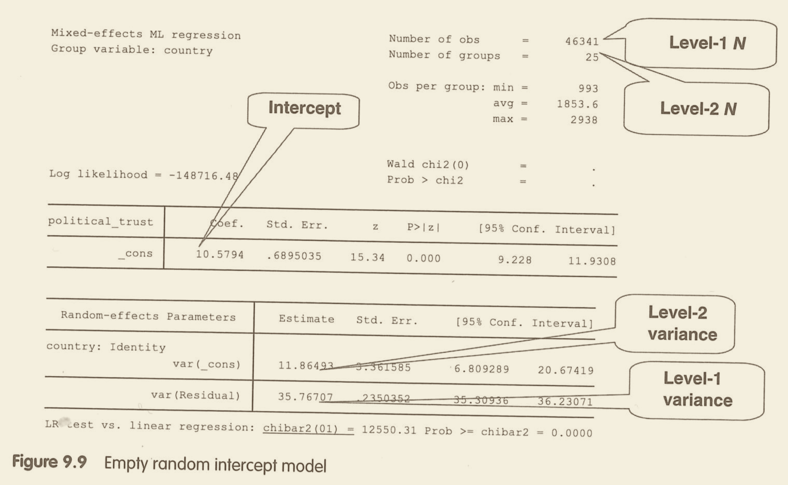
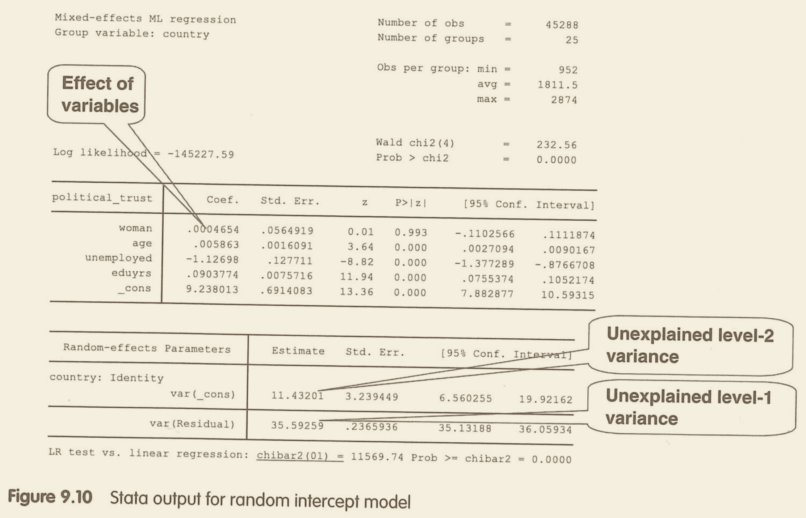
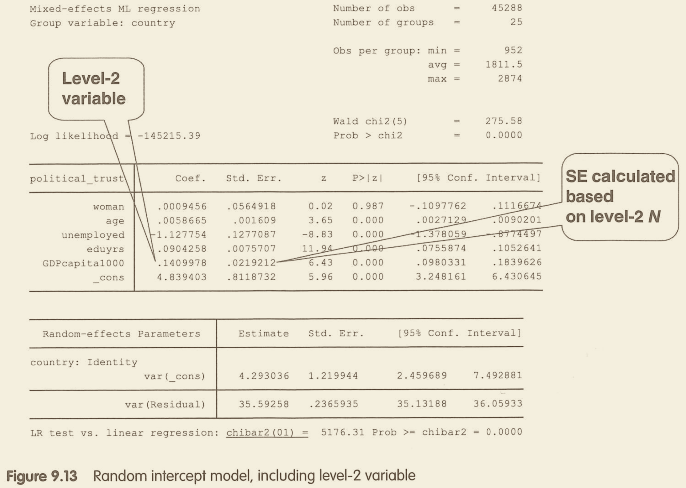
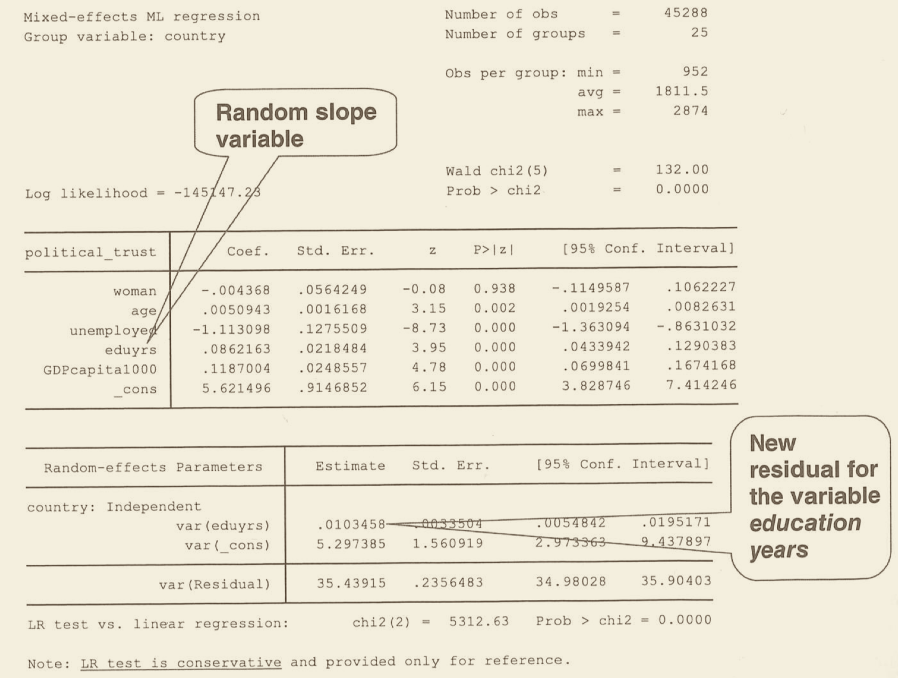
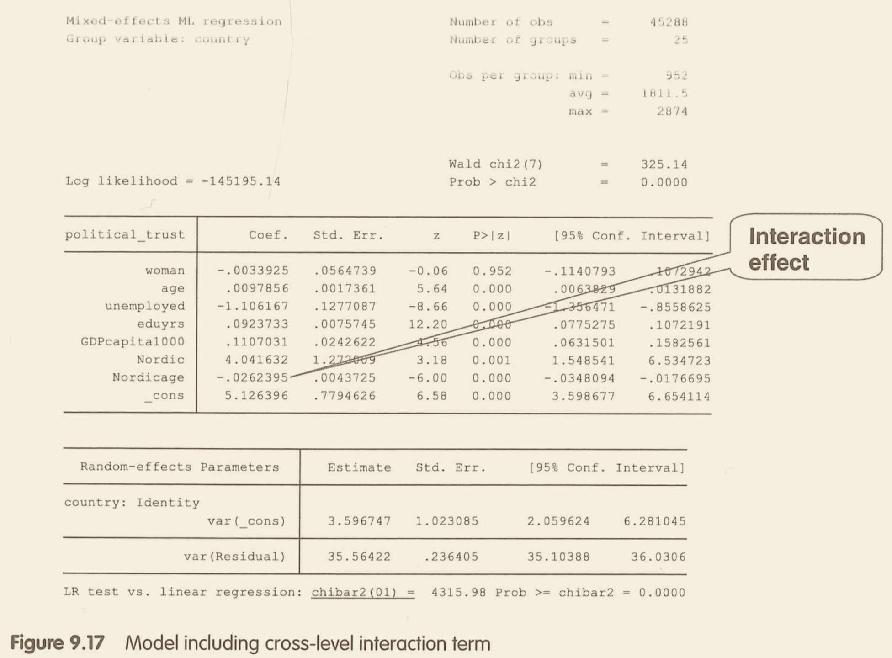
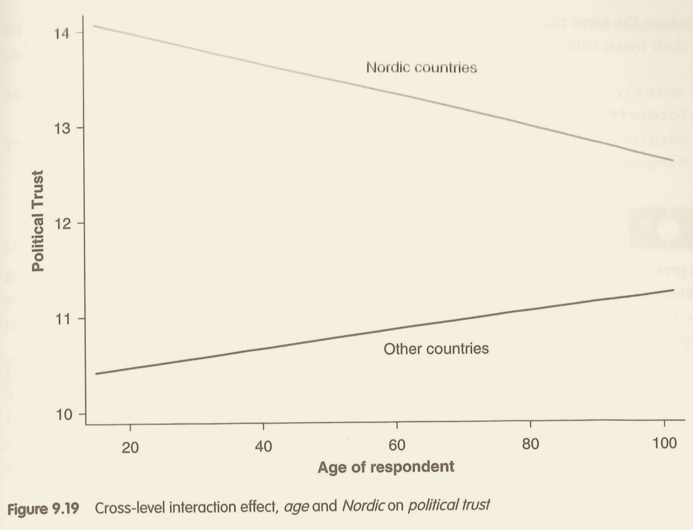
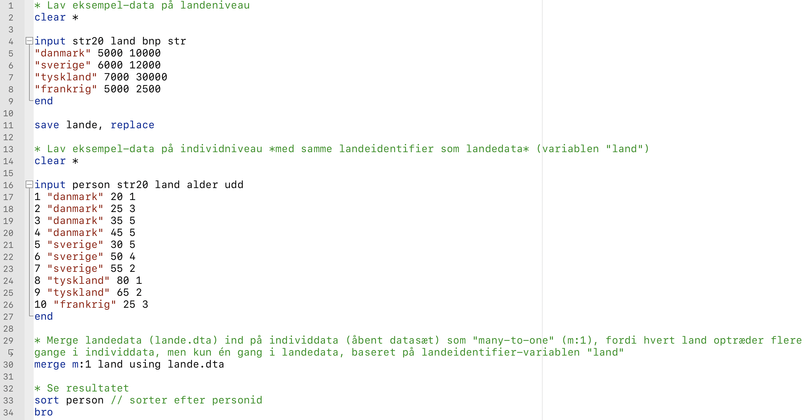
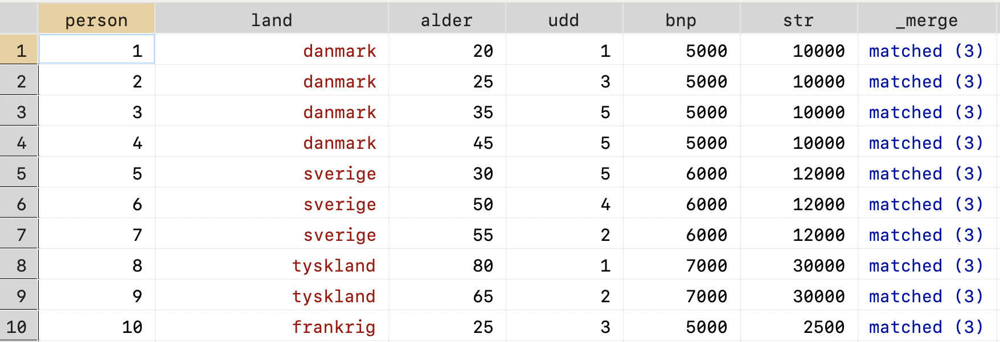

```{r, include=F}
pacman::p_load(tidyverse, knitr, ggdag, lubridate, kableExtra)

knitr::opts_chunk$set(echo = FALSE, 
                      fig.align = "center", 
                      fig.height=12,
                      cache = TRUE)

Sys.setlocale(locale = "da_DK.UTF-8")
```

# Oversigt

```{r plan}

source("../print_plan.R")
print_plan(11)
```

---

# Recap fra sidste gang

- Vi bruger **logistisk regression** i stedet for OLS, **når Y er binær**, pga. OLS' problemer med funktionel form (linearitet), fejlled, absurde sandsynligheder mv.

- I logistisk regression er der ikke kun én effekt af X &rarr; Y. Effekten afhænger af, hvor på X-aksen, vi står

- **Beta-koefficienterne** ("effekterne") angiver effekten af, at X vokser med +1 på *den naturlige logaritme til oddset for, at Y = 1* (fx at en person stemmer personligt)
    - umuligt at forstå intuitivt
    - **odds ratio** er ikke meget bedre
    
- Fortolker vha. tricks
    - **Average Marginal Effect** (AME): Den marginale effekt X &rarr; P(Y=1) for *alle niveauer af X* - opsummeret i et gennemsnit
    - **Marginal Effect at the Mean** (MEM): Den marginale effekt X &rarr; P(Y=1) i *et bestemt punkt* på X-aksen - typisk gennemsnittet af X
    - **Forudsagte sandsynligheder**: Sandsynligheden for Y=1 for *alle niveauer af X* - "S-kurven"

---

# Dagens program

- Multilevel analyse - nyt emne

- Hvad er det, hvornår og hvorfor bruger vi det?

- Hvordan udfører vi det i Stata og fortolker output? Eksempel fra Mehmetoglu & Jakobsen (2016)

- Øvelsesopgaver i Stata (sammen - så meget vi når)

---

# Dagens formål

- Forstå multilevel-problemer og analyse

- Være bevidst om, hvilke problemer multilevel analyse afhjælper

- Hvilke muligheder er der, hvilke valg skal man træffe?

- Lære hvordan man udfører og fortolke i Stata

---

# Pensum

Hox, J. J. (2010). *Multilevel analysis: techniques and applications* (2. edition). Routledge. **Kapitel 1**

Mehmetoglu, M., and T. G. Jakobsen. (2016). *Applied statistics using Stata: a guide for the social sciences*. Sage. **Kapitel 9**.

---
---
---
---

<!--

- "Multilevel analysis can be seen as a generalization of OLS regression to accommodate the complexities of estimating regression models with two or more levels" (197)
- Data! Smart. World values survey. European social survey. 
- Merging data ... brief! 
- Rule of thumb: 10 obs per indep. (level 2)

-->
---
---
---
---

# Begreber

- **Niveauer** (levels)
    - niveau 1 = level 1 = det "laveste" niveau ≈ individniveau
    - niveau 2 = level 2 = "gruppeniveau" = noget der indeholder niveau 1-observationer
    
- Multilevel analyse = multilevel model = multilevel regression = linear mixed (effects) model

- **intercept** = Y intercept =  konstant = $\beta_0$ = $\alpha$
    - **varying intercept** = random intercept

- **slope** = hældning = effekt = (beta)koefficient = $\beta_1$    
    - **varying slope** = random effect = random coefficient  
	- multilevel
	
- **Fixed effect vs. random effect**
    - fixed effect (FE) = "almindelige effekter" = én effekt for hele datasættet
    - random effect (RE) = noget nyt = varierende effekter på tværs af grupper

---

# Hvad er multilevel analyse?

- Endnu en udvidelse af OLS

**Multilevel forskning**

> "individuals and the social groups are conceptualized as a __hierarchical system of individuals nested within groups__, with individuals and groups defined at separate levels of this hierarchical system. Naturally, such systems can be observed at different hierarchical levels, and variables may be defined at each level. This leads to research into the relationships between __variables characterizing individuals and variables characterizing groups__, a kind of research that is generally referred to as __multilevel research__" .right[(Hox, 2010, p. 1)]


- Hierarkisk struktur i data (samplet) -> hierarkisk struktur i populationen/virkeligheden

---

# Hvorfor multilevel analyse?

Hvorfor? 

Metodemæssige grund: Statistisk og kausal inferens

- Kontrol for variable på gruppeniveau, der både påvirker X og Y på level 1 -> undgå bias, spørgsmålet om kausalitet

- Styr på standardfejl -> p-værdier (disaggregation)

Substantiel/teoretisk grund: Viden om multilevel-dynamikker og konteksteffekter

- Substantielt interesseret i effekten af level 2-variabel (X) på level 1-variabel (Y) 
	- level 2-spørgsmål/-hypoteser/-problemer/-research
	- konteksteffekter, direkte og
	- ink. Cross-level interaktion (hvordan kontekst betinger level 1-effekter)

---

# Spørgsmål

- Break-out i mindst 10 min.

- Snak om så mange spørgsmål som muligt

- Bagefter hører vi et svar fra **break-out gruppe 1/6 på spgm. 1**, fra **gruppe 2/7 på spgm. 2**, fra **gruppe 3/8 på spgm. 3**, fra **gruppe 4/9 på spgm. 5/10**

***

1. Hvad er et multilevel-problem? Giv et hypotetisk eksempel på et problem eller en hypotese

2. Hvordan adskiller multilevel-analyse sig fra almindelig regression? (behøver ikke være teknisk)

3. Giv et par eksempler på data med multilevel-struktur

4. Hvad menes der med "aggregering" og "disaggregering"? (se Hox, 2010, pp. 2-4)

5. Hvad er *det statistiske problem* ved at aggregere hhv. disaggregere data? Hvad sker der med *N*? (se Hox, 2010, p. 3)

???

"A multilevel problem is a problem that concerns the relationships between variables that are measured at a number of different hierarchical levels" (Hox, 2010, p. 4)

Kendte eksempler: Individer inden for grupper (f.eks. lande/kommuner) og tidslige observationer inden for enheder (fx lande-år = paneldata)

**(Dis)aggregation**: At flytte variable mellem niveauer. **Aggregation**: "variables at a lower level are moved to a higher level, for instance by assigning to the schools the school mean of the pupils’ intelligence scores". **Disaggregation**: "moving variables to a lower level, for instance by assigning to all pupils in the schools a variable that indicates the denomination of the school they belong to"

---

# Den dårlige tilgang til multilevel analyse

1. Find ud af, på hvilket niveau vi er interesserede i at forklare et outcome. Typisk eksempel: Individ (fx hvem stemmer vil individet stemme på)

2. Flyt alle relevante variable med disaggregation (eller aggregation) til dette niveau. 

3. Lav almindelig multivariat regressionsanalyse (eller andet) med brug af alle variable uden at skelne 
    - Antager (som regel) at alle individer er uafhængige
    - Antager derfor også at at den disaggregerede data faktisk er målt (uafhængigt) for det pågældende individ
    
- Når variable disaggregeres, så der er en værdi per individ (laveste niveau), bliver disse værdier, som jo stammer fra et mindre antal "super-units" (overenheder), **blæst op** i den forstand, at det ligner, der er mange flere observationer.
- Og omvendt: Når man aggregerer mister man en masse information (variation) og dermed power (svagere tests &rarr; mindre sandsynlighed for at finde effekter, der ellers i virkeligheden er der)
- Når man bruger den klassiske (dårlige) tilgang, vil almindelige statistiske tests tro, det er uafhængig information og derfor give en kunstigt høj sandsynlighed for (fejlagtig) statistisk signifikans. 

- "the fallacy of the wrong level": Når man analysere data på et niveau og drager konklusioner på et andet 
    - Ecological fallacy: Analysere et højere niveau og fortolke på lavere niveau (fx når man analyserer landedata og konkluderer om enkeltindividerne).
    - Atomistic fallacy: Når man formulerer konklusioner på et højere niveau end det analyserede
    - Relateret til Simpson's paradoks: Når man "pooler" (samler) data fra (substantielt) forskellige populationer og analyserer dem, som om de var en stor samlet population. 
- Detaljerne er komplicerede og har mest af alt noget at gøre med korrelation vs. kausalitet, spuriøsitet osv.
- Take-away: Pas på med at konkludere på andre niveauer end det målte/analyserede
    
---
    
# Data 

- Mange supergode multinationale datasæt frit tilgængelige, herunder European Social Survey og World Values Survey

- Lovede Carolin at vise, hvordan man kan merge to datasæt

- Hvordan man merger individdata med landedata &rarr; til sidst + do-fil

---

# Multilevel-modellen

--

Multilevel-modellen begynder med at opdele **variansen i den afhængige variabel** på de to niveauer

- **Variansen i den afhængige variabel** er et mål for spredningen eller afvigelserne *rundt om variablens gennemsnit*
    
--

- Variansen opdeles i:
    - (1) spredningen **inden for hver gruppe** rundt om *gruppens gennemsnit* (lagt sammen)  
    - (2) spredningen **mellem grupperne**, dvs. gruppegennemsnittenes spredning om *det samlede gennemsnit*

--

- Denne opdeling kan ses i **Null-modellen** helt uden uafhængige variable (vi ser det om lidt)

--

- Matematisk ser det således ud:
    - $Y_{ij} = \beta_0 + u_{0j} + e_{ij}$
    - $dependent\_variable = total\_mean + error\_term\_level\_2 + error\_term\_level\_1$
    
---

# Multilevel-modellen

**Bottom line**

--

- Takket være variansopdelingstricket, kan vi inddrage uafhængige variable fra begge niveauer til analysen
    
    - fx $\beta_1 X_{1ij}$ (niveau 1) og $\beta_2 X_{2j}$ (niveau 2)
    
--

- Vær her opmærksomme på **antal variable ift. antal observationer** på niveau 2
    - tommelfingerregel\* om min. **10 obs.** per uafhængig variabel

--

- Multilevel-modellen bruger automatisk det korrekte *N* for hvert niveau til at beregne usikkerheder og p-værdier

???

*Tommelreglen kommer fra Mehmetoglu & Jakobsen (2016), s. 206, og er et absolut minimum. Det kan i nogle tilfælde være nødvendigt at anlægge 0.10 signifikansniveau i stedet for 0.05, når man analyser effekten af niveau 2-variable. 

---
class: title-slide, center, middle

# Stata, fremgangsmåde og eksempler

---

# Multilevel-analyse i Stata

--

> **mixed   Y_lvl1 || ID_lvl2:** (*Null-model*)

> **mixed   Y_lvl1   X1_lvl1   X2_lvl1   X3_lvl1   X4_lvl2   X5_lvl2   ||   ID_lvl2:**

- **ID_lvl2** er en variabel, der identificerer grupperne, fx *landenavn*. Husk kolon i enden af **ID_lvl2:**

- **_lvl1** og **_lvl2** indikerer, hvilket niveau variablen hører til i eksemplet. *Stata finder selv ud af dette* i praksis! 

- Eventuelle *varying slopes* (random effects, dvs. niveau 1-X'er fra venstresiden af **||**) tilføjes efter **ID_lvl2:**

--

**Stata options**

- Nogle tilføjer "**ml variance**", som specificerer, at modellen skal fittes med **maximum likelihood estimation**, og at vi vil se **niveau-opdelingen af variansen**. Begge dele er **standard**, hvorfor man ikke behøver specificere det

- Når modellen inkluderer *varying slopes*, anbefaler Mehmetoglu & Jakobsen at tilføje **cov(unstructured)**, så modellen bliver uafhængig af variabel-skala (2016, p. 212)

---
class: middle

# Fremgangsmåde

- Vi vil estimere effekten af en eller flere **uafhængige variable (X) på niveau 2 (gruppeniveau)** på en **afhængig variabel (Y) på niveau 1 (individniveau)**         
    - foruden eventuelle uafhængige variable (X) på niveau 1 (individniveau)

- Vi er interesserede i **indflydelsen fra konteksten (niveau 2)**, fordi vores vores teori, problemformulering og/eller hypoteser tilsiger dette

---
class: middle

# Fremgangsmåde

1. Lav tom ("Null") model, der alene skelner mellem niveauerne (*varying intercepts*)

2. Tilføj uafhængige **niveau 1**-variable

3. Tilføj uafhængige **niveau 2**-variable

4. Tilføj evt. **varying slopes** (random effects) for en eller flere uafhængige niveau 1-variable

5. Tilføj evt. **interaktion** enten på samme niveau eller *cross-level*

6. **Fortolk** på helheden - især de "fulde" modeller

---

# 1. Lav tom ("Null") model

**Eksempel fra Mehmetoglu & Jakobsen, 2016, pp. 201ff**

.left-column[

**mixed political_trust || country:**

Giver os bl.a. antal **observationer** per niveau og **gennemsnitlig tillid** (*_cons*)

Desuden **opdelingen af den uforklarede varians** i tillid på gruppeniveau, *var(_cons)*, og individniveau,  *var(Residual)*

]

.right-column[

```{r}

```

]

---

# 1. Lav tom ("Null") model

**Eksempel fra Mehmetoglu & Jakobsen, 2016, pp. 201ff**

.left-column[

Hvor stor en andel af variansen i tillid tilskrives **gruppeniveauet** (hvor stor er VPC/ICC)?

$\frac{11.9}{11.9+35.8}$

*Tommelfingerregel*:<br>Min. 5 % før niveau 2 er relevant

Kan det betale sig at fortsætte med multilevel model?

]

.right-column[

```{r}

```

]

???

VPC/ICC ≈ 24.9 %

Kan også findes med *estat icc*

---

# 2. Tilføj uafhængige niveau 1-variable

.left-column[

**mixed political_trust woman age unemployed eduyrs || country:**

Påvirker uddannelse (X4) politisk tillid (Y)?

Er den uforklarede varians i tillid faldet? Markant?

]

.right-column[

```{r}

```

]

---

# 2. Tilføj uafhængige niveau 1-variable

.left-column[

Påvirker uddannelse (X4) politisk tillid (Y)?

*Ja (p=0.000). For hvert år vokser tilliden med 0.09*

Er den uforklarede varians i tillid faldet? Markant?

*Faldet marginalt, men stort set uændret. De nye variable (den nye model) har således ikke megen forklaringskraft*

]

.right-column[

```{r}

```

]

---

# 3. Tilføj uafhængige niveau 2-variable

.left-column[

**mixed political_trust woman age unemployed eduyrs GDPcapita1000 || country:**

Påvirker uddannelse (X4) stadig politisk tillid (Y)?

Hvad kan vi sige om **effekten af BNP**?

Er den uforklarede varians i tillid faldet denne gang? Markant?

]

.right-column[

```{r}

```

]

---

# 3. Tilføj uafhængige niveau 2-variable

.left-column[

Effekten af uddannelse (X4) er praktisk talt uændret

Når BNP/cap. vokser med $1000, øges hvert lands gennemsnitlige tillid med 0,14  

På landeniveau er den uforklarede varians [*var(_cons)*] faldet markant fra 11,9 til 4,3

$\frac{11.9-4.3}{11.9}≈0,64$<br>&rarr; ca. 64 % af gruppe-variansen kan forklares vha. BNP 

]

.right-column[

```{r}

```

]
---

# 4. Tilføj evt. **varying slopes** for niveau 1-variable

.left-column[

**mixed political_trust woman age unemployed eduyrs GDPcapita1000 || country: eduyrs**

Hvilken uafhængig variabel - fra hvilket niveau - er tilføjet som **random effect**?

Hvad vil det sige?

Hvad kan vi sige om dens effekt på tillid?

]

.right-column[

```{r}

```

]

---

# Ekskurs: Hvad er varying slopes aka random effects?

- En slags ekstra udvidelse: Man kan sagtens lave en god multilevel analyse uden varying slopes


---

# 4. Tilføj evt. **varying slopes** for niveau 1-variable

.left-column[

Vi har tilføjet varying slopes for **uddannelse** (niveau 1)

Vi accepterer, at uddannelse kan påvirke tillid fundamentalt forskelligt i forskellige lande. Derfor beregner vi en effekt for hvert land. Koefficienten for *eduyrs* er gennemsnitseffekten

Når et individs uddannelsesniveau vokser med +1, øges tilliden *gennemsnitligt set* med 0,086

]

.right-column[

```{r}

```

]

---

# 5. Tilføj evt. **interaktion** 

.left-column[

**mixed political_trust woman unemployed eduyrs GDPcapita1000 i.Nordic##c.age || country:** // OBS! Intet varying slope for *age*? 

Er det en alm. same-level eller en cross-level interaktion?
 
Er effekten af alder betinget af, om landet er nordisk?
 
]

.right-column[

```{r}

```

]

---

# 5. Tilføj evt. **interaktion** 

.left-column[

Er det en alm. same-level eller en cross-level interaktion?

*Cross-level! Nordic er en dummy, der angiver om landet (gruppen) er et af de nordiske lande* 
 
Er effekten af alder betinget af, om landet er nordisk?

*Ja! Effekten af alder er -0,0262 mindre i nordiske lande (p=0,000) - og den er 0,0097 i ikke-nordiske lande*

]

.right-column[

```{r}

```

]

---

# 5. Tilføj evt. **interaktion** 

.left-column[

Er det en alm. same-level eller en cross-level interaktion?

*Cross-level! Nordic er en dummy, der angiver om landet (gruppen) er et af de nordiske lande* 
 
Er effekten af alder betinget af, om landet er nordisk?

*Ja! Effekten af alder er -0,0262 mindre i nordiske lande (p=0,000) - og den er 0,0097 i ikke-nordiske lande*

]

.right-column[

```{r}

```

]

---
class: middle, inverse


# Tre ekstra-ting

1. Udvidelser

2. Antagelser

3. Merge niveau 1-data (fx surveydata) med niveau 2-data (fx landedata)

---
class: inverse

# Udvidelser

1. **Logistisk multilevel regression (logit)** &rarr; brug det kun, hvis det er nødvendigt

2. **Multilevel-model med tre niveauer** &rarr; brug det kun, hvis det er nødvendigt

3. **Cross-classified multilevel-model**
    - ikke en klar hierarkisk struktur &rarr; fx individer indlejret i sideordnede kontekster
    - brug det kun, hvis det er nødvendigt

---
class: inverse

# Antagelser 

- **Ikke pensum!** - men problematikken kan eventuelt nævnes

- I princippet samme antagelser som OLS - *gange to*
    
    - linearitet, uafhængige obs., homoskedasticitet, normalfordelte fejlled etc. skal i princippet være opfyldt på hvert niveau
    
    - det meste er svært-til-umuligt at teste

**Muligheder**

- *Multikollinearitet* &rarr; tjek evt. med VIF efter alm. OLS

- *Indflydelsesrige outliers* &rarr; tjek evt. grafisk for niveau 2: er der lande med meget ekstreme værdier?

---
class: inverse

## Hvordan man merger individdata med landedata: *do-fil*

```{r, fig.align='left'}

```

---
class: inverse

## Hvordan man merger individdata med landedata: *resultat*

```{r}

```

---
class: center, middle, middle
background-color: #FEFFA2

# Øvelsesopgaver i Stata

---
background-color: #FEFFA2

# Dagens pointer

- Test

---
background-color: #FEFFA2

# Næste gang

.pull-left[

- Vi starter på fire uger med **kausal inferens**
    
    - begynder at tage kausalitetsspørgsmålet alvorligt frem for blot at antage "effekter" for eksemplets skyld
    
- Næste uge

    - **Kausal inferens I: Kausal inferens og instrumentvariable**

    - ingen holdtime
    
    - derefter **PÅSKEFERIE**
    
- Vi ses igen efter påske til Kausal inferens II: Paneldata

]

.pull-right[

<iframe src="https://giphy.com/embed/54WycskplA1OlPc5cd" width="480" height="270" frameBorder="0" class="giphy-embed" allowFullScreen></iframe>

]

---
class: center, middle
background-color: #FEFFA2

# Tak for i dag!

<iframe src="https://giphy.com/embed/kBrCMKXl2Kz4kUGTr1" width="480" height="320" frameBorder="0" class="giphy-embed" allowFullScreen></iframe>