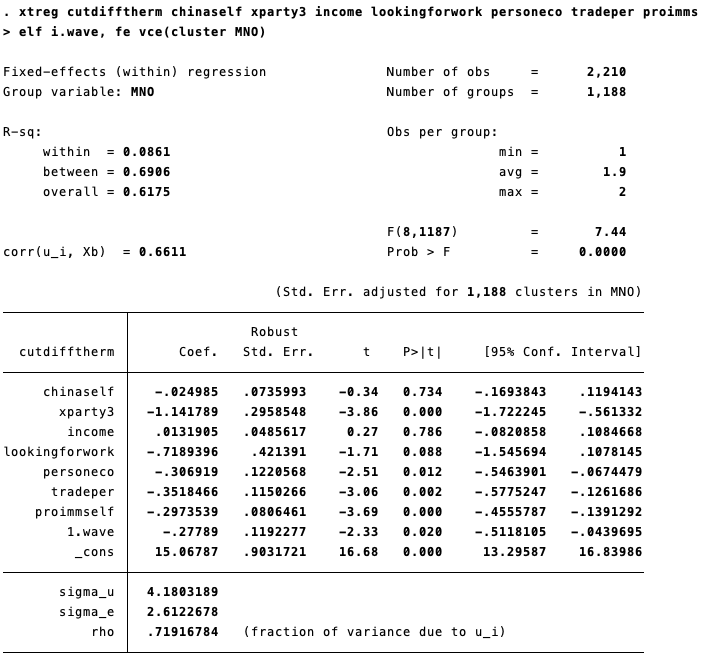

```{r, include=F}
pacman::p_load(tidyverse, knitr, ggdag, lubridate, kableExtra)

knitr::opts_chunk$set(echo = FALSE, 
                      fig.align = "center", 
                      fig.height=12)

Sys.setlocale(locale = "da_DK.UTF-8")
```

# Oversigt

```{r plan}

source("../print_plan.R")
print_plan(13)
```

---

# Recap fra sidste gang

---

# Dagens program

---

# Dagens formål

---

# Pensum

Stock, J. H., Watson, M. W. (2003). Introduction to econometrics (Vol. 104). Boston: Addison Wesley. 396-419. **Kapitel 10: Regression with Panel Data.**

---
layout: true

# Paneldata

---

**Tværsnitsdata/krydssektionel data/cross-sectional data**

- Et udsnit af en given population (eller en hel population) målt på ét tidspunkt
- Rumlig/spatial variation: Estimationer baserer sig på variation mellem enheder
- F.eks. valgundersøgelser, European Social Survey, World Value Survey, etc. &rarr; Alt hvad I har lært i metodefagene indtil nu.

**Tidsseriedata**

- Vi følger én enhed over tid
- Tidslig/temporal variation
- F.eks. udviklingen i opbakning til statsministerpartiet fra 2001-2020.

**Paneldata**

- Kombinerer tværsnits- og tidsseriedata: Data for flere enheder og flere perioder.
- Rumlig og tidslig variation: Estimationer baserer sig på variation mellem enheder og over tid.
- F.eks. landepanel eller paneler af surveyrespondenter.

---

Paneldata kan have to strukturer. Hvad er forskellen?

.pull-left[
.center[**Bredt format**]
```{r, results='asis'}
tabl <- " 
id | x1 | x2 | y1 | y2
:---:|:---:|:---:|:---:|:---:
a  | 1  | 1  | 4  | 5
b  | 0  | 1  | 5  | 8
c  | 1  | 0  | 3  | 3
"
cat(tabl) # output the table in a format good for HTML/PDF/docx conversion
```
]

.pull-right[
.center[**Langt format**]
```{r, results='asis'}
tabl <- " 
id | tid | x | y 
:---:|:---:|:---:|:---:|:---:
a  | 1   | 1 | 4
a  | 2   | 1 | 5
b  | 1   | 0 | 5
b  | 2   | 1 | 8
c  | 1   | 1 | 3
c  | 2   | 0 | 3
"
cat(tabl) # output the table in a format good for HTML/PDF/docx conversion
```
]

---

.pull-left[
.center[**Bredt format**]
```{r, results='asis'}
tabl <- " 
id | x1 | x2 | y1 | y2
:---:|:---:|:---:|:---:|:---:
a  | 1  | 1  | 4  | 5
b  | 0  | 1  | 5  | 8
c  | 1  | 0  | 3  | 3
"
cat(tabl) # output the table in a format good for HTML/PDF/docx conversion
```
**En observation (række) per enhed og variable (kolonne) for hver periode.**
]

.pull-right[
.center[**Langt format**]
```{r, results='asis'}
tabl <- " 
id | tid | x | y 
:---:|:---:|:---:|:---:|:---:
a  | 1   | 1 | 4
a  | 2   | 1 | 5
b  | 1   | 0 | 5
b  | 2   | 1 | 8
c  | 1   | 1 | 3
c  | 2   | 0 | 3
"
cat(tabl) # output the table in a format good for HTML/PDF/docx conversion
```
**En observation (række) per enhed-periode og kun en kolonne per variabel.**
]

Bredt format kan have sine egne fordele, men vi skal bruge **langt dataformat** til regressionsanalyse. 

---

## Hvordan ændrer man struktur?

Fra bredt til langt format i Stata:

- *reshape long [variable, der skal transformeres], i([id-variabel]) j([navn på ny tidsvariabel])*

OBS: variable efter long skal være forsynet med en angivelse af tidsperiode/bølge eller lignende på en konsistent måde (f.eks. 10, 12 og 14 som angivelse af år 2010, 2012 og 2014).

Fra langt til bredt format i Stata:

- *reshape wide [variable, der skal transformeres], i([id-variabel] ) j([tidsvariabel])*

Eller skriv: *help reshape* &rarr; sådan kan I altid finde hjælp til en kommando (eller brug Google).

---
layout: false

# Notation

For at holde styr på at variable både kan varierer tidsligt og rumligt (mellem enheder), er der tilføjet et ekstra fodtegn, *t*.

Vær ikke bange: *i* refererer til enhederne som observeres og *t* refererer til hvilken tidsperiode der observeres.

- $i = 1, 2, 3, ... , n$

- $t = 1, 2, 3, ... , T$

Dvs. når vi skriver en statistisk model, så angiver fodtegnet hvor en variabel varierer:

- $x_i$ angiver at variablen x varierer på tværs af i enheder.

- $x_t$ angiver at variablen x varierer på tværs af t tidsperioder

- $x_{it}$ angiver at variablen x varierer på tværs af i enheder og t tidspunkter.

$Y_{it}=\alpha_i + \beta_1 X_{it}+\epsilon_{it}$

Her er ledet $\alpha_i$ enheds-fixed effects &rarr; varierer på tværs af tværs af i enheder, men er konstante på tværs af tid.

---

# OLS på krydssektionelle data

Dette var et hovedtema på metode 2:

- At lave en statistisk model, som udtrykker hvor meget Y gennemsnitligt ændrer sig i sin egen enhed, når x ændres med én.

Sådan en model kunne se sådan her ud:

$Y_i=\alpha + \beta_1 X_{1,i} + \beta_2 X_{2,i} + \beta_3 X_{3,i} + \beta_4 X_{4,i} + \beta_5 X_{5,i} + \epsilon_{i}$

Her er den store udfordring endogenitet:

- Dvs. at en vores uafhængige variable, $X_{1,i} ... X_{5,i}$ er korreleret med vores $\epsilon_{i}$.

- Hvis dette er tilfældet har vi *udeladt variabel bias* (OVB), altså glemt at kontrollere for en relevant variabel.

(Endogenitet elimineres, når den uafhængige variabel tildeles tilfældigt &rarr; hint til eksperimenter og næste uge.)

---
class: title-slide, center, middle

# Øvelsesopgaver

---

# Øvelsesopgave 12.1

Den afhængige variabel i Mutz’ analyser og i denne øvelsesopgave er **cutdifftherm**, som udtrykker respondentens positive følelser over for Donald Trump fratrukket positive følelser over for Hillary Clinton. Højere værdier af cutdifftherm betyder altså en relativt mere positiv holdning til Trump.

Vi begynder med en cross-sectional analyse, der ignorerer datas panelstruktur. Undersøg derfor kun observationer i 2016. Fit en OLS-model med holdning til Trump som afhængig og “China threat” (chinaself) som uafhængig. Inkludér parti (xparty3), indkomst (income), ledighed (lookingforwork) og personlig økonomi (personeco) som kontrolvariable. Hvad er sammenhængen mellem “China threat” og støtte til Trump?

Hvordan ville sådan en model se ud? Den generelle model på forrige slide så sådan her ud:

$Y_i=\alpha + \beta_1 X_{1,i} + \beta_2 X_{2,i} + \beta_3 X_{3,i} + \beta_4 X_{4,i} + \beta_5 X_{5,i} + \epsilon_{i}$

Det, som vi bliver bedt om at gøre, ser sådan her ud (jeg har blot tilføjet navne):

$cuttdifftherm_i = \alpha + \beta_1 ChinaThreat_i + \beta_2 Parti_i + \beta_3 Indkomst_i + \beta_4 Ledighed_i + \beta_5 Økonomi_i + \epsilon_{i}$

---

# Øvelsesopgave 12.1: Lad os tolke

$cuttdifftherm_i = \alpha + \beta_1 ChinaThreat_i + \beta_2 Parti_i + \beta_3 Indkomst_i + \beta_4 Ledighed_i + \beta_5 Økonomi_i + \epsilon_{i}$

.pull-left[
**X: China self/China Threat:**
I hvilken grad respondenten opfatter Kina som en trussel mod USA (skalaen går fra 1 (trussel) til 7 (mulighed))

**Y: Cutdifftherm:**
Udtrykker respondentens positive følelser over for Donald Trump fratrukket positive følelser over for Hillary Clinton. Højere værdier betyder altså en relativt mere positiv holdning til Trump.

- Hvad er sammenhængen mellem “China threat” og støtte til Trump?
- Hvor kan man aflæse $\beta_1$?
- Hvordan ser $R^2$ ud?
]

.pull-right[
```{r}
include_graphics("media/panel1.png")
```
]

---

# Øvelsesopgave 12.1: Lad os tolke

$cuttdifftherm_i = \alpha + \beta_1 ChinaThreat_i + \beta_2 Parti_i + \beta_3 Indkomst_i + \beta_4 Ledighed_i + \beta_5 Økonomi_i + \epsilon_{i}$

.pull-left[
Overordnet set, en stærk negativ sammenhæng:

Når en respondent går 1 point højere op på skalaen, altså opfatter Kina som mere mulighed og mindre trussel (bemærk skala), reduceres støtten til Trump med .47 skalapoint.

Det peger altså isoleret set på at “China threat” havde en effekt på støtte til Trump.
]

.pull-right[
```{r}
include_graphics("media/panel1.png")
```
]

---

# Øvelsesopgave 12.2 

Tilføj variablene der angiver om respondenten selv har haft gavn af international handel (tradeper) og om respondenten er pro-indvandring (proimmself). Hvordan påvirkes dit svar på spm. 1?

Her bliver I faktisk spurgt om hvorvidt $\beta_1$ ændrer sig, når vi tilføjer de to variable, tradeper og proimmself som før lå og hyggede sig nede i fejlledet, $\epsilon_i$:

$cuttdifftherm_i = \alpha + \beta_1 ChinaThreat_i + \beta_2 Parti_i + \beta_3 Indkomst_i\\+ \beta_4 Ledighed_i + \beta_5 Økonomi_i + \beta_6 Handel_i + \beta_7 ProInd_i + \epsilon_{i}$

---

# Øvelsesopgave 12.2

.pull-left[
Vi tilføjer variablene der angiver om respondenten selv har haft gavn af international handel (tradeper) og om respondenten er pro-indvandring (proimmself).

- Hvad er sammenhængen mellem “China threat” og støtte til Trump nu?

- Tænk i øvrigt over: Hvornår er de tilføjede variable målt? Hvor står de henne tidsligt ift. vores afhængige variabel?

Så hvordan påvirkes dit svar på spm. 1?
]

.pull-right[
```{r}
include_graphics("media/panel2.png")
```
]

---

# Øvelsesopgave 12.2

.pull-left[
Sammenhængen mellem “China threat” og støtte til Trump, $\beta_1$ reduceres til .2, men er stadig signifikant.

**Bemærk dog**: At de variable vi tilføjede er holdningsvariable, og modellen bruger derfor holdninger til at forklare holdninger:

I denne specifikation er der derfor en vis risiko for såkaldt *post-treatment (adjustment) bias*: tradeper kunne godt være en konsekvens af om man ser Kina som en trussel, og så går den ikke at bruge som kontrolvariabel.
]

.pull-right[
```{r}
include_graphics("media/panel2.png")
```
]

---

# Hvorfor anvende paneldata?

- Den **teoretiske** grund: Vi kan studere **dynamik** og stabilitet 

- Den **metodiske** grund: Vi kan anvende fixed effects og dermed opnå stærkere kausal inferens:

- Vi kan tage højde for alle faktorer, som er konstante indenfor enheder (enheds-fixed effects) og

- alle faktorer indenfor en tidsperiode, som påvirker enhederne på samme måde (tids-fixed effects).

- Det fede er, at vi ikke engang behøver at måle disse faktorer!

Det er en smart måde at imødekomme udfordringen med udeladt variabel bias i krydssektionel OLS.

---

# Så hvordan estimeres det?

$Y_{it} = \beta_1 X_{it} + \alpha_i + \gamma_t + \epsilon_{it}$

Det lyder avanceret, men det er i virkeligheden ikke særlig langt fra hvad I allerede kan.

Tænk på det, på den her måde:

- Enheds-fixed effects, $\alpha_i$ , opnår vi ved tilføje en dummy for hver enhed som kontrolvariabel.

- Tids-fixed effects, $\gamma_t$ , opnår vi ved at tilføje en dummy variabel (0/1) for hver tidsperiode som kontrolvariabel.

Hvorfor er det, at vi opnår fixed effects på den måde? (hint: hvad opnår vi ved statistisk kontrol?)

--

Den tilbageværende variation er kun indenfor enheder &rarr; FE kaldes også en within-estimator.

Hvad er der ændret ved α ift. tidligere?

- modellen har ikke længere nogen overordnet konstant.
- Alle enheder har nu deres eget konstantled, det er derfor fodtegnet i er tilføjet til α i - dette udtrykker altså at konstantledet faktisk ikke længere er en konstant, men varierer på tværs af enhederne i.
- Modellen tager netop højde for enheds-konstante effekter, ved at hver enhed har sit eget konstantled.

---

# Stata: To metoder

Der er to måde at estimere fixed effects på i Stata:

1. *xtreg y x, fe* kræver forudgående specificering af datastrukturen: *xtset enhedsid tidsvariabel*

2. *reg y x i.tidsvariabel, absorb(enhedsid)*

I får samme resultater - med *reg* kan I dog teste OLS-antagelserne som I lærte på metode 2, hvilket er ganske handy.

*absorb* tilføjelsen er det samme som at tilføje i.enhedsid som kontrolvariabel men ikke ønske, at dens estimater præsenteres i Stata-outputtet (vi har jo oftest mange enheder).

---

# Øvelsesopgave 12.3

Brug xtset-kommandoen til at angive id- og tidsvariablene:

```{r}
include_graphics("media/panel3.png")
```

---

# Øvelsesopgave 12.4

Estimér paneldatamodeller med de samme to specifikationer som ovenfor. Hvordan adskiller resultaterne sig? Hvad kan vi på baggrund heraf konkludere om betydningen af “China threat” for amerikanske vælgeres støtte til Donald Trump i 2016?

$cuttdifftherm_i = \alpha + \beta_1 ChinaThreat_{it} + \beta_2 Parti_{it} + \beta_3 Indkomst_{it} + \beta_4 Ledighed_{it} + \beta_5 Økonomi_{it} + \epsilon_{it}$

Vi bliver igen bedt om at kigge på $\beta_1$ . Men denne gang udnytter vi panelstrukturen gennem $\alpha$ i som indfanger enheds-fixed effects.

Det vil sige, at $\beta_1$ nu udtrykker hvor meget y ændrer sig, når x ændrer sig med ét skalapoint indenfor personer.

---

# Øvelsesopgave 12.4

.pull-left[
X: China self/China Threat I hvilken grad respondenten opfatter Kina som en trussel mod USA (skalaen går fra 1 til 7, hvor 1 er ‘trussel’ og 7 er ‘mulighed’)

Y: Cutdifftherm Positive følelser over for Donald Trump fratrukket positive følelser over for Hillary Clinton. (des højere værdier, des mere positiv holdning til Trump).

- Hvordan ser det ud ift. vores OLS model på tværsnitsdata?

- Hvad er der sket med $R^2$?
]

.pull-right[
```{r}
include_graphics("media/panel4.png")
```
]

---

# Øvelsesopgave 12.4

.pull-left[
Koefficienten på Chinaself er -.09, og betyder at for en positiv enhedsændring hos en respondent mellem surveybølge 1 og 2 reduceres støtten til Trump med ca. 0.09 - men ændringen er altså ikke signifikant.

Forskellen mellem resultaterne i hhv. tværsnitsmodellen og panelmodellen peger på, at selvom folk der opfatter Kina som en trussel bedre kan lide Trump (tværsnit), er det ikke sådan at ændringer i denne opfattelse af Kina hænger sammen med ændringer i støtte til Trump (paneldata).

Peger på at tidsinvariant uobserveret heterogenitet, dvs. permanente forskelle mellem individer, som panelmodellen tager højde for, kan forklare den sammenhæng vi observerede i tværsnitsmodellen.
]

.pull-right[
```{r}
include_graphics("media/panel4.png")
```
]

---

# Øvelsesopgave 12.4

**Lige en krølle mere på fortolkningen:**

Der er forskel på *at være* et demokrati og *at blive* et demokrati’

- På samme måde kan man her sige at ‘der er forskel på at være Trump-støtte og at blive Trump-støtte’.

- Det illustrerer at tværsnitsanalysen og panelanalysen besvarer forskellige spørgsmål.

Forestil jer for eksempel at borgere i områder, hvor mange arbejdspladser gennem 00’erne er blevet outsourcet til Kina, betragter Kina som en trussel og elsker Trump. Tværsnitsanalysen viser os netop, at der er en stærk sammenhæng mellem de to. Der er ikke et kausalt forhold, for de er begge to konsekvenser af noget bagvedliggende (outsourcing).

Netop dét kan vi lære af panelmodellen, som viser at ændringer i X ikke hænger sammen med ændringer i Y. Dermed bør vi være skeptiske over for, om der er en kausal sammenhæng mellem de to, og vi er jo ofte interesserede i kausalitet. Men resultatet fra tværsnitsanalysen er jo stadig interessant, også selvom det er misvisende ift. en kausal fortolkning.

---

# Øvelsesopgave 12.4

.pull-left[
$R^2$ viser, at respondenterne ligner sig selv over tid og er forskellige fra hinanden generelt: Der er 67% ved within og $R^2$ between er omkring 5% udtrykker tids-fixed effects. Dette opsummerer meget godt, hvor meget forklaringskraft som modellen har squeezed ud af fejlledet. (husk at et højt $R^2$ ikke er et mål i sig selv, når vi laver statistiske analyser).

Som sagt før, eksisterer der ikke en konstant i FE-modellen. I Stata-outputtet udtrykker cons den gennemsnitlige værdi for fixed effects (læs mere her).
]

.pull-right[
```{r}
include_graphics("media/panel4.png")
```
]

---

# Øvelsesopgave 12.4: Yderligere kontrol

$cuttdifftherm_{it} = \alpha_i + \beta_1 ChinaThreat_{it} + \beta_2 Parti_{it} + \beta_3 Indkomst_{it}\\+ \beta_4 Ledighed_{it} + \beta_5 Økonomi_{it} + \beta_6 Handel_{it} + \beta_7 ProInd_{it} + \epsilon_{it}$

.pull-left[
Hvad er der sket med koefficienten for *chinaself*?

Nu er den blevet endnu mindre signifikant.
]

.pull-right[
```{r}
include_graphics("media/panel5.png")
```
]

---

# Øvelsesopgave 12.4: Tilføjelse af tids-fixed effects

Lad os tilføje tids-fixed effects, $\gamma_t$:

$cuttdifftherm_{it} = \alpha_i + \gamma_t + \beta_1 ChinaThreat_{it} + \beta_2 Parti_{it} + \beta_3 Indkomst_{it}\\+ \beta_4 Ledighed_{it} + \beta_5 Økonomi_{it} + \beta_6 Handel_{it} + \beta_7 ProInd_{it} + \epsilon_{it}$

Når vi tilføjer fixed effects for tid, estimeres en model med det, som kaldes two-way fixed-effects.

Denne model kaldes også difference-in-differences (DID)-estimatoren.

Her udtrykker koefficienten: Hvor meget mere ændrer y sig over tid for personer med x+1 sammenlignet med personer med x? M.a.o.: Hvor meget ændres tidstrenden i y, når x øges med 1?

---

# Øvelsesopgave 12.4

.pull-left[
Fra forrige slide: Her udtrykker koefficienten: Hvor meget mere ændrer y sig over tid for personer med x+1 sammenlignet med personer med x? M.a.o.: Hvor meget ændres tidstrenden i y, når x øges med 1?

- Hvad udtrykker $\beta_1$ her? Er der ændringer i tidstrenden?

- Hvad fortæller estimatet ved *i.wave* os?

- Er modellen substantielt forskellig fra den forudgående, som kun havde enheds-fixed effects?
]

.pull-right[
```{r}
include_graphics("media/panel6.png")
```
]
---

# Øvelsesopgave 12.4

.pull-left[
$\beta_1$ er -.025 og insignifikant, hvorfor ingen gennemsnitlig ændring i y’s tidstrend, når x ændres med 1?

Koefficienten for 1.wave er til gengæld signifikant negativ: Det vil sige, at folk i gennemsnit bliver mere negative overfor Trump mellem 2012 og 2016 (reference er wave==0). Det giver god mening, for Trump var ikke kandidat i 2012, og ikke-politiske figurer er tit mere populære.

Modellen er stort set ens med den forudgående.
]

.pull-right[
```{r}
include_graphics("media/panel6.png")
```
]

---

# Antagelser

Lad os lige vende antagelserne.

Samme antagelser som OLS. Når I vil teste dem så skal I bruge *reg*-kommandoen med *absorb*-tilføjelsen for tid og enheder. Derefter kan I lave jeres sædvanelige tests fra metode 2:

- (Fravær af bias)

- TIlfældig stikprøve

- Normalfordelte fejlled

- Homoskedasticitet

- Fravær af stærk multikollinearitet

- Linearitet

- Fravær af meget indflydelsesrige observationer

Og en ekstra:

- Uafhængige observationer/fravær af autokorrelation: En enheds fejlled må ikke korrelere over tid.

- Løsning: Klyngerobuste standardfejl (clustered standard errors). Anvend disse som udgangspunkt

- Tilføjes med *cluster(id-variabel)*

---

# Klyngerobuste standardfejl

Standardfejl: *Præcisionen* at et estimat (en effekt)

Normale standardfejl antager at alle observationer er uafhængige af hinanden.

På metode 2 lærte I, at vi kan tilføje White’s robuste standardfejl for at korrigere for heteroskedasticitet.

Når vi observerer den samme observation flere gange, vil der være en udfordring med autokorrelation: En enheds fejlled vil være korreleret over tid. Konsekvensen er, at normale standardfejl vil underestimere usikkerheden.

**Klyngerobuste standardfejl er løsningen**:

- Når I tilføjer klyngerobuste standardfejl på enhedsniveau (i vores tilfælde personer) så tager vi højde for, at observationerne ikke er uafhængige inden for personer - det er jo den samme person. Derfor holder vores antagelse om uafhængige observationer ikke.

- Dette betyder, at normale standardfejl vil overvurdere, hvor meget selvstændig variation, der er i data.

- Derved blivr vores standardfejl for små, og altså vores usikkerhed undervuderet. Ved at clustre vores standardfejl på individer (MNO), ordner vi dette problem.

- Mao. kan man sige, at de klyngerobuste standardfejl tager højde for, at data rummer sammenklumpede observationer

---

# Øvelsesopgave 12.4: Lad os tilføje klyngerobuste standardfejl

--

.pull-left[
Vi har tilføjet klyngerobuste standardfejl på individniveau vha. optionen vce(cluster MNO).

- Hvad er der sket med størrelserne på vores estimater?

- Hvad er der sket med vores standardfejl?
]

.pull-right[
```{r}

```
]

---

# Øvelsesopgave 12.4: Lad os tilføje klyngerobuste standardfejl

.pull-left[
Vores estimater er uændrede. Hvorfor det? Fordi standardfejlen ikke vedrører vores estimaters størrelser, men alene vedrører usikkerheden ved disse estimater.

Standardfejlen for vores primære forklarende variabel, *chinaself* er også næsten uændret. Dette indikerer, at variablen ikke er særlig konstant hos individer over tid altså at individer ikke var særlig tilbøjelige til at besvare spørgsmålet ens i begge bølger.

Bemærk til gengæld hvordan variable, som er mere statiske, f.eks. parti og indkomst får lidt større standardfejl fordi modellen korrigerer for clustering.
]

.pull-right[
```{r}

```
]

---

# En samlet fremgangsmåde

1. Data med enheder observeret i flere perioder. Data skal være i langt format-

2. Fortæl Stata, at data er paneldata vha. xtset [idvariabel] [tidsvariabel]

3. Kør jeres analyse vha. xtreg y x, fe

4. Test antagelser (vha. reg y x, absorb(i.enhedsvariabel)

5. Undersøg/demonstrer robusthed af resultater, når der tages højde for *tidsvarierende* kontrolvariable, og når der bruges klyngerobuste standardfejl.

---

# Higher order fixed effects

Bare en sidenote, som kan være nice to know, eller måske kan bringes i anvendelse, når I engang skal skrive bachelor:

I dag har vi kun berørt enheds-fixed effects i paneldataanalyse.

Man kan dog også godt tilføje rumlige fixed-effects som er på et højere niveau end enheds-niveauet.

Hvis man f.eks. kigger på de samme individer over tid, kan man tilføje fixed effects på et højere rumligt niveau:

- Lande-niveau

- Kommune-niveau

- Valgkreds-niveau

- Osv.

---

# Ulemper ved panel data

Med panel data estimation med fixed effects løser mange af udfordringerne ved OVB: Men kun for de konstante (tidsinvariante) variable. Deraf navnet fixed effects. Træerne vokser altså ikke ind i den kausal-inferentielle himmel.

Der er fortsat potentielle kilder til bias:

- Udeladte variable som ikke er konstante på tværs af enheder eller tid.

- Omvendt kausalitet - det kan ikke modelleres væk

---

# Dagens pointer

---

# Næste gang

---

# Tak for i dag!
