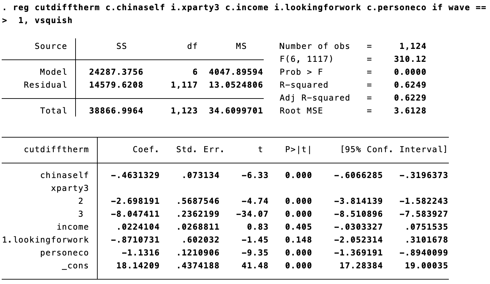
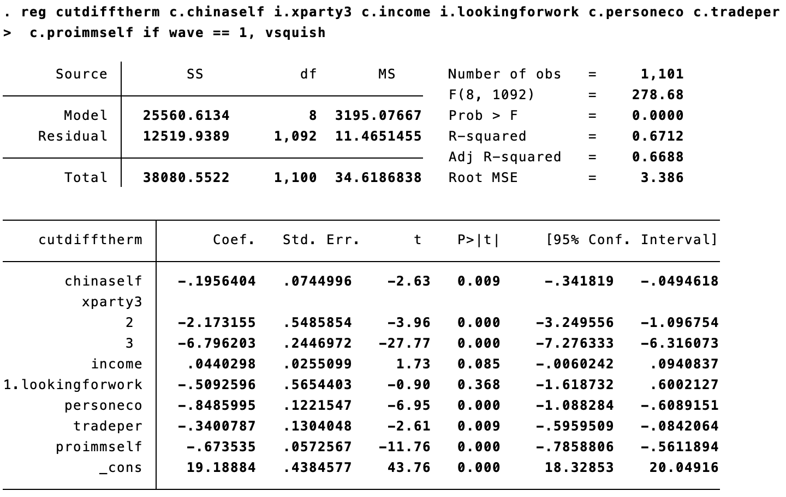
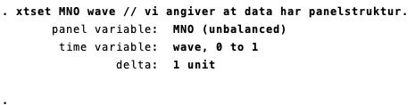
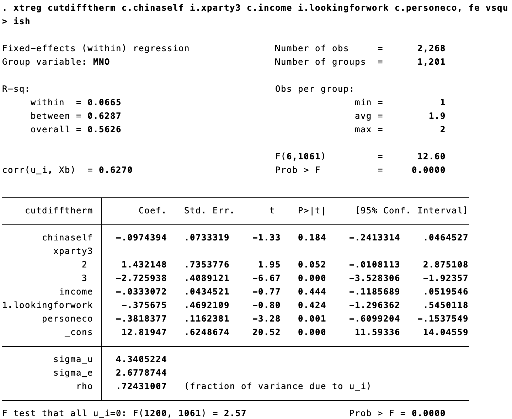
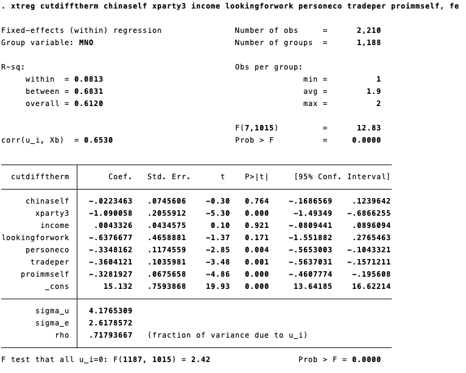
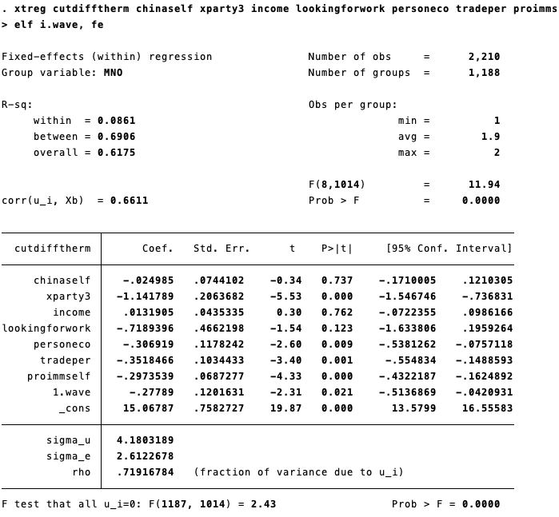
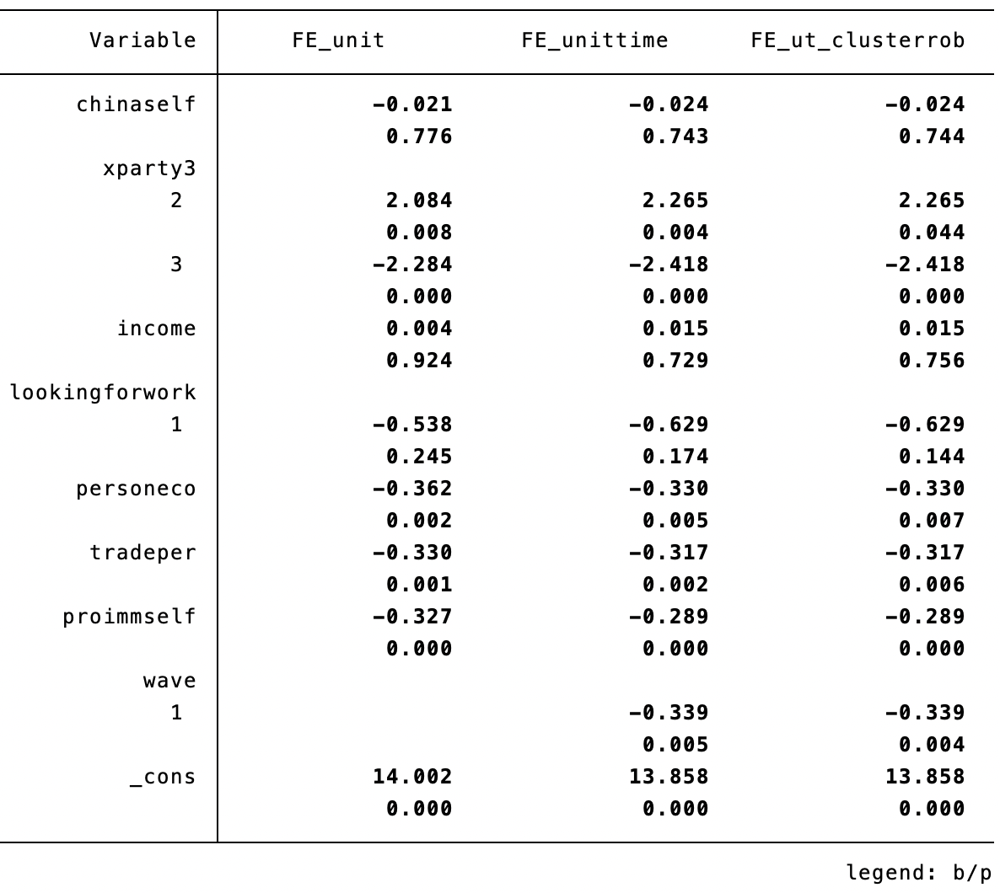

```{r, include=F}
pacman::p_load(tidyverse, knitr, ggdag, lubridate, kableExtra)

knitr::opts_chunk$set(echo = FALSE, 
                      fig.align = "center", 
                      fig.height=12,
                      cache = TRUE)

Sys.setlocale(locale = "da_DK.UTF-8")
```

# GENÅBNING!

<br>

.pull-left[

- Men ikke for os helt endnu...

- Jeg venter ligesom jer i spænding på næste udmelding

- Sandsynligvis afholder jeg en lille **spørgetime** inden eksamen, så forhåbentlig kan vi nå at mødes IRL en enkelt gang

]

.pull-right[

.right[<iframe src="https://giphy.com/embed/lKe5Ll88iZMmQ" width="480" height="360" frameBorder="0" class="giphy-embed" allowFullScreen></iframe><br>**CSS**]

]

---

# Oversigt

```{r plan}

source("../print_plan.R")
print_plan(14)
```

---

# Dagens program

0. Info om vejledning

1. Kausalitet og lidt overblik og afgrænsning

2. Panel__*data*__

3. Fixed effects-modeller vs. almindelig OLS
    - Hvad er fidusen?
    - Øvelsesopgaver
    - Stata

---

# Første vejledning

- **15 min. per gruppe** (10 min. hvis man skriver alene)
- Datoer: **16/4** (formiddag), **19/4** (eftermiddag) og **23/4** (eftermiddag)
- Foregår på **Zoom**: Ét link til alle (begge hold) &arr; log på et par min. før jeres vejledning
- **Tilmelding i Google Sheets** - først til mølle
- Jeg sender **links** til Google Sheet og Zoom

--

**Forberedelse**

- Send en **superkort beskrivelse** af jeres idé indeholdende:
    - Navn(e), hold, vejledningsnummer (jf. Google Sheet)
    - Foreløbig problemformulering
    - Primær metode
    - Data
    - Evt. andre væsentlige overvejelser
    - Spørgsmål!
- **Format**: Max. en halv normalside &rarr; PDF-fil (filnavn der begynder med vejledningsnummer)
- **Deadline**: Send til mig på **sdas@ifs.ku.dk** senest 24 timer før jeres vejledning

---

# Dagens formål

1. At forstå hvorfor paneldata ofte er smartere end tværsnitsdata  

2. At få en fornemmelse for logikken bag fixed effects-modeller

3. At vide hvordan man klargør og analyserer paneldata i Stata

---

# Pensum

Stock, J. H., & Watson, M. W. (2003). Introduction to Econometrics (Vol. 104). Boston: Addison Wesley. 396-419. **Kapitel 10: Regression with Panel Data.**

---

# Recap på kausal inferens 

- I har flere gange hørt mig sige, at vi simpelthen har antaget, at sammenhængen mellem et X og Y er en "**effekt**", og at vi "skyder kausalitetsdiskussionen til hjørne" &rarr; det er slut nu!

--

- Hariris forelæsning om kausalitet og IV inden påske var en ekstremt vigtig (og god!) forelæsning

    - Han præsenterede **potential outcomes**-frameworket, der er den dominerende forståelse af kausalitet
    - Kort sagt handler kausalitet om sammenligninger - **kontrafaktiske sammenligninger**
    - Effekten af X &rarr; Y er **forskellen mellem det faktiske Y for en person, der *har* fået "treatment" (X), og det Y personen ville have haft uden "treatment"** 
    - Sidstnævnte (Y1|D=0) er **kontrafaktisk** og kan ikke observeres &rarr; derfor bruger vi diverse smarte påfund og krumspring (IV-regression og andre **naturlige eksperimenter**)
    
--

- Med OLS og paneldataanalyse forsøger vi at lave fornuftige sammenligninger mellem det, vi antager er substantialt set ens enheder *efter vi har kontrolleret for en række faktorer* ("all else being equal") 
    - vi kan dog aldrig vide os helt sikre på ikke at mangle væsentlige kontrolvariable, og derfor er det en forholdsvist usikker og følsom vej til kausal inferens ift. naturlige eksperimenter
    - **paneldata** har dog nogle særlige fordele, som vi skal se på i dag

---

# Lidt vigtig intro og afgrænsning

- **Paneldata** er slet og ret en type **data** - ligesom tværsnitsdata (fx alm. surveys) &rarr; ikke særligt ophidsende

--

- Årsagen til denne undervisningsgang er, at denne datastruktur giver nogle **fede analysemuligheder**:

    - Paneldata kan i princippet bruges til at undersøge dynamik (udvikling/påvirkning over tid)
    - Kan besvare spørgsmål a la 'Hvad er effekten af at *blive* et demokrati' vs. 'Hvad er effekten af at *være* et demokrati' (ændringer i stedet for niveau)
    - Men i praksis bruges paneldata først og fremmest som en smart kontrolstrategi &rarr; forbedret grundlag for **kausal inferens** ift. almindelig OLS

--

- __Panel*data* kan analyseres på mange måder__ (bl.a. first-difference, random effects, tidsserieanalyse, m.m.), men i praksis anvendes mest (enheds- eller two-way) **fixed effects-modeller** &rarr; det er kun disse, vi kigger på i dag

--

- Hariri var meget grundig, teknisk og pædagogisk til forelæsningen
    - (gen)se evt. hans forelæsning for at få fingerspitzengefühl med fixed effects (de forskellige sammenligninger og estimatorer) 
    - denne time bliver mere anvendelsesfokuseret &rarr; hvornår/hvorfor/hvordan bruger vi paneldata

---

# Paneldata - Den Ultrakorte Version

--

1. Når vi har mulighed for at arbejde med **paneldata** (gentagne observationer af mange enheder) - *og alternativet er en analyse af tværsnitsdata* - så er det næsten altid smart at anvende paneldata

--

2. Paneldata giver os redskaber til at lukke nogle problem-døre - konkret at eliminere nogle former for **omitted variable bias**. Mao. giver det et meget stærkere (omend uperfekt) fundament for **kausal inferens**

--

3. De vigtigste redskaber/modeller at kende og forstå er **fixed effects-modeller**, som essentielt set kan koges ned til **alm. OLS med kontrol for enheden samt evt. tidsperioden**

--

4. I praksis fungerer det ved, at man **tilføjer dummyer for hver enhed** (samt evt. for hver tidsperiode), hvormed hovedeffekten __estimeres inden for (*within*) hver enhed__  

---
class: center, middle, inverse

# Panel__*data*__

---

# Datatyper

**Tværsnitsdata/cross-sectional data**

- Et tværsnit af en given population målt på ét tidspunkt - eller et sample (udsnit)
- Kun rumlig/spatial variation, dvs. variation mellem enheder
- Eksempler: Valgundersøgelsen, European Social Survey, etc. &rarr; alt det I har lært i metode indtil nu

**Tidsseriedata**

- (Typisk) en enkelt enhed/observation målt over tid
- Kun tidslig/temporal variation, dvs. udvikling over tid
- Eksempler: Udviklingen i opbakning til statsministerpartiet fra 2001-2020

**Paneldata**

- Kombinerer tværsnits- og tidsseriedata: Data for flere enheder og flere perioder
- Rumlig *og* tidslig variation, dvs. variation *indenfor* enheder over tid samt enhedsforskelle i denne 
- Eksempler: Landepanel eller panel af surveyrespondenter

---

# Paneldata - struktur

Paneldata kan overordnet set have to strukturer. Data i tabellerne nedenfor er ens. **Hvad er forskellen?**

.pull-left[

```{r}
t1 <- tribble(~enhed, ~x1, ~x2, ~y1, ~y2,
        "a"  , 1  , 1  , 4  , 5,
        "b"  , 0  , 1  , 5  , 8,
        "c"  , 1  , 0  , 3  , 3) %>% 
  kable(align = "c", caption="Bredt format") %>% 
  column_spec(1:4, width="1.5cm")

t1
```
]

.pull-right[

```{r}
t2 <- tribble(~enhed, ~tid, ~x, ~y,
        "a"  , 1   , 1 , 4,
        "a"  , 2   , 1 , 5,
        "b"  , 1   , 0 , 5,
        "b"  , 2   , 1 , 8,
        "c"  , 1   , 1 , 3,
        "c"  , 2   , 0 , 3) %>% 
  kable(align = "c", caption="Langt format") %>% 
  column_spec(1:4, width="1.5cm")

t2
```
]

---

# Paneldata - struktur

Paneldata kan overordnet set have to strukturer. Data i tabellerne nedenfor er ens. **Hvad er forskellen?**

.pull-left[`r t1` 

*En række per enhed - en kolonne per variabel og periode*

]

.pull-right[`r t2` 

*En række per enhed-periode - kun en kolonne per variabel*

]

.center[&rarr; Vi skal altid bruge **langt format** til regressionsanalyse af paneldata!]

---

# Hvordan ændrer man format fra bredt til langt?

**Stata**

> reshape long ["brede" variable der skal transformeres], i([ny enheds-variabel]) j([ny tidsvariabel])

--

Det er vigtigt, at variabel*navnene*, der angives efter "long", er forsynet med en angivelse af tidsperiode/bølge på en konsistent måde (f.eks. bnp10, bnp12 og bnp14 for BNP i år 2010, 2012 og 2014)

--

**Eksempel**

> reshape long x y, i(enhed) j(tid)

--

Problemer? Skriv "help reshape" (sådan kan I altid få hjælp til en kommando) eller søg på Google

???

Fra langt til bredt format i Stata:

reshape wide [variable, der skal bredes ud], i([enheds-variabel]) j([tidsvariabel])

Fx. "reshape wide bnp dem, i(land) j(aar)"

---
class: center, middle, inverse

# Analyse af paneldata

1. Notation
2. Alm. OLS
3. Fixed effects

---

# Notation

For at holde styr på variable, der både varierer tidsligt og rumligt, tilføjes et ekstra fodtegn, **t**, udover det velkendte **i** &rarr; **i** refererer til de observerede *enheder*, mens **t** refererer til *tidsperioden*, enhederne observeres i 

--

Når vi skriver en **statistisk model** på formel, angiver fodtegnet altså, **hvor(dan) hver variabel varierer**:

- $X_i$  &rarr; variablen X varierer kun mellem enheder
- $X_t$  &rarr; variablen X varierer kun over tid 
- $X_{it}$ &rarr; variablen X varierer *både* mellem enheder og over tid. Der er altså en måling for hver periode *t* for hver enhed *i*  

--

**Eksempel**  

$Y_{it}=\alpha + \beta_1 X_{1,it} + \beta_2 X_{2,i} + \beta_2 X_{3,t} + \epsilon_{it}$

Hvad kan vi sige om variationen i de tre uafhængige variable?

<!-- --- -->

<!-- # Recap OLS på krydssektionelle data -->

<!-- - Hovedtema på Metode 2: At lave en statistisk model, som udtrykker hvor meget Y gennemsnitligt ændrer sig, når X vokser med +1 -->

<!-- Sådan en model kunne se sådan her ud: -->

<!-- $Y_i=\alpha + \beta_1 X_{1,i} + \beta_2 X_{2,i} + \beta_3 X_{3,i} + \epsilon_{i}$ -->

<!-- Her er den store udfordring endogenitet: -->

<!-- - Dvs. at en vores uafhængige variable, $X_{1,i} ... X_{5,i}$ er korreleret med vores $\epsilon_{i}$ -->

<!-- - Hvis dette er tilfældet har vi *udeladt variabel bias* (OVB), altså glemt at kontrollere for en relevant variabel. -->

<!--  -->

---

# Øvelsesopgave 8

**Hvorfor vandt Trump det amerikanske præsidentvalg i 2016?**

.left-column[

```{r}

```

```{r}
include_graphics("media/trump.png")
```

```{r}

```

]

.right-column[

- Mutz hævder, at Trump-vælgere er motiveret af en **følelse af tabt status** snarere end økonomiske vanskeligheder

- Vi har paneldata med samme respondenter (**MNO**) målt to gange - i 2012 og 2016 (**wave**)

    - Den *afhængige* variabel er **cutdifftherm**, som udtrykker respondentens **positive følelser over for Trump** fratrukket positive følelser over for Hillary (0-19; højere værdi = mere positiv holdning til Trump)
    - Den primære *uafhængige* variabel er **chinaself** ("China threat"), som udtrykker **i hvilken grad respondenten opfatter Kina som en trussel mod USA** fra 1 (trussel) til 7 (mulighed)
    - En **positiv sammenhæng** mellem X og Y ville altså indikere, at mindre trussel &rarr; mere støtte til Trump  

]

---

# Øvelsesopgave 8.1

**Cross-sectional analyse af 2016-bølgen** 

- Vi ignorerer datas panelstruktur og anvender kun observationer fra 2016 (= tværsnit)

- **Fit en OLS-model med holdning til Trump (_cutdifftherm_) som afhængig variabel og _chinaself_ som uafhængig**

    - **Kontrolvariable**: indkomst (income), ledighed (lookingforwork), personlig økonomi (personeco) og parti (xparty3)

--

- Hvordan ville sådan en model se ud? 

--

> $cutdifftherm_i = \alpha + \beta_1 ChinaThreat_i + \beta_3 Indkomst_i + \beta_4 Ledig_i\\+ \beta_5 Økonomi_i + \beta_6 Parti\_Independent_i + \beta_7 Parti\_Democrat_i + \epsilon_i$

---

# Øvelsesopgave 8.1

**Cross-sectional analyse af 2016-bølgen** 

.left-column[

**Hvad er sammenhængen mellem "China threat" (chinaself) og støtte til Trump?**

... efter kontrol for de fire kontrolvariable

]

.right-column[
```{r}

```
]

---

# Øvelsesopgave 8.1

**Cross-sectional analyse af 2016-bølgen** 

.left-column[

Overordnet set, en **stærk negativ sammenhæng**

Når en respondent går 1 point højere op på China threat-skalaen (1-7), altså opfatter Kina *mindre* som trussel, reduceres støtten til Trump med 0.46 skalapoint (p<0.000)

Det peger altså isoleret set på, at "China threat" havde en stærk effekt på støtten til Trump

]

.right-column[
```{r}

```
]

---

# Øvelsesopgave 8.2 

**Cross-sectional analyse af 2016-bølgen - med yderligere kontrolvariable** 

.left-column[

Tilføj kontrolvariable, der angiver om respondenten selv har haft gavn af international handel (**tradeper**) og er *for* indvandring (**proimmself**)

**Er der stadigvæk en sammenhæng mellem chinaself og cutdifftherm? Har den ændret sig?**

]

.right-column[
```{r}

```
]

---

# Øvelsesopgave 8.2 

**Cross-sectional analyse af 2016-bølgen - med yderligere kontrolvariable** 

.left-column[

Sammenhængen reduceres markant fra 0.46 til 0.20, men er stadig signifikant (p<0.01)

Side note: Man skal være yderst varsom med at kontrollere for (holdnings)variable, der i sig selv er påvirket af X &rarr; risiko for **post-treatment bias**

]

.right-column[
```{r}

```
]

---

# Men er det en *kausal* sammenhæng?

- Kan vi med ro i maven konkludere, at X (opfattet trussel fra Kina) har en kausal effekt på Y (støtte til Trump), dvs. *forårsager* Y?

- Hvorfor/hvorfor ikke?

- Hvad skal der til?

- Snak om det i 3-5 min.

***

--

- Den helt **centrale forudsætning** er, at der ikke er endogenitetsbias, herunder **omitted variable bias** (OVB)
    - at der er kontrolleret for alle **faktorer, som kan påvirke både X og Y** (a.k.a. fravær af spuriøsitet)
    
- Vi kunne ret hurtigt finde nogle faktorer, der potentielt påvirker trusselsopfattelse *og* støtte til Trump og dermed *confounder* sammenhængen 

---
layout: true

# Omitted variable bias

```{r}
tb <- tribble(~a, ~b,
              "A - farlig","B - håndterbar",
              "C - håndterbar","D - OK") %>% as.data.frame()

names(tb) <- c("Tidsvariant", "Tidsinvariant (konstant)")
rownames(tb) <- c("Enhedsvariant", "Enhedsinvariant (ens)")

kable(tb, caption="Typologi over faktorer, der kan medføre OVB")
```

---

--

- D. Fuldstændigt **ens og konstante faktorer** (Planet = jorden) &rarr; behøver vi ikke at bekymre os om 

--

- C. Faktorer der **varierer over tid**, men er ens for alle 

--

- B. Faktorer der **varierer mellem enheder**, men er konstante over tid

--

- A. Faktorer der **både varierer over tid og mellem enheder**

--

- Med **tværsnitsdata/OLS** skal vi kunne kontrollere for det hele (bortset fra D)

---

- Med **paneldata** kan vi anvende **fixed effects** til at eliminere nogle former for OVB
    - **enheds-fixed effects** eliminerer B
    - **tids-fixed effects** eliminerer C
    - D er ufarlig

--
    
- Det magiske er, at **vi ikke engang behøver kunne observere disse faktorer**

--

- Kun **A er tilbage** (*ideosynkratisk OVB*, jf. Hariri) og må håndteres med kontrolvariable

--

> "[Two-way fixed effects] is **immune to omitted variable bias from variables that are constant either over time or across [units]**" .right[(Stock & Watson)]

---
layout: false

# Så hvordan estimeres (two-way) fixed effects?

--

$Y_{it} = \beta_1 X_{it} + \alpha_i + \gamma_t + \epsilon_{it}$

Sådan! Det ser avanceret ud, men det er i virkeligheden tæt på, hvad I allerede kan. Læg mærke til fodtegnene

--

- **Enheds-fixed effects**, $\alpha_i$, opnår vi ved tilføje en **dummy for hver enhed** som kontrolvariabel
    - Vi "kontrollerer for enhedsvariation" og giver hver enhed sit eget $\alpha_i$ (konstantled), som tager højde for enheds-konstante faktorer

--

- **Tids-fixed effects**, $\gamma_t$ , opnår vi ved at tilføje en **dummy for hver tidsperiode** som kontrolvariabel
    - Vi "kontrollerer for tidsvariation" og fjerner den overordnede tidstrend

--

- Den tilbageværende variation er kun **indenfor hver enhed** &rarr; kaldes derfor også en *within-estimator*

---

# Så hvordan estimeres (two-way) fixed effects?

**Stata**

*Enten*

> xtset enhedsid tidsvariabel

*efterfulgt af*

> xtreg Y X i.tidsvariabel, fe

*eller*

> reg y x i.tidsvariabel, absorb(enhedsid)

--

- Samme kommandoer uden **"i.tidsvariabel"**, hvis vi kun vil have enheds-fixed effects

--

- Med **reg** kan vi efterfølgende teste OLS-antagelser. **absorb**-tilføjelsen er det samme som at tilføje "i.enhedsid" som kontrolvariabel uden at estimaterne printes i Stata-outputtet

---

# Øvelsesopgave 8.3

**Tilbage til Trump og Mutz!**

.left-column[

```{r}

```

```{r}
include_graphics("media/trump.png")
```

```{r}

```

]

.right-column[

Brug *xtset*-kommandoen til at specifiere panelstrukturen og enheds- og tidsvariablene for Stata:

```{r}

```

]

---

# Øvelsesopgave 8.4

**Enheds-fixed effects**

- I opgave 8.4 bliver vi igen bedt om at estimere $\beta_1$

- Men denne gang udnytter vi panelstrukturen og den tidslige variation (*t*-fodtegn) og tilføjer enheds-fixed effects, $\alpha_i$

--

$cutdifftherm_{it} = \alpha_{i} + \beta_1 ChinaThreat_{it} + \beta_3 Indkomst_{it} + \beta_4 Ledig_{it} + \beta_5 Økonomi_{it} \\ + \beta_6 Parti\_Independent_{it} + \beta_7 Parti\_Democrat_{it} + \epsilon_{it}$  

--

- Konsekvens: Nu udtrykker $\beta_1$, **hvor meget Y ændrer sig, når X vokser med +1 _indenfor personer_**

---

# Øvelsesopgave 8.4

**Enheds-fixed effects**

.pull-left[

**Hvordan adskiller resultaterne sig fra tværsnitsanalysen?** 

Hænger *chinaself* sammen med støtte til Trump?

]

.pull-right[
```{r}

```
]

---

# Øvelsesopgave 8.4

**Enheds-fixed effects**

.pull-left[

Koefficienten for chinaself er -0.09 (forventet retning), men sammenhængen er **ikke signifikant** (p=0.184)

Selvom folk der opfatter Kina som en trussel bedre kan lide Trump, **jf. tværsnitsanalyse**, betyder det ikke, at *ændringer i opfattelsen af Kina* hænger sammen med - eller forårsager - *ændringer i støtte til Trump*, **jf. paneldata-analyse**

]

.pull-right[
```{r}

```
]

---

# Øvelsesopgave 8.4

**En krølle på fortolkningen**

- Der er forskel på *at være* et demokrati og *at blive* et demokrati - eller at være/blive Trump-tilhænger

- Tværsnitsanalysen og panelanalysen besvarer derfor reelt forskellige spørgsmål

--

- Forestil jer for eksempel at borgere i områder, hvor mange arbejdspladser gennem 00’erne er blevet outsourcet til Kina, betragter Kina som en trussel og elsker Trump. Tværsnitsanalysen viser os netop, at der er en stærk sammenhæng mellem de to. Der er ikke et kausalt forhold, for de er begge to konsekvenser af noget bagvedliggende (fx outsourcing)

- Panelmodellen viser imidlertid, at ændringer i X ikke hænger sammen med ændringer i Y. Men resultatet fra tværsnitsanalysen er stadig interessant, også selvom det er misvisende ift. en kausal fortolkning

---

# Øvelsesopgave 8.4

**Enheds-fixed effects med yderligere kontrolvariable**

.pull-left[

Vi tilføjer **to kontrolvariable** mere (*tradeper* og *proimmself*)

Se på koefficienten for **chinaself** igen

Nu er den blevet endnu mindre signifikant (p=0.776)

]

.pull-right[
```{r}

```
]

---

# Øvelsesopgave 8.4

**Two-way fixed effects**

.pull-left[

**Vi tilføjer tids-fixed effects** ("i.wave") dvs. en dummy for hver periode (her reelt kun én dummy)

Dermed estimeres en model med **two-way fixed-effects** (kaldes også *difference-in-differences-estimatoren*)

Her udtrykker koefficienten: Hvor meget *mere* ændrer Y sig over tid for personer med X+1 sammenlignet med personer med X? Eller **hvor meget ændres tidstrenden for Y, når X øges med +1**?

**Er tidstrenden gennemsnitligt set forskellig** for individer, der ser Kina som en mulighed vs. som en trussel? (Se på _chinaself_ igen)

]

.pull-right[
```{r}

```
]

---

# Øvelsesopgave 8.4

**Two-way fixed effects**

.pull-left[

Nej! Nu er $\beta_1$ (-0.24) endnu mindre signifikant (p=0.74)

Hvad fortæller estimatet for **wave** os?

Folk bliver gennemsnitligt set mere negative overfor Trump fra 2012 til 2016

]

.pull-right[
```{r}

```
]

---

# Klyngerobuste standardfejl

- **Standardfejl** angiver *præcisionen* at et estimat (en effekt)

--

- Normale standardfejl antager at alle observationer er uafhængige af hinanden

--

- Når vi observerer den samme observation flere gange, vil der ofte være udfordringer med **autokorrelation**, dvs. at samme enheds fejlled er korreleret over tid 
    - **normale standardfejl undervurderer derfor usikkerheden**

--

- En mulig løsning: **Klyngerobuste standardfejl** på enhedsniveau
    - det får Stata til at tage højde for, at observationerne ikke er uafhængige, men at der er flere per person - at data indeholder sammenklumpede (clustered) observationer
    - ofte en god idé - i det mindste som supplement

--

- Tilføjes i Stata med optionen **cluster(enhedsvariabel)**, dvs. ", cluster(MNO)" 

---

# Finale: Sammenligning af tre modeller

*Beta-koefficienter* og *p-værdier* fra tre modeller med alle kontrolvariable samt (1) **enheds-fixed effects**, (2) **two-way fixed effects** og (3) **two-way fixed effects med klyngerobuste standardfejl** på enhedsniveau

.pull-left[

Hvor stor en forskel tids-fixed effects og klyngerobuste standardfejl gør, **afhænger af den konkrete undersøgelse**

**Her gør det praktisk talt ingen forskel**, hvilket i og for sig er en god ting &rarr; indikerer at sammenhængen er **robust**

Bemærk at **klyngerobuste standardfejl** ikke ændrer ved estimaterne, men kun ved usikkerheden (standardfejl og p-værdier) 

]

.pull-right[
```{r}

```
]

???

Tabellen er lavet med "estimates store modelnavn" efter kørslen af hver model og så:

> estimates table [modelnavne], b(%7.3f) p(%7.3f) title("titel") varwidth(16) modelwidth(16) vsquish 

---

# Opsummering - en samlet fremgangsmåde

1. **Indsaml/find paneldata** (enheder observeret i flere perioder) - skal være i **langt format**

2. Fortæl Stata, at data er **paneldata**: "xtset enhedsvariabel tidsvariabel"
    
3. **Kør jeres regressionsanalyser**: "xtreg Y X Z1 Z2 Z3, fe"
    
4. Undersøg og demonstrér **robusthed** af resultater overfor forskellige specifikationer, herunder kontrol for *tidsvarierende* faktorer (vha. **tids-fixed effects**) og **klyngerobuste standardfejl**

    - xtreg Y X Z1 Z2 Z3 i.tidsvariabel, fe
    
    - xtreg Y X Z1 Z2 Z3 i.tidsvariabel, fe cluster(enhedsvariabel)
    
5. Test **forudsætninger** som normalt med OLS baseret på genkørsel af model(ler)

    - reg Y X Z1 Z2 Z3 i.tidsvariabel, absorb(i.enhedsvariabel)
    
    - samme antagelser som OLS plus **ingen autokorrelation**

---

# Ulemper ved paneldata

1. Panel data med fixed effects-estimation løser mange af udfordringerne med **omitted variable bias (OVB)** og endogenitet, **men ikke alle**: 

--

    - med **two-way-fixed effects** kan vi eliminere OVB fra tidsinvariante variable og enhedsinvariante variable, men **ideosynkratisk OVB** (fra tids- og enhedsvariante faktorer) **skal stadig håndteres med alm. kontrol**, før vi kan kalde et estimat for en kausaleffekt
    
--

    - vi kan ikke afhjælpe **omvendt kausalitet** med paneldata &rarr; (også) her må vi argumentere teoretisk
  
--

    - (begge elimineres, hvis den uafhængige variabel tildeles tilfældigt &rarr; hint til eksperimenter i næste uge)
    
--

2. Det kræver langt flere **ressourcer** og mere **tid** at indsamle paneldata end tværsnitsdata. Derfor er paneldata sværere at indsamle selv, mindre udbredt og **mindre tilgængeligt**

---

# Higher-order fixed effects

En nice-to-know sidenote (evt. relevant i bachelorprojekt)

- Vi har kun berørt *enheds*-fixed effects

- Man kan også tilføje **rumlige fixed-effects på et højere niveau end enheds-niveauet** - også med tværsnitsdata (klar parallel til multilevel-analyse)

- Eksempel: Hvis man undersøger en sammenhæng for **individer i forskellige lande**, kan man fx tilføje fixed effects (og klyngerobuste standardfejl) på lande-niveau og dermed håndtere alt det, der gør folk forskellige på tværs af lande

---

# Dagens pointer

- Paneldataanalyse handler først og fremmest om at kontrollere for en masse (observerede eller uobserverede) ting med et snuptag

- Naturlige eksperimenter (IV, RD, mv.) giver os et passende sammenligningsgrundlag til at identificere kausale effekter

- Observationelle tværsnitsanalyser (fx OLS) kan kun stræbe efter dette ved at kontrollere for alle faktorer, der påvirker X og Y &rarr; aldrig helt sikkert

- **Paneldata** har den store fordel, at man kan udnytte kombinationen af rumlig og tidslig variation til at lave (two-way) fixed effects-modeller, der **eliminerer nogle typer omitted variable bias**
    - herefter kun problemer med faktorer, der varierer mellem enheder *og* over tid
    - klar forbedring fra OLS men ikke på niveau med naturlige eksperimenter

- Fixed effects-modeller tilføjer dummyvariable for enheder og tid for at finde effekten af X på Y *inden for enhederne* (over tid) eller *difference-in-differences*
    - husk desuden på forskellen mellem "effekten" af *at blive et demokrati* vs. *at være et demokrati*

---

# Næste gang

- Sidste holdtime <span style='font-size:30px;'>&#128553;</span>

- Kausal inferens III: Eksperimentelle designs

    - "Guldstandarden" inden for kausal inferens

    - Vigtigt at få en fornemmelse for &rarr; idealet for de fleste tilgange til kausal inferens

- Første vejledning (husk at tilmelde jer) 

---
class: title-slide, center, middle

# Tak for i dag!
