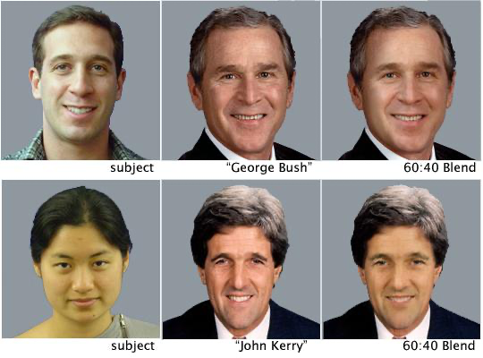
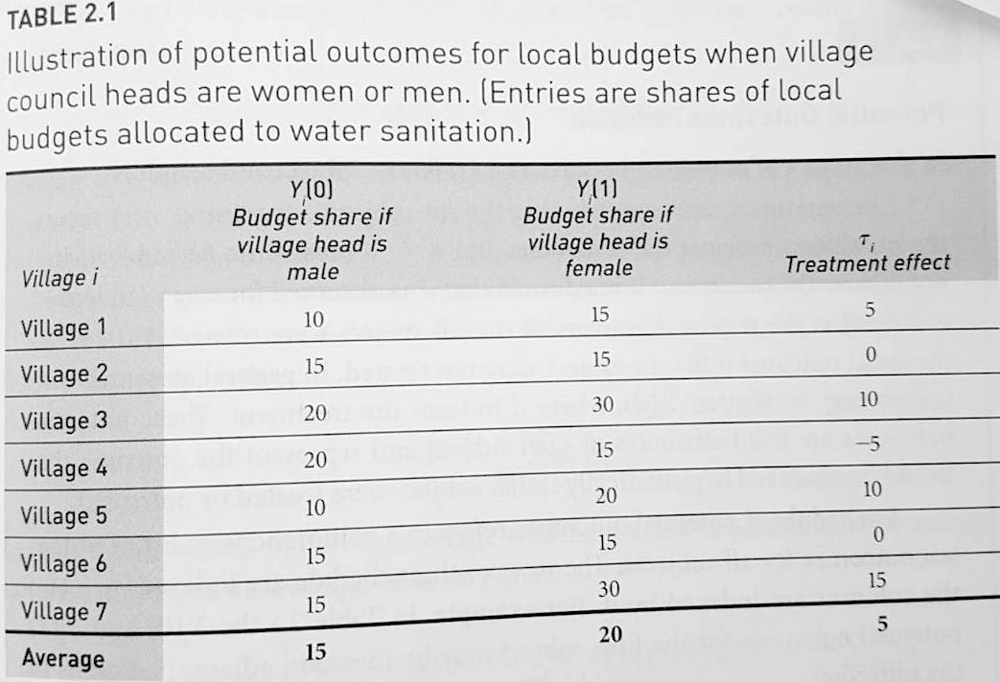
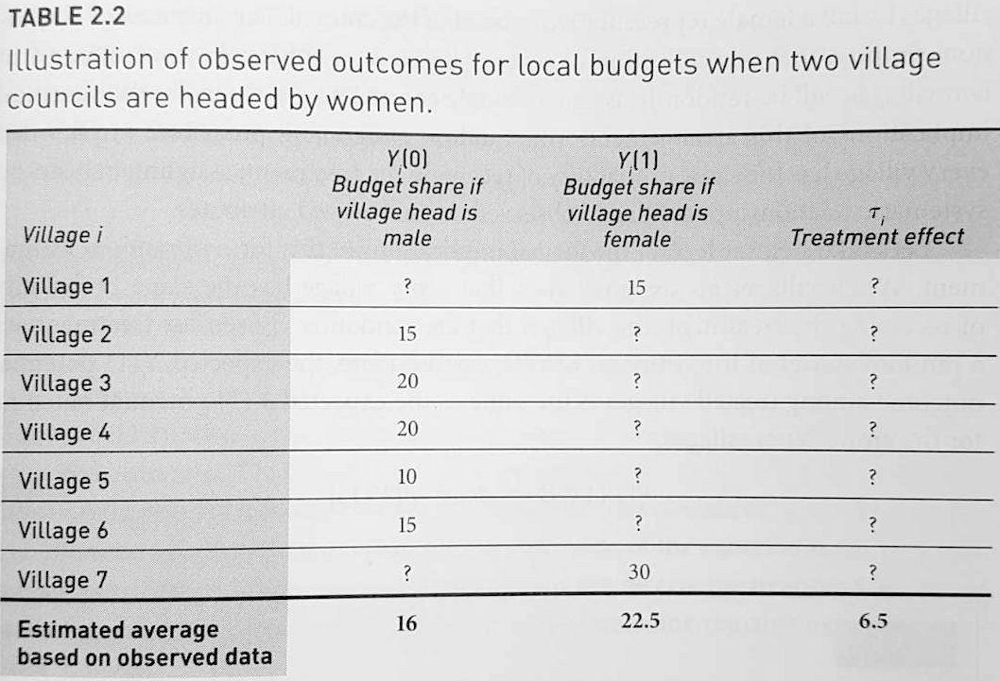
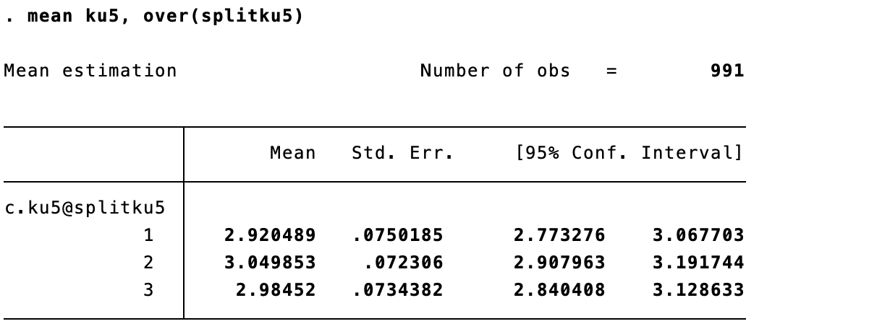
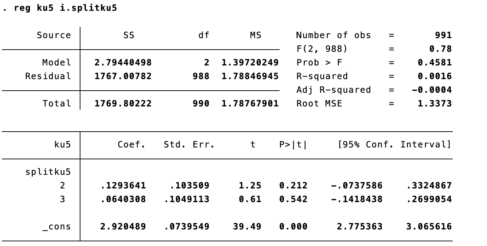

```{r, include=F}
pacman::p_load(tidyverse, knitr, ggdag, lubridate, kableExtra, xaringanExtra)

knitr::opts_chunk$set(echo = FALSE, 
                      fig.align = "center", 
                      fig.height=12,
                      cache = TRUE)

Sys.setlocale(locale = "da_DK.UTF-8")

xaringanExtra::use_tile_view()
```

# Sidste holdtime!

```{r plan}

source("../print_plan.R")
print_plan(15)
```

---

# Vejledning

- Husk første vejledning på Zoom 16/4, 19/4 og 23/4

- Tilmeld jer i Google Sheets &rarr; [http://kortlink.dk/2b3zy](https://docs.google.com/spreadsheets/d/1E81aUlid_0q6mMuxVZyLYhfcqZhQybu1pwlxlALtQn4/edit)
    - de fleste har allerede gjort det &rarr; skriv til mig, hvis der ikke er flere tider

- Anden vejledning &rarr; samme format omkring uge 20 

---

# Recap fra sidste gang

- Kausalitet kræver, at X er **eksogent** &rarr; fravær af endogenitetsbias, herunder **omitted variable bias (OVB)**

--

- **Paneldata** er en smart datatype med *gentagne observationer af mange enheder* (fx survey to gange med samme respondenter)

--

- **Fixed effects-modeller** (enheds-, tids- eller two-way) er en udvidelse af OLS, der udnytter paneldatastrukturen

    - kontrollerer "automatisk" for variation (heterogenitet) på enheds- og/eller tidsniveau

    - kan helt **eliminere OVB fra faktorer, der er tids- eller enhedskonstante** - både observerede *og uobserverede* (!)
    
    - fortolkning ændres en smule til effekten af X på Y **inden for enheder over tid** (*within unit-estimator*) eller forskelle i udviklingen over tid (*difference-in-differences-estimator*)  

--

- **paneldata og fixed effects er ikke en perfekt løsning** &rarr; fortsat mulighed for omvendt kausalitet og OVB fra tids- og enheds-variante faktorer 

---

# Dagens program

1. Lidt indledning om eksperimenter

2. Potential outcomes, ATE og randomisering

3. Eksperiment vs. statistisk kontrol

4. Tre centrale antagelser bag eksperimenter

5. Analyse og øvelsesopgaver

---

# Dagens formål

- At forstå *hvorfor* eksperimentet er den bedste løsning, når det kommer til at identificere **kausale effekter** (kausal inferens)

- At forstå fidusen og logikken i eksperimentets hjørnesten: **randomisering**

- At vide mere om nogle af de **faldgruber** (antagelser), man skal være opmærksom på, når man designer eksperimenter

- At kunne analysere og fortolke resultaterne af et eksperiment

---

# Pensum

Gerber, A. S., & Green, D. P. (2012). Field experiments: Design, analysis, and interpretation. WW Norton.

- Kapitel 1: Introduction

- Kapitel 2: Causal Inference and Experimentation

&rarr; Grundsten i moderne eksperimentel politologi og socialvidenskab (eksperiment- og kausal inferens-interesserede kan med fordel læse lidt videre)

---

# Hvad er et eksperiment*?

*aka _randomized controlled trial_ (RCT)

--

- Kaldes sommetider "guldstandarden" inden for kausal inferens, da vi ofte stræber mod, sammenligner med eller efterligner eksperimentet

--

- Kort fortalt er eksperimentet en metode, hvor man **tilfældigt fordeler nogle subjekter** i (mindst) to grupper - en treatmentgruppe og en kontrolgruppe - og tildeler subjekterne i treatmentgruppen et - I gættede det - **treatment** (stimulus)

    - Efter tildelingen af treatment måles et outcome (Y) i begge grupper

    - Pga. randomiseringen er grupperne statistisk set ens og treatment er den eneste forskel. **Derfor kan effekten af treatment estimeres som forskellen i de to gruppers outcome**
    
    - Vi kan mao. helt eliminere endogenitetsbias &rarr; stærk evidens for kausalitet

--

> "_Random allocation is the dividing line that separates experimental from non-experimental research in the social sciences_" (Gerber & Green, 2012, p. 8)

---

# Typer af eksperimenter

- Eksperimenter kan designes og "findes" i mange former, herunder

    1. Det klassiske laboratorieeksperiment
    2. Surveyeksperimenter  
    3. Felteksperimenter (eksperimenter udført i "den virkelige verden")
    4. Naturlige eksperimenter (IV-regression, RDD mv.)
    5. Kvasieksperimenter (observationelle studier, hvor vi kan argumentere for, at X er eksogen eller så-godt-som-tilfældigt fordelt)
    
--

- Der er fordele og ulemper ved alle &rarr; fx har laboratorieeksperimenter ofte størst **intern validitet**, fordi forskeren har fuldstændig kontrol over situationen

--

- Til gengæld kan flere af de andre have en højere grad grad af eksperimentel realisme eller **økologisk validitet**, fordi de undersøger den virkelig verden, som den faktisk udfolder sig
    - det gør at vores resultater lettere kan overføres/generaliseres til "virkeligheden"
    - afhænger af autenciteten af (1) treatment, (2) subjekterne, (3) konteksten og (4) outcome (se Gerber & Green, 2012, pp. 9-13)
   
???

Som Gerber & Green påpeger fordrer alle eksperimenttyper, at treatment tildeles tilfældigt - det er ikke nok, at det er uorganiseret, uudgrundelig, etc.

---

# Et eksempel på et politologisk eksperiment

.pull-left[

1. "researchers obtained digital photographs of 172 registered voters"

2. "these same participants were asked to participate in an online survey [...] about the presidential candidates (President George W. Bush and Senator John Kerry)"

3. "The screens for these candidate questions included photographs of the two candidates displayed side by side. **Within this split-panel presentation, participants had their own face either morphed with Bush or Kerry** at a ratio of 60% of the candidate and 40% of themselves"

4. "weak partisans and independents [...] **moved in the direction of the more similar candidate**"

]

.pull-right[
```{r}

```

*Kilde: Iyengar (2009) og Bailenson, Iyengar, and Yee (2009)*

]

???

Iyengar, S. (2009). Laboratory Experiments in Political Science. Conference on Experimentation in Political Science, Northwestern University

Bailenson, JN, Iyengar, S., Yee, N., & Collins, N. (2009). Facial similarity as a voting heuristic. *Public Opinion Quarterly*.
---

# Potential outcomes

**Hvad er potential outcomes og hvordan hjælper de os med at forstå kausale effekter?**

--

- Potential outcomes er en måde at formalisere den kausale logik

--

- Forestil jer, at vi slår **plat eller krone**, om hvorvidt et subjekt, $i$, skal tildeles et treatment (*D*) eller ej: 

    - $D_i = 1$, treatment tildeles
    - $D_i = 0$, treatment tildeles ikke

--

- Hvert subjekt $i$ har **to potentielle udfald af outcome** $Y_i$:

    - subjekt $i$ viser sit treatede potential outcome $Y_i(1)$, hvis vi tildeler det et treatment, $D_i = 1$

    - omvendt viser subjekt $i$ sit untreatede potential outcome $Y_i(0)$, hvis vi *ikke* tildeler det et treatment, $D_i = 0$

--

- Kun ét af scenarierne kommer faktisk til at udspille sig. Vi vil aldrig kunne observere begge udfald for samme enhed

---

# Potential outcomes

**Hvad forsøger Gerber & Green at illustrere med disse to næsten ens tabeller? Hvad er forskellen?**

.pull-left[
```{r, fig.cap="Syv landsbyer i to parallelle verdener<br>(Gerber & Green, 2012, p. 23)"}

```
]

.pull-right[
```{r, fig.cap="Syv landsbyer i vores realiserede verden<br>(Gerber & Green, 2012, p. 31)"}

```
]

---

# Average Treatment Effect (ATE)

Hvert subjekt har i teorien sin egen **treatmenteffekt** defineret ved:

> $\tau_i = Y_i(1) − Y_i(0)$ &rarr; dvs. forskellen på $Y_i$ med og uden treatment $D_i$ (to parallelle verdener)

--

- Men er $\tau_i$ observerbar?

--

- Nej. Vi kan kun observere det realiserede (treatede eller untreatede) potential outcome for hvert subjekt - aldrig begge

--

- Ærgerligt?! For det vi er interesserede i at finde er gennemsnittet af alle subjekters $\tau_i$ også kaldet **den gennemsnitlige treatment effekt (ATE)**

--

- Men der findes en genial løsning på problemet ... nogen gæt?

--

- **Tilfældig tildeling af treatment (randomisering)!**

---

# Tilfældig tildeling af treatment (I)

**Hvordan gør _randomisering_ os i stand til at estimere ATE, der, som sagt, aldrig kan observeres direkte?**

--

- Svar: Randomiseringen skaber grupper, der i udgangspunktet (pre-treatment) er identiske

--

- Mere præcist betyder det, at der er lige stor sandsynlighed for at blive "udtrukket" til treatment for kvinder, mænd, unge, gamle, rige, fattige, høje, lave, hvide, sorte, universitetsuddannede, faglærte etc. etc. 
    - gælder alle observerbare såvel som uobserverbare karakteristika
    - betyder at grupperne i forventningen er ens &rarr; *statistisk set* ens 

--

- Det betyder, at der ikke er nogen (systematisk) sammenhæng mellem **gruppernes karakteristika** (baggrundsvariable) og deres **treatmentstatus**
    - i kausalmodellen er der altså ingen pile, der peger ind på X

--

- I økonometri-lingo er den **uafhængige variabel (*X*) uafhængig af fejlledet**, $\epsilon_i$. Mao. varierer $\epsilon_i$ kun rent tilfældigt ift. $X_i$ i modellen $Y_i = \alpha + \beta_1 X_i + \epsilon_i$
    - det betyder, at den uafhængige variabel per design er **eksogen** &rarr; vi har elimineret **endogenitetsbias**

---

# Tilfældig tildeling af treatment (II)

- Da grupperne er statistisk set ens, er deres potentielle outcomes også identiske

--

- Derfor udgør kontrolgruppen *per design* et validt kontrafaktum til treatmentgruppen &rarr; vi kan sammenligne dem

--

- Forskellen i gruppernes gennemsnit vil udtrykke den gennemsnitlige $\tau_i$ (ATE) - netop hvad vi søger!

--

- Denne *difference-in-means*-estimator er en **unbiased estimator af ATE** (som vi søger), når vores uafhængige variabel er tilfældigt tildelt 
    - unbiased: vi kan godt ramme forbi den sande ATE med vores konkrete undersøgelse, men hvis vi gentog den 100 gange, ville vi ramme rigtigt

--

***

- **Tilfældig tildeling af X er fundamentet for designbaseret inferens, og det er den første og vigtigste antagelse for eksperimentet** (de to andre kommer lige straks)  

---

# Tilfældig tildeling af treatment (III)

**Randomisering i praksis**

--

- Sandsynligheden for at blive udtrukket til treatment- og kontrolgruppen behøver ikke at være 50/50. Det kunne også være f.eks. 20/80

--

**Simpel vs. komplet randomisering**

Vi antager en 20/80-fordeling af treatment- og kontrolgruppen: 

- **Komplet randomisering** sørger for, at der nøjagtigt er 20 i treatmentgruppen og 80 i kontrolgruppen

--

- **Simpel randomisering** betyder blot, at der er 20 % sandsynlighed for at hvert subjekt placeres i treatmentgruppen, men reelt kan det (tilfældigvis) ende med at være 12, 17 eller 25   

--

- Se **konkret procedure** (komplet randomisering) i Frederik Hjorths slides eller Gerber & Green (2012)

- Sommetider tager vi en mere praktisk tilgang, fx ved at tildele treatment pba. lige/ulige fødselsdatoer i surveyeksperimenter
 
---

# Modelbaseret inferens

**Kunne vi have opnået samme valide sammenligningsgrundlag - dvs. to statistisk set ens grupper - vha. statistisk kontrol?**

- Hvad ville det kræve?

--

- **At vi kontrollerer for samtlige potentielt relevante variable**
    - at alle relevante variable er observer*bare*
    - at vi faktisk *har* observeret (målt) dem &rarr; vi har data
    - at der ikke findes yderligere relevante variable, som vi pt. ikke engang har fantasi til at forestille os 

--

- Meget **stærk antagelse** &rarr; og vi kan aldrig være sikre! 

--

- Netop **derfor er eksperimentet genialt**: Randomiseringen eliminerer alle systematiske observerbare **og uobserverbare** forskelle mellem treatmentgruppen og kontrolgruppen. Det eliminerer *alle* confounders af X &rarr; Y

--

- **Tilfældig tildeling af X giver det stærkest mulige grundlag for kausal inferens** og er derfor altid at foretrække frem for *modelbaseret inferens*, når det kommer til kausale spørgsmål

---
class: center, middle, inverse

# De tre centrale antagelser* bag eksperimenter

_*nødvendige antagelser for at et eksperiment estimerer gennemsnitseffekten (ATE) på en unbiased måde_

1. Tilfældig tildeling af treatment (randomisering)

---

# Antagelse 2: Ekskluderbarhed

**Treatmenttildelingen påvirker kun Y gennem selve treatment**

--

- Truet når der opstår forskelle mellem treatment- og kontrolgruppen, **udover selve treatment**, som kan påvirke outcome, fx hvis:
    - **treatment er "bundled"**, dvs. indeholder flere X’er. F.eks. at få et brev, som opfordrer en til at stemme. Her modtager treatmentgruppen både et brev og informationen i brevet
    - **subjekter er bevidste** om deres treatmentstatus og kan handle på den
    - **outcome måles forskelligt** i de to grupper

--

- Antagelsen om ekskluderbarhed er grunden til, at vi eksempelvis:
    - sørger for at subjekter og forskere ikke kender treatmentstatus &rarr; (double) **blinding**
    - tildeler kontrolgruppen et **placebo** (fx kalktabletter eller en "neutral" besked)
    - generelt undersøger alle subjekter under nogenlunde **samme betingelser** (fx tidspunkt, vejr)

--

- Vi kan **visualisere** problemet i en kausalmodel...

???

Brud på eksluderbarhedsantagelsen betyder ikke nødvendigvis, at det vi finder ikke er en kausal effekt. Spørgsmålet er, hvad det er en effekt af? Uden ekskluderbarhed er det kombinationen af flere faktorer (fx brev + besked), hvilket ofte er mindre informativt og kan være misvisende.

---

# Antagelse 3: Non-interferens

**Ingen subjekter påvirkes af andre subjekters treatmentstatus (ingen spill-over mellem subjekter)**

--

- Truet når der er spill-over mellem subjekter, fx hvis:

    - Subjekter kender andre subjekters **treatmentstatus**
    
    - Treatment kan "smitte" fra treatede til untreatede (og subjekterne er tidsligt og rumligt i nærheden af hinanden)

--

- Endnu en god grund til **blinding** (og evt. at adskille subjekter i rum/tid)

--

- Også dette kan vi **visualisere** i en kausalmodel...

---

# Jamen, hvordan *analyserer* man så et eksperiment? 

- Med designbaseret (kausal) inferens ligger alt det hårde arbejde i *designet*, så analysen er nem! 

--

- **Effekten** af et treatment estimeres simpelthen som **forskellen i gennemsnittet af outcome mellem treatment- og kontrolgruppen** (*difference-in-means*)

--

- Men vi vil også gerne vide noget om **præcisionen eller usikkerheden** i estimatet

--

    - Vi kunne for eksempel lave en **t-test** ("ttest outcome, by(treatmentgruppe)"), men et langt mere fleksibelt værktøj er ... &#129345;

--

<p style="font-size:50px;font-weight:bold;font-color:red;">OLS! &#127878; &#127881; &#127870;</p>

--

> **reg outcome i.treatmentgruppe**

- $\beta_1$ er den estimerede effekt (ATE) og p-værdien viser, om den er statistisk signifikant

- Vi ser det om lidt i øvelsesopgaven

---
class: title-slide, center, middle

# Øvelsesopgave 9

---

# Øvelsesopgave 9: Baggrund

**Dansk surveyeksperiment af holdning til invandring/multikulturalisme som funktion af priming af (anti-)racisme og politisk korrekthed**

**Stimuli** (_splitku5_) er tre tilfældigt tildelte vignetter:

> **Vignette 1** [*kontrolgruppen*]: "Danmark bliver i disse år et mere etnisk og religiøst mangfoldigt samfund. Der er delte meninger om, hvorvidt det udgør et problem eller en mulighed"

> **Vignette 2** [*treatment 1*]: "Danmark bliver i disse år et mere etnisk og religiøst mangfoldigt samfund. Der er delte meninger om, hvorvidt det udgør et problem eller en mulighed. __Nogle siger, at der er ”politisk korrekt” at kalde mangfoldighed en mulighed__"

> **Vignette 3** [*treatment 2*]: "Danmark bliver i disse år et mere etnisk og religiøst mangfoldigt samfund. Der er delte meninger om, hvorvidt det udgør et problem eller en mulighed. __Nogle siger, at det er racistisk at kalde mangfoldighed et problem__"

**Outcome** (*ku5*) er holdning til mangfoldighed:

- "Hvad med dig? Betragter du mangfoldighed mest som **et problem eller mest som en mulighed**?" [1-5]

---

# Øvelsesopgave 9: Break-out

Jeg har tilføjet lidt flere spørgsmål til **øvelsesopgave 9.1 og 9.2** (tre spørgsmål til hver, de står på de næste slides, man kan godt svare uden at have kigget på øvelsesopgaven hjemmefra)

1. Vi gennemgår spørgsmålene

2. Diskutér i grupper &rarr; **break-out** i ca. 10 min.

3. Bagefter samler vi op og tager opgave 9.3 (analyse) sammen

4. Der kommer en udførlig **do-fil** på Absalon med svar og Stata-kode til det hele

---

# Øvelsesopgave 9.1: Antagelser

1. Hvad er den konkrete og den konceptuelle forskel på de tre vignetter (se forrige slide)? 

2. Hvad er **treatment**?

3. Hvad er idéen med at give kontrolgruppen "neutral" information frem for blot at undlade at give dem en vignette?
    - tænk på antagelsen om ekskluderbarhed (at randomiseringen *kun* virker gennem treatment) 

???

> **Vignette 1** [*kontrolgruppen*]: "Danmark bliver i disse år et mere etnisk og religiøst mangfoldigt samfund. Der er delte meninger om, hvorvidt det udgør et problem eller en mulighed"

> **Vignette 2** [*treatment 1*]: "Danmark bliver i disse år et mere etnisk og religiøst mangfoldigt samfund. Der er delte meninger om, hvorvidt det udgør et problem eller en mulighed. __Nogle siger, at der er ”politisk korrekt” at kalde mangfoldighed en mulighed__"

> **Vignette 3** [*treatment 2*]: "Danmark bliver i disse år et mere etnisk og religiøst mangfoldigt samfund. Der er delte meninger om, hvorvidt det udgør et problem eller en mulighed. __Nogle siger, at det er racistisk at kalde mangfoldighed et problem__"

---

# Øvelsesopgave 9.2: Randomisering og balancetest

1. Det er ikke muligt at undersøge statistisk, om randomiseringen - grundstenen i et eksperiment - er *lykkedes*. Hvorfor?

2. Men vi kan lave en **balancetest**, dvs. en statistisk test af, om grupperne empirisk set er nogenlunde ens (balancerede) på en række baggrundsvariable, fx køn (*gender*), alder (*age*), uddannelse (*profile_education*) og pre-treatment holdning (*ku1*)

3. Hvis vi lavede en **regression af treatment på de fire baggrundsvariable** (obs.: her er treatment den *afhængige* variabel), og vi fandt en **statistisk signifikant sammenhæng mellem alder og treatment**, 

    a. hvad ville dette så fortælle os om sammensætningen af vores treatment- vs. kontrolgrupper?
    
    b. ville vi kunne vurdere, om randomiseringen var succesfuld? 

---

# Øvelsesopgave 9.3: Analyse

.pull-left[

- Effekten af hvert treatment er simpelthen **forskellen i gennemsnittene** mellem hver treatmentgruppe og kontrolgruppen (*difference-in-means*)

- **Hvordan finder vi frem til effekten af at blive treated med vignette 2?**

]

.pull-right[

```{r}

```

]

--

- Effektestimatet for **vignette 2** er $3.050 - 2.920 ≈ 0.13$

- Effektestimatet for **vignette 3** er $2.984 - 2.920 ≈ 0.06$

--

- Så nemt var det at finde vores estimater af treatmenteffekterne. **Men hvad mangler der?**

--

    - Vi vil meget gerne også have et estimat af **usikkerheden**, så vi kan sige, om effekterne er **statistisk signifikante** &rarr; løsning: **OLS**

---

# Øvelsesopgave 9.3: Analyse

.pull-left[

**OLS**

> **reg ku5 i.splitku5**

- Hvordan ser **estimaterne** ud ift. vores egne beregninger?

- Er effekterne **statistisk signifikante**?

]

.pull-right[

```{r}

```

]

--

***

**En sidste pointe om kontrolvariable i eksperimenter.** Man kan godt medtage en eller flere **kontrolvariable** i sin regression, selvom det er et eksperiment. Dette kan øge **præcisionen** af estimaterne (mindre standardfejl) uden at tilføre (eller mindske) bias - især **hvis grupperne er ubalancerede** (uens trods den tilfældige fordeling). Man skal dog for det første **undgå at kontrollere for faktorer, der selv kan være påvirket af treatment** (&rarr; *post-treatment bias*). For det andet skal man ikke bruge det til **p-hacking**. Ideelt set planlægger man på forhånd, hvilke kontrolvariable man evt. vil inddrage, og uanset hvad **fremlægger man også den "rene" analyse** uden kontrolvariable (*se eksempel i do-fil*)

---
class: middle, inverse

# Spørgsmål?

- Øvelsesopgaven

- Eksperimenter

- Kausal inferens

- De andre metoder

- Eksamen

- Andet

---
class: inverse

# Dagens pointer

- Eksperimenter er med god grund guldstandarden inden for kausal inferens

- Når vi bestemmer, hvem der får treatment, ud fra et tilfældighedsprincip, afskærer vi alle confounders fra at påvirke X og eliminerer dermed både **omitted variable bias** og **omvendt kausalitet**

- Vi er derfor så sikre, man kan være, på, at **vi har isoleret kausaleffekten X &rarr; Y** eller den gennemsnitlige $\tau_i$ (Average Treatment Effect, ATE)

- **Eksperimenter er designbaseret inferens** - en tilgang til kausal inferens, der er langt overlegen ift. modelbaseret inferens (kontrolvariabel-tankegangen) 
    - der findes mange **typer af eksperimenter** med fordele og ulemper, men de deler alle den samme logik 

- **Tre vigtige antagelser** for eksperimentet: (1) Tilfældig tildeling af treatment, (2) ekskluderbarhed, (3) non-interferens

- **Analysen er nem** &rarr; typisk laver vi blot **OLS** med outcome som Y og treatmentgruppe som (kategorisk) X

---
class: middle, inverse

# Næste gang

- **Nej desværre** <span style="font-size:50px;">&#127774;</p>

- Jeg skriver til jer på **Absalon** omkring **anden vejledning og spørgetime**

- God fornøjelse med resten af kurset og god arbejdslyst! 

---
class: title-slide, center, middle

# Tak for denne gang (ses til vejledning) &#128155;

<iframe src="https://giphy.com/embed/UQaRUOLveyjNC" width="480" height="200" frameBorder="0" class="giphy-embed" allowFullScreen></iframe>
