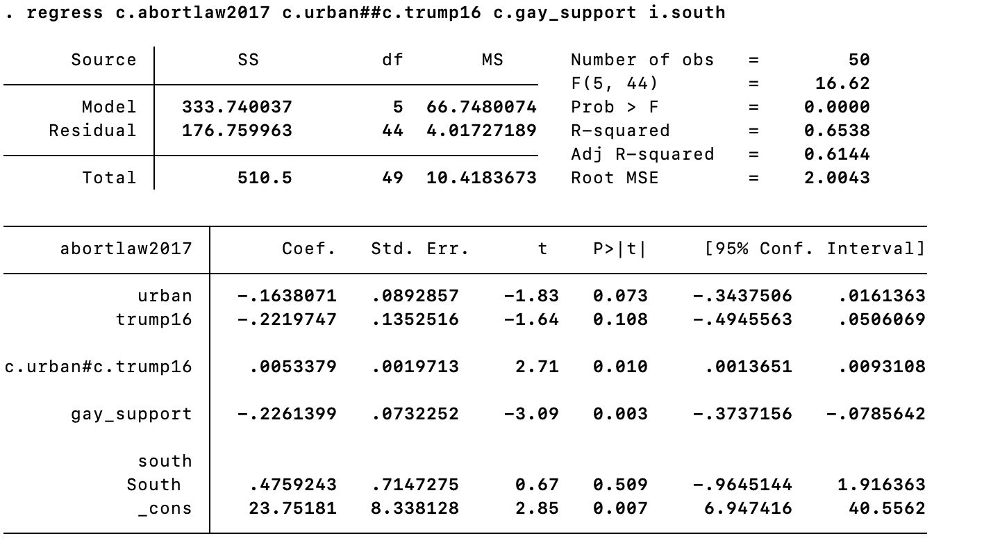
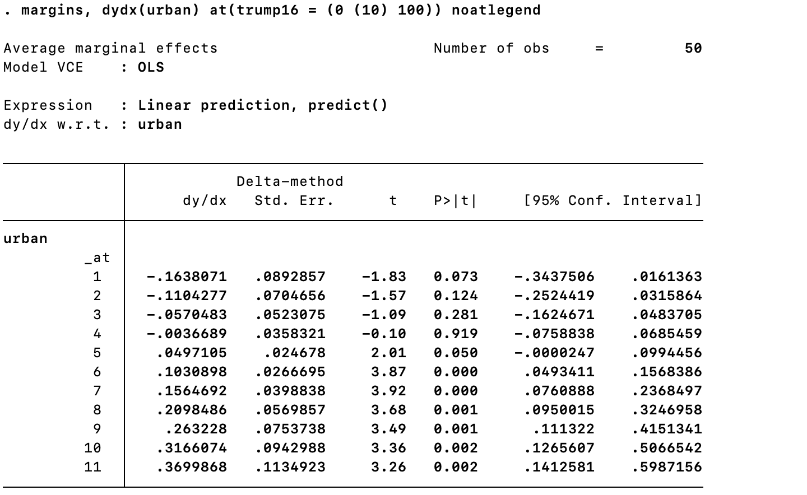
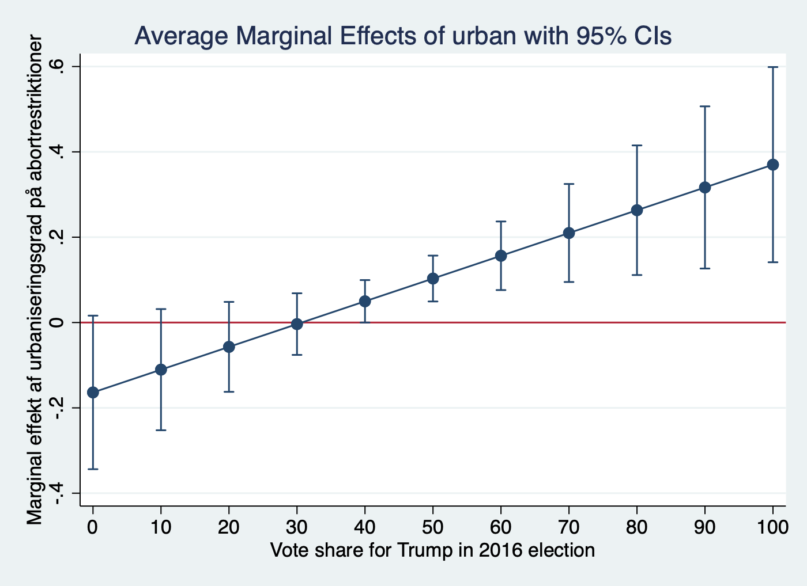
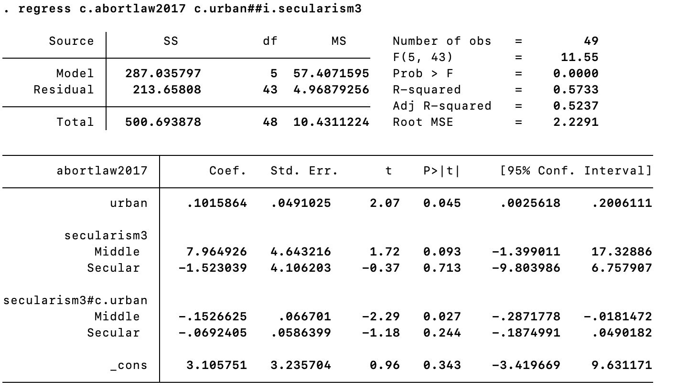
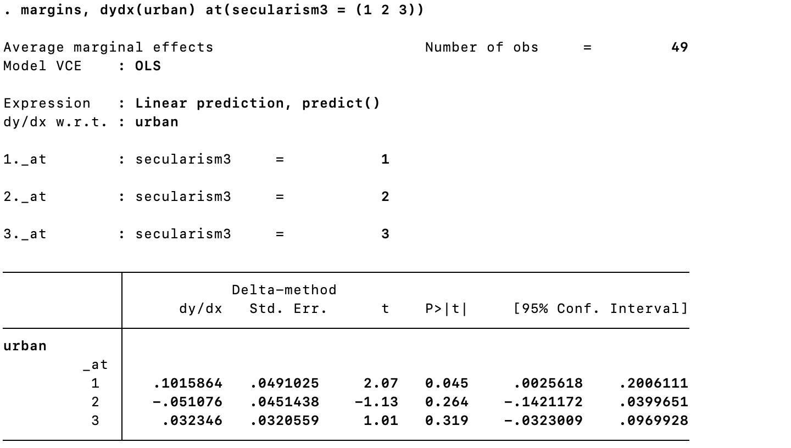
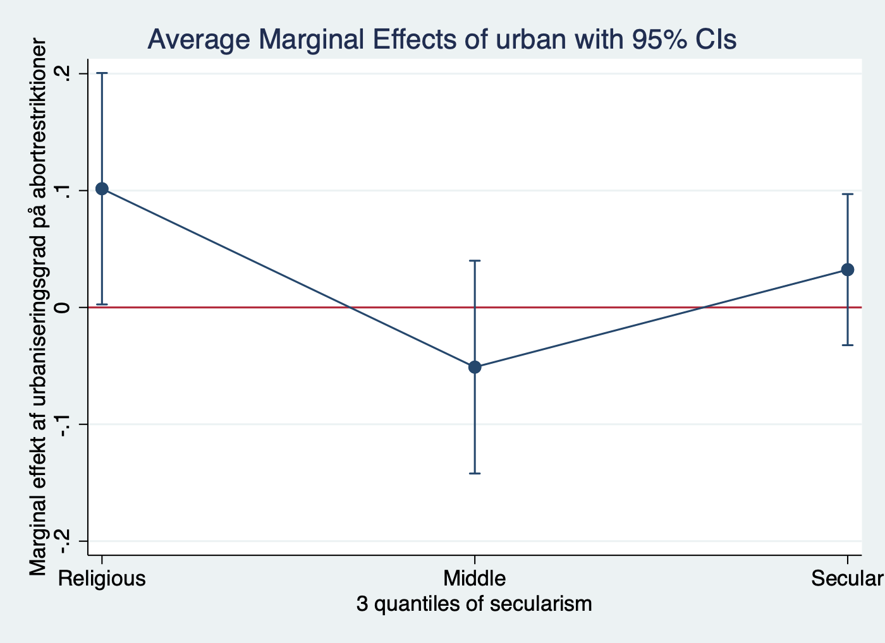

layout: true

```{r setup, include=FALSE}
knitr::opts_chunk$set(echo = F)
```

# Opgave 2

---

Undersøg dernæst vha. en interaktionsmodel om stemmeandelen til Trump i 2016 (trump16) modererer effekten af urbanisering i modellen fra opgave 4.1. Husk at der enten skal stå i. eller c. foran de variable som interageres. Fortolk resultatet. Illustrér interaktionen mellem Trump-stemmeandel og urbanisering vha. marginale effekter.

---

```{r}

```

---

```{r}

```

---

```{r}

```

---
layout: true

# Opgave 6

---
Undersøg dernæst, om der er forskel i effekten af urbanisering mellem graden af sekularisme (secularism3). Lav en interaktionsmodel med interaktion mellem urban og secularism3. Fortolk resultatet.
---

```{r}

```

---

```{r}

```

---

```{r}

```


